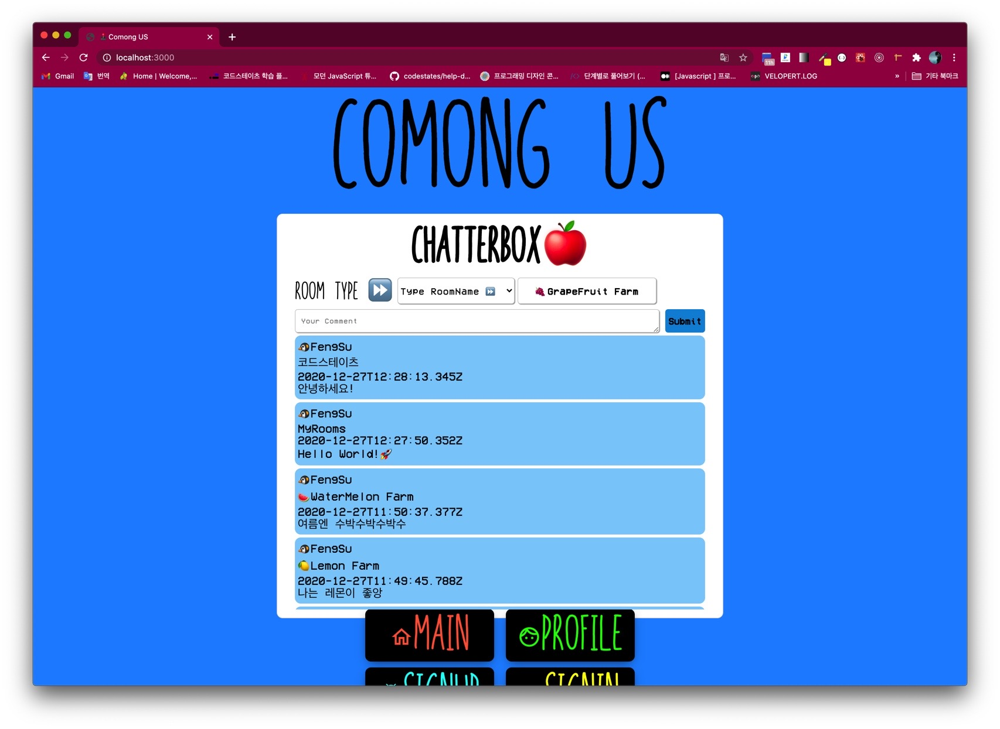
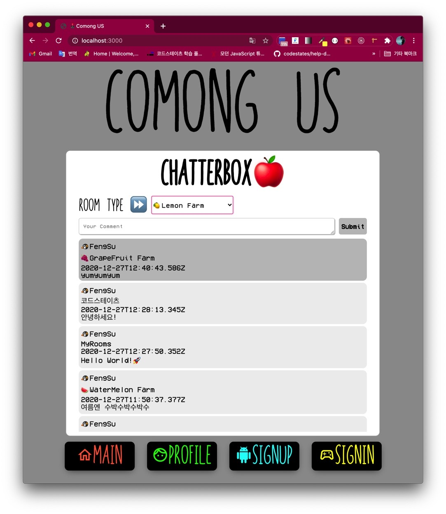
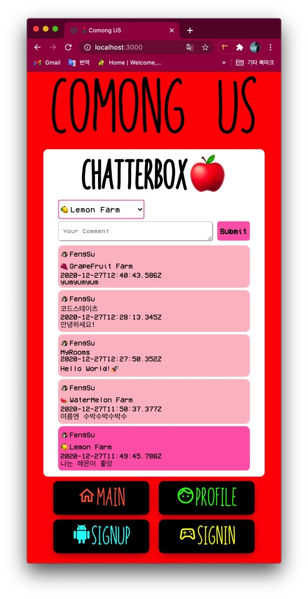

## 🍊더 시도해 볼 것 - 얼마나 달성했니?

### 1. Auto-Fetching

뭔가 어렵게 느껴졌는데, 그럼 매 번 자동 CMD + R 새로고침을 해주면 되잖아?

componentDidMount() 에서, 초기 코드는 아래와 같았다.

```js
componentDidMount() {
  this.getData();
}
```

그리고 구글에 자동 새로고침을 검색하다 보니 이런게 나와서 적용해 봤다.

```js
componentDidMount() {
  window.setTimeout(window.location.reload(), 60000);
}
```

1분마다 (60초) 창을 자동 새로고침 해주는 기능을 하는데, 뭔가? 억지로? 되는거 같은데??

강제로 맞춘 느낌이랄까?

만약 1초마다 자동 새로고침이면 창이 1초마다 깜빡거려서 시력에 상당한 악영향을 끼칠 지도 모른다.

그래서 마지막 방법.

```js
componentDidMount() {
  setInterval(() => {
    this.getData();
  }, 1000);
}
```

class 형 컴포넌트에서는 함수를 작성하면 위에 항상 constructor 내에 아래 처럼 작성하는데,

```js
this.getData = this.getData.bind(this)
```

안해줬으니 저렇게 익명 함수로 넘긴다.

### 2. Room (category) 선택하기

서버로 부터 받아온 데이터를 반복을 돌려서 방 배열을 중복을 제거한 뒤 state 에 설정해 두었다.

render 되는 부분에 jsx 로 select 와 option 을 사용해서 Room 을 선택할 수 있게 해주었다.

onChange 이벤트를 select/option 부분 에 적용해서 handleChangeRoom 함수를 통해서,

state 를 event.target.value 로 받아 변경해 주었다.

이 과정에서 DOM 을 선택해 사용했는데 리액트에서 이렇게 적용 해도 되는지는 아직 확실하진 않다.

그리고 select/option 에 없는 방을 만들어서 chat 을 날리고 싶다 하면,

select/option 의 "Type RoomName ⏩" 을 (value 가 typeRoom) 클릭할 때,

display 가 "none" 이였던 input 요소가 짠! 하고 나타난다.

여기 input 에도 이벤트를 마찬가지로 handleChangeRoom 에 걸고 room 의 state 를 DOM 선택 을 사용해서 setState 로 업데이트 해주었다.

사실 길게 적은 거 같지만 잘 되지 않아서 많이 막힘을 겪었었다.

그리고 이 것을 결정적으로 제대로 시도해야 겠다고 마음먹은 것은 페어님을 만나서 서로 보여주는 시간을 가졌기에 가능했다.

## 🚀과정 사진

### 1. 전체 화면



### 2. 중간 화면



### 3. 작은 화면



## 🌈더 해보고 싶은 것

아바타 이미지를 선택해서 같이 넣게 만들어 주고 싶다.


