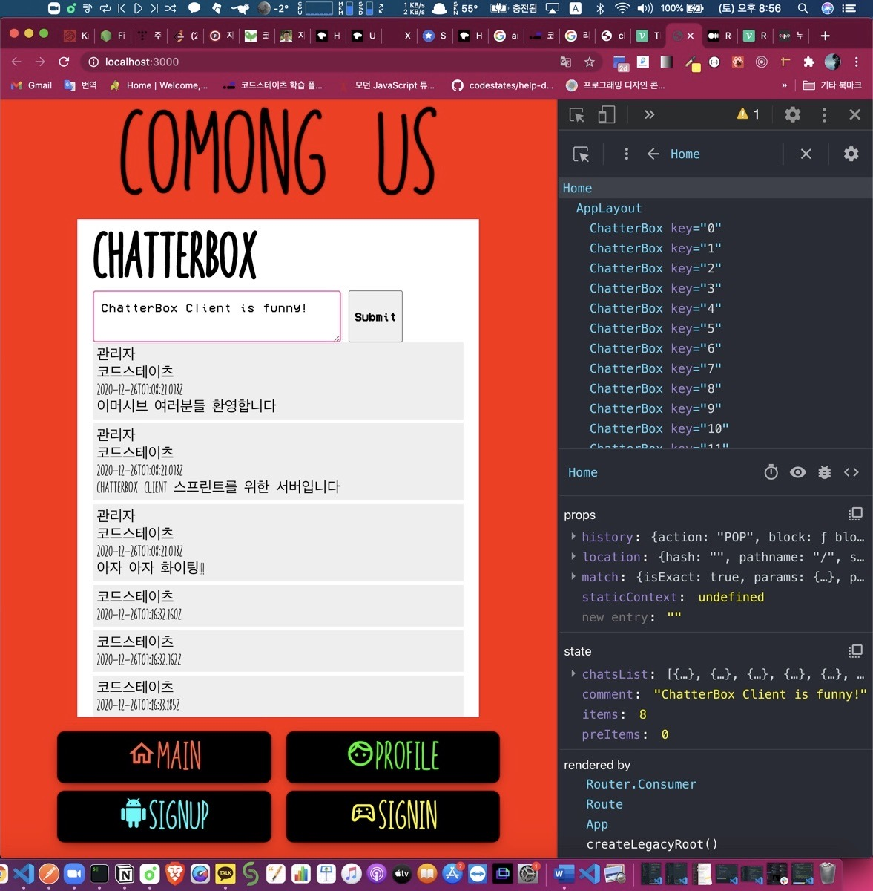
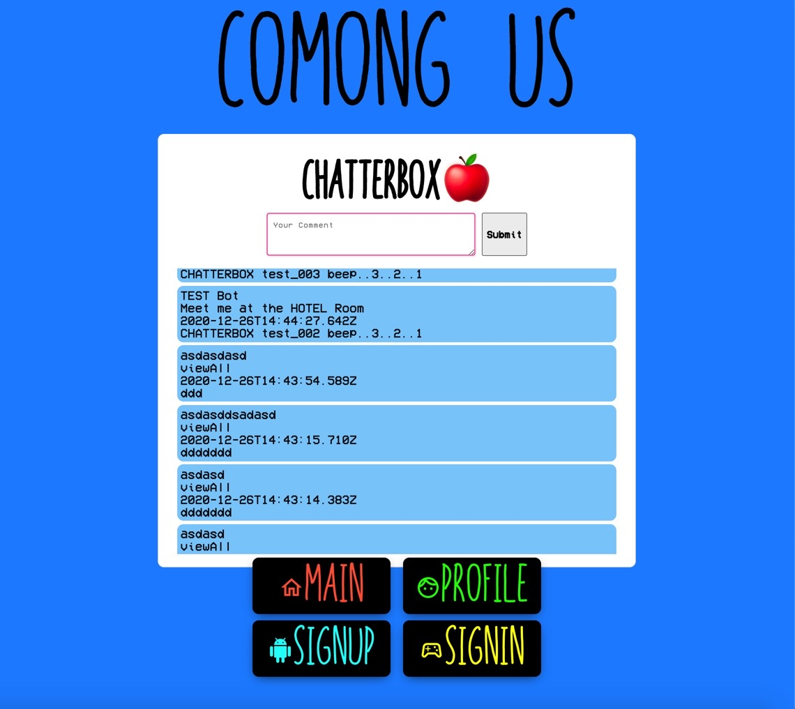
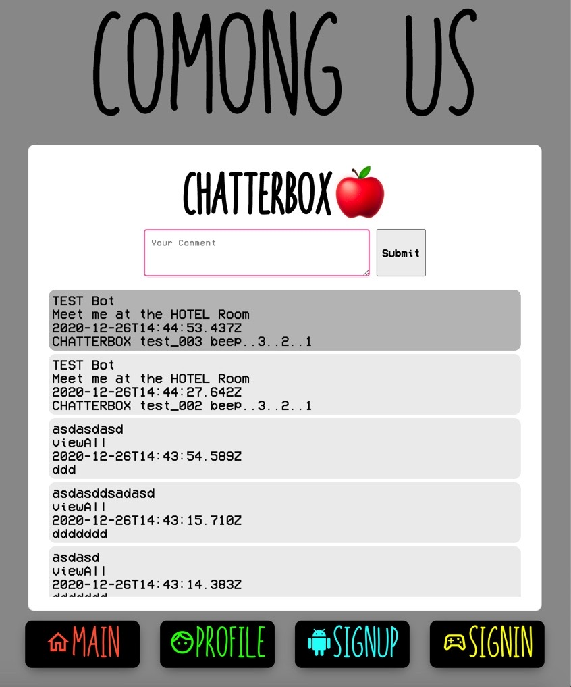
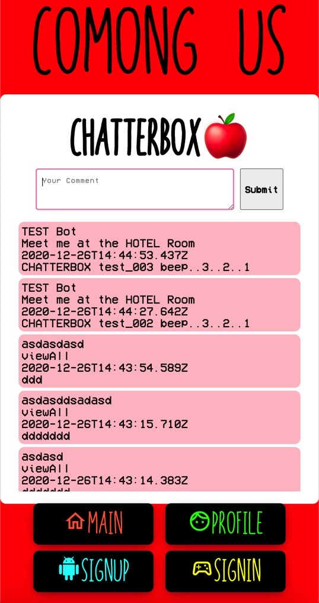

## 😱들어가기 전에

약 거의 6일? 만에 ComongUS 프로젝트를 다루게 되었다.

이번 주 전반에는 비동기 처리를 위한 3대장인 callback, promise, async & await 을 학습했고,

후반에는 코드스테이츠 서버에 fetch 를 통해 사용자들의 chat 목록들을 불러오고 서버에 내가 작성한 chat 을 저장하게 하는 ChatterBox Client 를 만들어 보았다.

그래서 크리스마스 날인 25일 부터 이것을 내 ComongUS 프로젝트에 이식하기 위한 수술을 시작했다.

나름 복습도 되고 할 것 같았는데, 난 분명 페어님과 스프린트를 잘 진행했는데!

아니 글쎄 리액트 프로젝트에 어떻게 할지 감을 잡지 못한 거다..

이걸 어떻게 하나? 그래서 혼자 끙끙대다가 어제 헬프 데스크에 아래와 같은 코드를 올리며 질문을 구했다.

```jsx
const ChatterBox = () => {
  return (
    <>
      <MessageBox />
      <div>it works?</div>
    </>
  )
}

const app = {
  server: 'http://12.34.567.891:8000/messages',
  init: () => {
    app.fetch().then(messages => {
      for (let i = 0; i < messages.length; i++) {
        app.renderMessage(messages[i])
      }
    })
  },
  fetch: () => {
    return fetch(app.server)
      .then(res => res.json())
      .then(data => {
        return data.results
      })
  },
  renderMessage: msg => {
    console.log(msg)
    return (
      <MessageBox
        username={msg.username}
        roomname={msg.roomname}
        date={msg.date}
        text={msg.text}
      />
    )
  },
}

app.init()

export default ChatterBox
```

뭔가 ChatterBox 라는 컴포넌트를 만들어다 놓고 이것을 Home.js 에 import 해서 적용해 놓으면 될 것만 같았다.

하지만 도저히 렌더링이 진행되지 않아서 어제 하루를 날리게 되었다.

리액트에 대해 뭔진 모르지만 어디에선가 부족함이 있다는 것을 알고 좌절했지만 오늘 (12월 26일) 다시 시도한 끝에,

중간 과정을 블로깅 할 수 있었다.

## 🍎ChatterBox Client 이식 수술 시작

https://velopert.com/3634

책으로도 구입하긴 했었는데 막상 두꺼운 책의 두께에 압도당해서 묻어놓고 있었는데, 위의 블로그 글을 읽게 되면서 드디어 내 ChatterBox Client 를 프로젝트에 이식할 수 있는 삽을 푸게 되었다.

아래의 코드는 Home.js 에 작성했다.

```jsx
import React, { Component } from 'react'
import AppLayout from '../../src/components/AppLayout'
import ChatterBox from '../components/ChatterBox'
import './Home.css'

class Home extends Component {
  constructor() {
    super()

    this.state = {
      chatsList: [],
    }
  }

  componentDidMount() {
    this.getData()
  }
  getData = () => {
    fetch('http://12.34.567.891:8000/messages')
      .then(res => res.json())
      .then(res => {
        this.setState({
          chatsList: res.results,
        })
      })
  }
  render() {
    const { chatsList } = this.state
    return (
      <AppLayout>
        {chatsList.map((chat, idx) => {
          return (
            <ChatterBox
              key={idx}
              username={chat.username}
              roomname={chat.roomname}
              date={chat.date}
              text={chat.text}
            />
          )
        })}
      </AppLayout>
    )
  }
}

export default Home
```

사실 위의 코드보다 더 단순한 상태에서 시작하다가 Class 형 컴포넌트를 만들게 되면서 만들어 나가는 것에 좀 더 자신감이 붙었다.

함수형 컴포넌트로 useState 를 적용해 보려는데 뭔가 내가 제대로 알지 못한다는 느낌을 강하게 받았다.

클래스형 컴포넌트를 사용하니까 상태 관리 할 때 어떻게 적용 했었는지, componentDidMount 에 대한 아이디어, setState 로 상태를 업데이트 하는 것 등등에 대해 서서히 기억도 살아나는게 좋았다.

## 🌈fetch 를 통한 GET 요청 - chat 목록 불러오기



위의 코드에서 작은 부분들을 수정해서 서버로부터 모든 chat 데이터 배열들을 불러온 뒤,

그 배열들을 map 으로 반복을 돌리고 ChatterBox 라는 컴포넌트를 추가 생성한 후 props 로 내려 주었다.

ChatterBox 컴포넌트는 단순하다.

```jsx
import React from 'react'
import './ChatterBox.css'

const ChatterBox = props => {
  return (
    <div className="chat">
      <div>{props.username}</div>
      <div>{props.roomname}</div>
      <div>{props.date}</div>
      <div>{props.text}</div>
    </div>
  )
}

export default ChatterBox
```

## 🌈fetch 를 통한 POST 요청 - chat 작성하기

fetch 를 통한 GET 요청에는 별도로 GET 을 명시해 주지 않았지만 (GET 요청에는 body 가 들어가지 않았지만),

나머지 요청 (POST, PUT, DELETE 등) 에는 body 를 넣는 등 요구 조건 들과 method 를 명시해 줘야 한다.

아, 먼저 jsx 로 (html 같이 생긴..) input 과 button 을 만들어 주었다.

```jsx
<div className="main">
  <h1>ChatterBox🍎</h1>
  <div className="input-group">
    <textarea
      id="comment"
      onChange={this.handleChange}
      name="comment"
      rows="2"
      cols="33"
      onKeyDown={this.handleKeyDown}
      placeholder="Your Comment"
    ></textarea>
    <button id="submit" onClick={this.handleSubmit}>
      Submit
    </button>
  </div>
</div>
```

### 1. textarea 에 onChange 함수 걸기 (with handleChange)

그리고 먼저!

textarea 에 onChange 함수를 걸어서 handleChange 함수가 실행되게 연결하는 거다.

handleChange 함수는 Home 컴포넌트의 this.state.comment 에다가 textarea 에 입력한 내 chat 글자가 업데이트 되게 만들어주는 함수이다.

### 2. button 을 onClick 했을 때 handleSubmit 함수 실행시키기

유어클래스에 있는 POST 요청을 보내는 코드를 다시 참고하면서 작성했다.

```jsx
handleSubmit = event => {
  event.preventDefault()
  const serverURL = 'http://12.34.567.891:2000/messages'
  let message = {
    username: 'TEST Bot',
    text: this.state.comment,
    roomname: 'Meet me at the HOTEL Room',
  }
  window
    .fetch(serverURL, {
      method: 'POST',
      body: JSON.stringify(message),
      headers: {
        'Content-Type': 'application/json',
      },
    })
    .then(response => response.json())
    .then(json => {
      console.log(json)
      event.target.value = ''
    })
    .then(() => setInterval(this.componentDidMount(), 1000))
}
```

event.preventDefault() 는 원래 이벤트가 해야 하는 작업을 방지시킨다는 의미 라고 한다.

원래는 form 에서 submit 이 발생하면 페이지를 다시 불러오게 되는데,

그렇게 되면 현재 컴포넌트에서 지니고있는 상태를 다 잃어버리게 되니까 이를 통해서 방지해 주는 역할을 한다.

또 하나 주의 깊게 볼 점은 아까 textarea 에 입력한 값이 state 의 comment 에 업데이트 되었기 때문에 message 의 text 로 들어갈 수 있게 되고,

POST 요청으로 message 객체를 실어 보내면 비로소 서버에 내 message 를 저장할 수 있게 됨과 동시에,

내가 작성한 글도 화면에 불러올 수 있게 되는 것이다.

## 🥝handleKeyDown 이벤트 적용

버튼을 누르는 것 뿐만 아니라 textarea 에 내 채팅을 적고 Enter 키만 치는 것만으로도 POST 요청을 하고 싶다면,

textarea 에 onKeyDown 을 적용하고,

여기에 handleKeyDown 함수를 적용한다.

handleKeyDown 함수는 아래와 같이 작성해 보았다.

```jsx
handleKeyDown = event => {
  if (event.keyCode === 13) {
    this.handleSubmit(event)
  }
}
```

clearMessages 함수도 setState 로 chatsList 를 빈 배열로 만들어 버리게끔 했는데,

handleSubmit 에 setInterVal 을 적용함으로써 쓸모가 없어진 듯 하다.

아! 그리고 추가로

fetch 로 데이터 배열을 받아올 때, 맨 앞에서 부터 받아오면 스크롤 하기가 귀찮아져서,

```jsx
.then((res) => {
    this.setState({
        chatsList: res.results.reverse(),
        });
    });
```

요런 식으로 (배열.reverse()) 적용해주면, 작성했던 거 맨 뒤 (최신 chat) 의 chat 을 불러 올 수가 있게 된다.

## 🥰CSS 스타일링 하기

CSS 는 재밌다고 생각했는데 정말 손을 한번 대기 시작하면 끝도 없는 것 같다.

textarea 와 버튼이 들어있는 div 와 그 아래 chat 들이 있는 div 가 아무리 flex 를 적용해도 안되어서 답답해 하다가,

결국 div 를 한번에 싸 주고 css 를 적용하니 내 맘에 조금 들게 되었다.

저번주 일요일 부터 알게 된 반응형 웹을 소소하게 나마 적용해 보았다.

## 🕹중간 과정 PHOTO

전체 화면일 때는 아래의 모습을 띄게 한다.



중간 화면일 때는 아래의 회색 배경을 적용했다.



각각의 chat 에 마우스를 가져다 대는 hover 를 했을 때 색이 좀 더 진해지게 표현했다.



마지막으로 제일 작은 화면일 때는 위와 같이 적용해 보았다.

## 🍊더 시도해 볼 것

일단 내일 오후 세시에 전 페어님과 만나서 서로 진행사항을 공유하기로 했다.

내일 중으로 해볼 것은

1. Room: 유저는 Room을 생성할 수 있어야 하고, 서버로부터 받은 메세지들은 room에 의해서 구분 될 수 있어야 합니다.

2. Auto Fetching: 클라이언트에서 새로고침을 하지 않더라도 서버에서 계속 새로운 메세지들을 받아 올 수 있어야 합니다.

3. Pagination: 이건 좀 심화 학습이기는 하다. 아마 좀 시간을 둬야 할듯?

그리고 CSS 스타일링인데, 일단 욕심내는 내 채팅의 모습은 아래 화면을 기대하며 만들어 보려고 한다.


ㅠㅠ...
