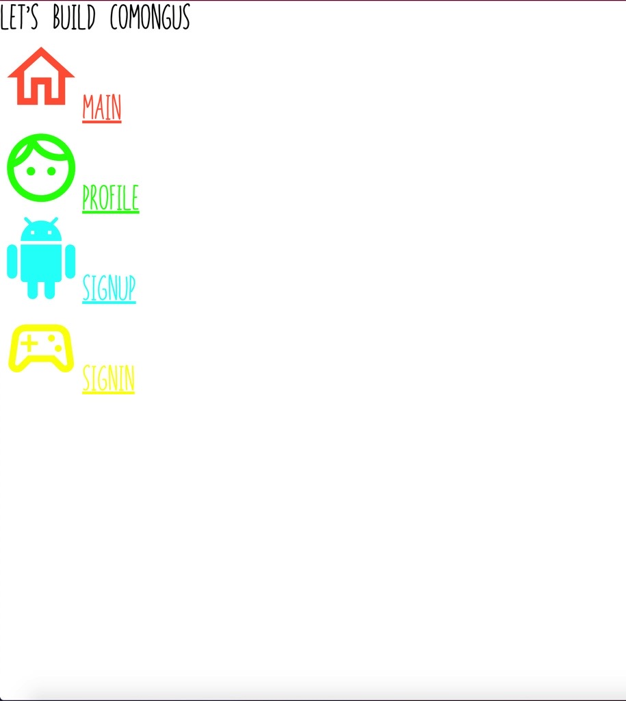
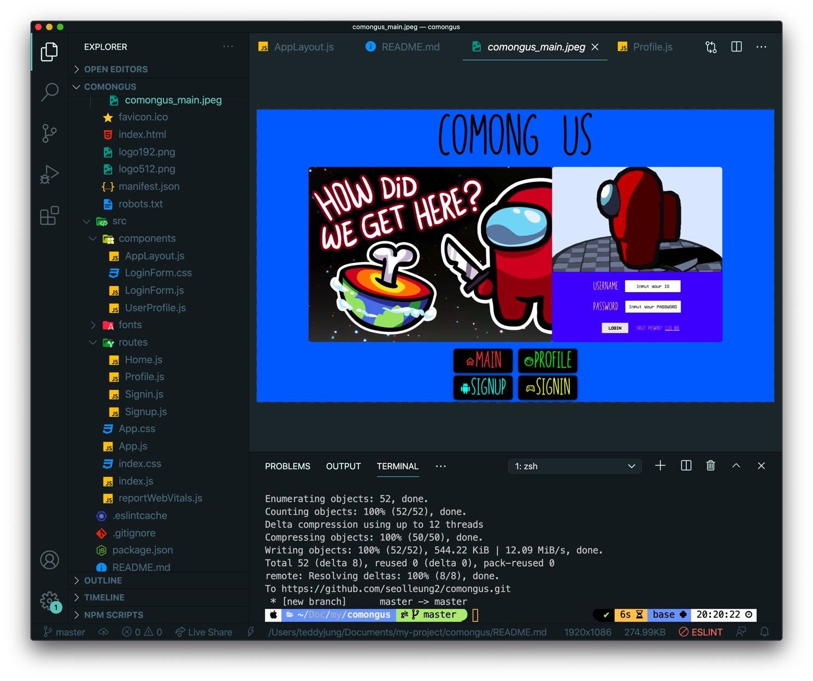
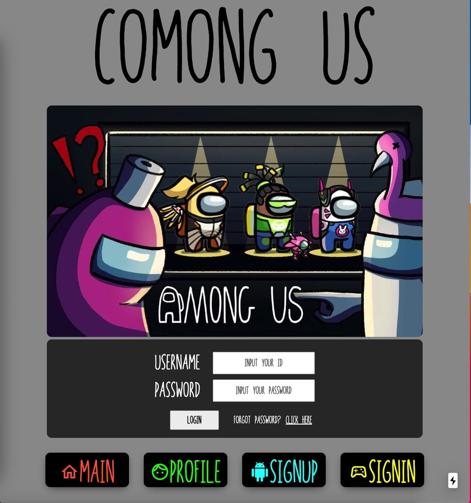
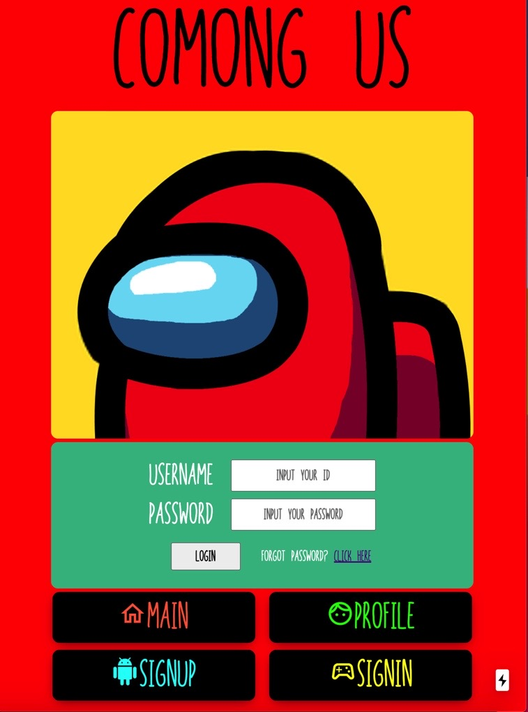

## 🌈Comong US Concept

온라인 웹 마피아 게임이고 각자가 코딩 문제를 푸는 미션이 주어진다.

(아직 모르겠다..)

임포스터는 각종 훼방을 놓는다.

(어떤 훼방인지는 이 또한 미정..)

채팅을 통해 마피아를 잡아 낸다. 뭔가 내용은 간단하다.

하지만 어떻게 만들까? 후덜덜 하다.

## 🎉왜? 어몽어스 캐릭터를 그대로 쓰나?

그냥 캐릭터가 귀엽게 생겨서이다.

요새는 카카오톡 이모티콘도 막 엄청 그림체가 화려 해서 인기를 끄는게 아니라, 뭔가..

그림체가 막 엄청난 화풍을 자랑하지 않고 병맛(?) 스럽게 생겼지만 인기를 끄는? 그런 캐릭터 말이다.

어몽어스 캐릭터가 딱 그런 느낌이다. (내생각에는 ..ㅎㅎ)

## 🕹현재 진행 사항

### 1. src/fonts 내에 2가지 폰트 넣음

구글에 amongus font 로 검색해보니,

in-your-face 라는 폰트와 vcr-osd-mono 폰트 두 종류가 있었다.

메인 폰트는 in-your-face 로 가면서 아이디나 비밀번호 입력할 때 쓰는 폰트는 vcr 폰트로 갈 생각이다.

폰트 확장자는 woff, eot, svg 등이 있는거 같은데 정확히는 잘 모르겠지만 이렇게 폴더 내에 넣고서,

```js
@font-face {
  font-family: "VCR-OSD-Mono";
  src: url("./fonts/VCR-OSD-Mono.ttf.woff") format("woff"),
    url("./fonts/VCR-OSD-Mono.ttf.svg#VCR-OSD-Mono") format("svg"),
    url("./fonts/VCR-OSD-Mono.ttf.eot"),
    url("./fonts/VCR-OSD-Mono.ttf.eot?#iefix") format("embedded-opentype");
  font-weight: normal;
  font-style: normal;
}
```

App.css 에 위와 같은 식으로 적용해 주면 된다.

### 2. src/routes 내 경로 나누어 파일 생성하기

Home.js 👉 http://localhost:3000/

Profile.js 👉 http://localhost:3000/profile

Signin.js 👉 http://localhost:3000/signin

Signup.js 👉 http://localhost:3000/signup

그리고 모든 경로에 해당하는 파일에 대해서는 똑같은 디자인을 적용하기 위해서!

src/components 폴더 내 AppLayout 이라는 컴포넌트를 만들었다.

여기서는 가운데 내용이 자리할 컨텐츠와 아래 메뉴 버튼들이 공통으로 들어가게끔 해주었다.

각 경로별로 들어가는 컨텐츠 내용이 달라질 것이기에,

일단 네 경로의 컴포넌트를 아래와 같이 AppLayout 으로 감싸주었다.

```jsx
import React from 'react'
import AppLayout from '../../src/components/AppLayout'

const Home = () => {
  return (
    <AppLayout>
      <div>Let's build COMONGUS</div>
    </AppLayout>
  )
}

export default Home
```

그러면 저 AppLayout 사이 샌드위치 된 리액트 node 는 AppLayout 의 children 이 된다.

그러면 AppLayout 컴포넌트에서 children 객체로 받아 쓸 수 있다.

### 3. react-router-dom 설치 및 경로 분기 코드 작성

react-router-dom 설치해 준다.

App.js 을 아래와 같이 수정하고 라우트와 만들어놓은 컴포넌트를 임포트 한다.

```js
function App() {
  return (
    <>
      <div className="app__title">COMONG US</div>
      <Route path="/" component={Home} exact={true} />
      <Route path="/profile" component={Profile} />
      <Route path="/signin" component={Signin} />
      <Route path="/signup" component={Signup} />
    </>
  )
}
```

exact 이꼴 true 를 적은 이유는 /profile 을 들어갔을 때 루트 경로의 내용까지 겹쳐 나오게 되므로 위와 같이 조정.

### 4. CSS 놀이 (App.css)

반응형이라는 것을 처음 써보게 되었다.

물론 더 파고 들면 더 많이 나오겠지만 일단 나는 이렇게 했다.

일단 App.css 에서 전체 적인 공통 css 의 모양을 잡는데,

```js
// 화면 최대치 일때 css

@media (min-width: 1024px) {
  // 여기는 최소 화면 크기가 1024부터 일때
  // 위에다 써도 될거같은데 안먹어서 이렇게 꼼수를 씀
}

@media (max-width: 1023px) {

}

@media (max-width: 767px) {

}

```

중요한 점은 무조건 창이 제일 작을때 부터 css 디자인을 해나가야 한단 점이다.

큰거 부터 짜서 작은 창을 css 하면 정신건강에 이롭지 않을 가능성이 있다.

### 5. Material UI Icon 사용

다른 라이브러리의 사용은 강력 배제하고 오로지 밑바닥부터 만들 생각이지만, 아이콘을 밑바닥부터 만들 이유는 없다고 생각한다.

https://material-ui.com/getting-started/installation/



설치후 import 해서 적용하면 된다.

```jsx
<div className="menu__item">
  <Link to="/">
    <a style={{ color: '#ff6341' }}>
      <HomeOutlinedIcon style={{ fontSize: '40px' }} />
      <span>MAIN</span>
    </a>
  </Link>
</div>
```

### 6. LoginForm 컴포넌트 만들기

Signin.js 에서 유저의 로그인 여부에 따라 UserProfile 이나 LoginForm 을 볼 수 있게 삼항 연산자를 적용했다.

```jsx
const Signin = () => {
  const [isLoggedIn, setIsLoggedIn] = useState(false)
  return <AppLayout>{isLoggedIn ? <UserProfile /> : <LoginForm />}</AppLayout>
}
```

그리고 components 내에 LoginForm 을 만들었다.

LoginForm 에서는 어몽 사진과 로그인을 하는 label, input 태그로 화면을 구성했다.

마찬가지로 아까와 같은 반응형을 적용해서 css 를 적용했다.

### 7. 스크린샷



창 크기가 중간 이하로 떨어질 때는 아래와 같이,



창 크기가 최소로 줄어들면,



## 🌈Achievement Goal

이렇게 한 번에 많이씩 만들지 못할 테니 매일 조금씩 조금씩 해나가야 겠다.

오늘은 무엇무엇을 배웠다~ 공부했다~ 그러면 최대한 적용할 방법을 찾아서 적용해 보고 노력해 보자.

알아도 아는게 아니란 걸 알게 되었으니 천천히 내 페이스에 맞게 만들어 나가자.
