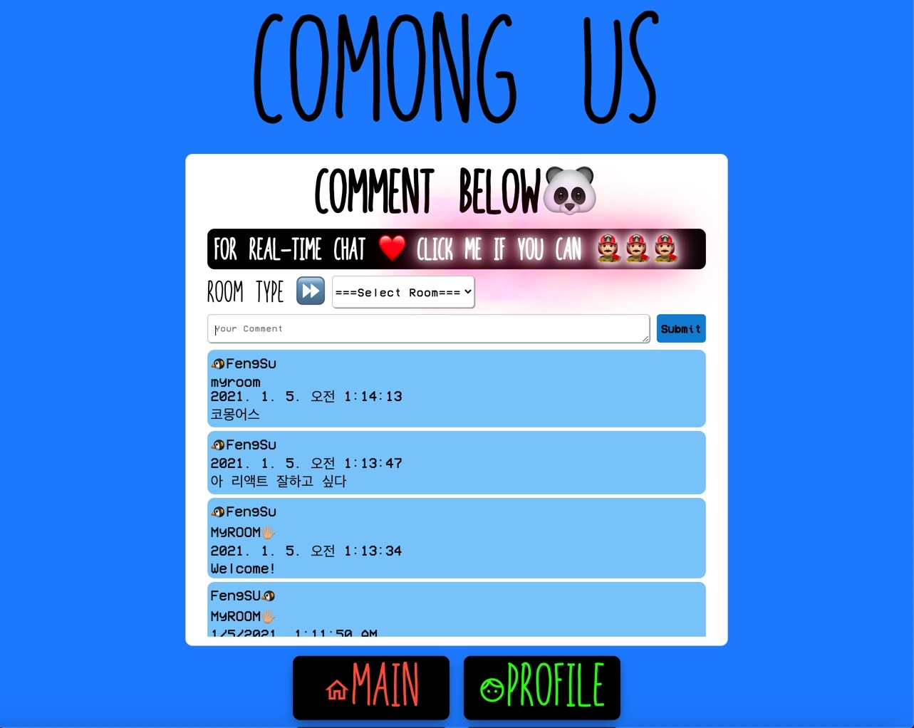
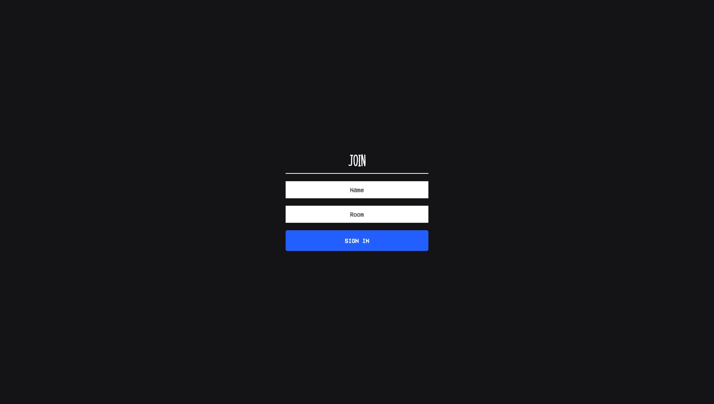
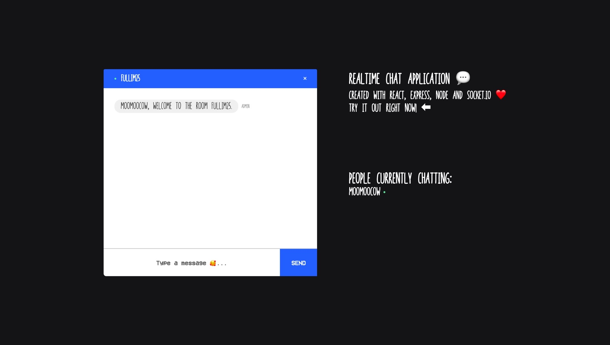
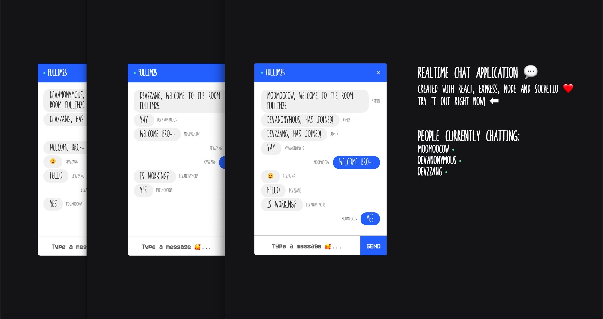

## 🌈Socket.io

지난 주 신정 연휴 포함한 기간동안 Socket.io 를 어떻게 내 코몽어스 프로젝트에 적용해 볼까 궁리하기 시작했고,

일요일날 완전한 마무리는 아니지만 만들어 볼 수 있었다.

온전히 내 머리에서 나온 것이 아니고 유튜브에 나오는 외국인 개발자가 스트리밍하는 긴 시간의 튜토리얼 영상을 다섯 차례 보며,

코드를 쳐 가며 이해해 보다가 마지막에 내가 이해한 내용을 바탕으로 Socket.io 공식문서와 실제 내 코몽어스 프로젝트에 직접 내가 이해한 바를

주석으로 작성해가며 코드를 완성했다.

별도로 코드를 쳐 가며 테스트 했을 땐 잘 되었지만 이걸 내 프로젝트에 이식해서 시도해 보려하니 잘 안되었었는데,

이때 에러 핸들링 이나 검색하는 법 그리고 socket.io 의 클라이언트 - 서버 간의 통신 방법, 이벤트를 전달하는 법 등에 대해 절반 이상은

익숙해졌다.

만들어서 끝!

이 아니라, 이제 내 프로젝트에 나를 소개 하는 페이지를 만들 때가 되었는데 바로.

이 웹페이지를 공유하면서 나를 소개 할 때 시청자가 해당 소개 페이지에서 내 소개를 보면서 실시간으로 채팅을 할 수 있게

재구성하는 것이 나의 목표이다.

## 🎇ComongUS 에 적용한 모습 - 메인 루트(root)



메인은 localhost:3000 으로 처음 클라이언트의 화면이 렌더링 된다.

chatterbox 를 리액트 클래스형 컴포넌트로 구현했다.

마찬가지로 서버도 직접 구현했다. (localhost:4000)

```js
const express = require('express')
const cors = require('cors')
const app = express()
const bodyParser = require('body-parser')
const jsonParser = bodyParser.json()
const port = 4000

let data = {
  results: [
    {
      username: 'FengSU🐧',
      text: 'ComongUS with Express.js🌈',
      roomname: 'MyROOM🖐🏼',
      date: new Date().toLocaleString(),
    },
  ],
}

app.use(cors())

app.use(jsonParser)

app.get('/messages', (req, res) => {
  res.status(200).send(data)
})

app.post('/messages', (req, res) => {
  console.log(req.body)
  data.results.push(req.body)
  res.status(201).send(req.body)
})

app.listen(port, () => {
  console.log(`COMONGUS app listening at http://localhost:${port} 🐼`)
})
```

다만 socket.io 로 구현한 리얼타임 채팅의 서버는 5000번 이다. 하나로 합치는 시도는 아직 하지 않았다.

하지만 가능한 거 같다.

express.Router() 를 사용하면 별도로 routes.js 파일을 생성해서 이 파일 내에서 엔드포인트에 따라 어떻게 처리 해 줄지를 분기할 수 있다.

## 🎇메인 루트의 CSS

위의 그림을 보면 분홍분홍하게 반짝거리는 텍스트를 클릭하면 리얼 타임 채팅 방으로 넘어가게 된다.

그런데 저 분홍분홍하게 만들어 보려고 keyframes 에 대해 찾아 보았고 main 에 해당하는 Home.css 에 작성해주었는데..

무척이나 느려지는 것이였다.

대략 이런 코드이다..

```css
@-webkit-keyframes neon1 {
  from {
    text-shadow: 0 0 10px #fff, 0 0 20px #fff, 0 0 30px #fff, 0 0 40px #ff1177,
      0 0 70px #ff1177, 0 0 80px #ff1177, 0 0 100px #ff1177, 0 0 150px #ff1177;
  }
  to {
    text-shadow: 0 0 5px #fff, 0 0 10px #fff, 0 0 15px #fff, 0 0 20px #ff1177,
      0 0 35px #ff1177, 0 0 40px #ff1177, 0 0 50px #ff1177, 0 0 75px #ff1177;
  }
}
```

그래서 현재는 주석을 채워놓은 상태이다.

## 🎇Welcome to Real-Time Chat!



그렇게 클릭해서 들어가면

localhost:3000/rtcjoin 으로 경로가 하나 더 늘어나는데,

여기서 roomname 과 내 닉네임을 치고 들어가게 된다.

```js
const express = require('express')
const app = express()
const http = require('http')
const socketio = require('socket.io')

const { addUser, removeUser, getUser, getUsersInRoom } = require('./users.js')

const PORT = 5000

const router = require('./router')

const server = http.createServer(app)

const io = socketio(server)

io.on('connection', socket => {
  console.log('a user connected!!🐼')
  // ! client side 에서 emit 으로 보낸 이벤트 'join' 을 받아오겠다.
  // socket.on("join", (data) => {
  //   console.log(data); // 오 지져스.. { name: 'hello', room: 'world' } 가 CLI 에 찍힌다.
  // });
  socket.on('join', ({ name, room }, callback) => {
    console.log(name, room)

    const { error, user } = addUser({ id: socket.id, name, room }) // users.js 에서 함수가 리턴하는 것을 눈여겨 볼것!

    if (error) return callback(error)
    // !emitted event 는 백엔드에서 프론트엔드로 넘겨주기 위한 방식 이구나!
    socket.emit('message', {
      user: 'admin',
      text: `${user.name}, Welcome to the room ${user.room}.`,
    })
    socket.broadcast
      .to(user.room)
      .emit('message', { user: 'admin', text: `${user.name}, has joined!` })

    socket.join(user.room)

    io.to(user.room).emit('roomData', {
      room: user.room,
      users: getUsersInRoom(user.room),
    })

    callback()
  })
  // ! on event 는 백엔드에서의 이벤트
  socket.on('sendMessage', (message, callback) => {
    const user = getUser(socket.id)

    io.to(user.room).emit('message', { user: user.name, text: message })
    io.to(user.room).emit('roomData', {
      room: user.room,
      users: getUsersInRoom(user.room),
    })

    callback()
  })
  socket.on('disconnect', () => {
    // console.log("user disconnected!!😢");
    const user = removeUser(socket.id)

    if (user) {
      io.to(user.room).emit('message', {
        user: 'admin',
        text: `${user.name} has left.`,
      })
    }
  })
})

app.use(router)

server.listen(PORT, () => {
  console.log(`Server HAS Started on port ${PORT}`)
})
```

socket.io 를 연결하기 위해서는 express 와 http 모듈을 모두 사용해야 한 다는 점을 알게 되었다.

내가 만든 서버는 express 로 (localhost:5000),

socket.io 를 받아오기 위한 서버는 http.createServer 로 내부 인자는 express() 를 받아서 만들게 된다.

## 🎇Real-Time Chat!



방 이름과 접속했다는 메시지가 뜨고, 다른 사람이 접속 할 때 메시지가 뜬다.

broadcast, emit, on 등에 대해 완전히 습득하지는 못했지만 다시 도전할 때 훨씬 더 효과적으로 할 수 있다는 자신감이 생겼다.

마지막으로,

여러 클라이언트를 동시에 열고 같은 이름의 방에 접속하면 아래의 화면을 볼 수 있고,

방에 접속한 사람들을 확인할 수 있고, 해당 클라이언트가 접속을 해제 하면 broadcast 를 통해 방에 남은 다른 클라이언트들은

해제한 클라이언트가 누구인지 메시지를 렌더함으로써 확인할 수 있다.



## 🎇개선할 점

접속을 해제한 클라이언트가 메시지 상에서는 해제 여부를 확인할 수 있지만,

파란불의 상태와 해당 클라의 유저이름을 지우게끔 구현해봐야 겠다.
