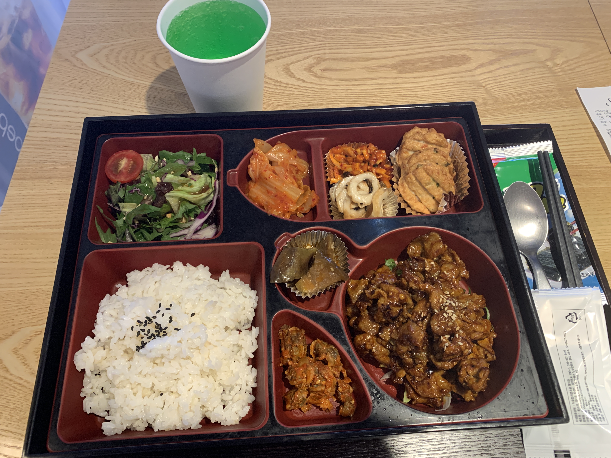

## 🛀08:00 - 기상 및 씻기

늦장 부리다가 여덟시에 일어난다. 알람은 더 일찍 울리게 하지만 와우 눈이 무거운 것은 아침도 마찬가지..

## 👟08:40 - 학습 장소 도착

두유에 시리얼을 타서 마셨다.

레몬수 가 아침을 깨운다.

## ✔09:00 - 10:30 - 체크포인트 solution (스코프, 클로저)

구글 캘린더 스케줄 상에는 1시간이 할당되어 있는데 끝까지 질문을 받아 주시고 답변 해주시는 멘토?님 선생님? 들의 열정이 대단하다.

전날 소크라테스 문제 푼거를 다시 리뷰 해보는 시간이였는데, 체크 포인트 솔루션을 통해서 한 번 더 머릿속에 스캐닝 해주는 과정이 아주 좋다.

역시 처음 봤을 때 보단 두 번째 보는게 낫고, 세 번째 보는게 낫다.

## 🤔10:30 - 11:00 - Intro to JS Koans

Koans 과제를 위해 코드 스테이츠의 koans repository 에 접근해서 내 repo 로 fork 를 떠오고 그것을 내 로컬 저장소로 클론해 오는 과정을 영상으로 시청했다.

잘 몰라서 아이패드에 무작정 순서대로 적었다.
보면서 하면 장땡.

## 💻11:00 - 12:00 - Git Lesson

Koans 과제를 위한 부연 보충 설명과 git 명령어에 대해 다시 학습한 걸 확인해 보는 시간을 가졌다.

code . 하고 open . 이 상당히 편리했다.

fork 와 clone 의 과정, 그리고 pull request 를 통해 오픈 소스에 기여하는 과정에 대해 대략 짐작을 하게 되었다.

나는 기여해서 pull request 를 보내도 레포 관리자가 응 아니야 하면 또 아무소용 없겠지? ㅎㅎ

## 🥣12:00 - 13:00 - Lunch 나는 그냥 시리얼 우적우적

## 🍎13:00 - 18:00 - 참선의 시간. Koans

불교적인 용어라 한다. 테스트 케이스 연습을 위한 과정 이라고 한다.
이 연습이 어떻게 연결되는지는 짐작할 수 없지만, 풀어가면서 대략 아 이렇구나 정도 겉핥기는 한 거 같다.

특히 8파트로 되어 있는데 5파트 부터 넘어가면서 조금씩 어려워지는 느낌이였다.

## 🍱18:30 - 20:00 - 식사

여섯시 반쯤 과제는 pull request 로 제출은 했는데, 풀었어도 이게 내 게 아닌 거 같은 느낌이다.
내일 또 복습하면 되니까 자리에서 그대로 일어나 어제 갔던 스타필드 불고기 브라더스에 갔다.

어제 제대로 못 찍은 마운틴 듀 소다 보이는가? 레몬색은 봤는데 저렇게 대놓고 초록색은 처음 봤다.

## 🤪20:00 - 23:00 - 클로저 복습 블로그 작성 및 소크라테스 스코프 10문제 풀면서 블로깅

조금 새겨진 거 같기도 하다.

스코프 문제는 풀면서 블로깅 했는데 마지막 8번 9번 헬프데스크에 올렸다.

## 자야지 ㅠㅠ 😴💤
