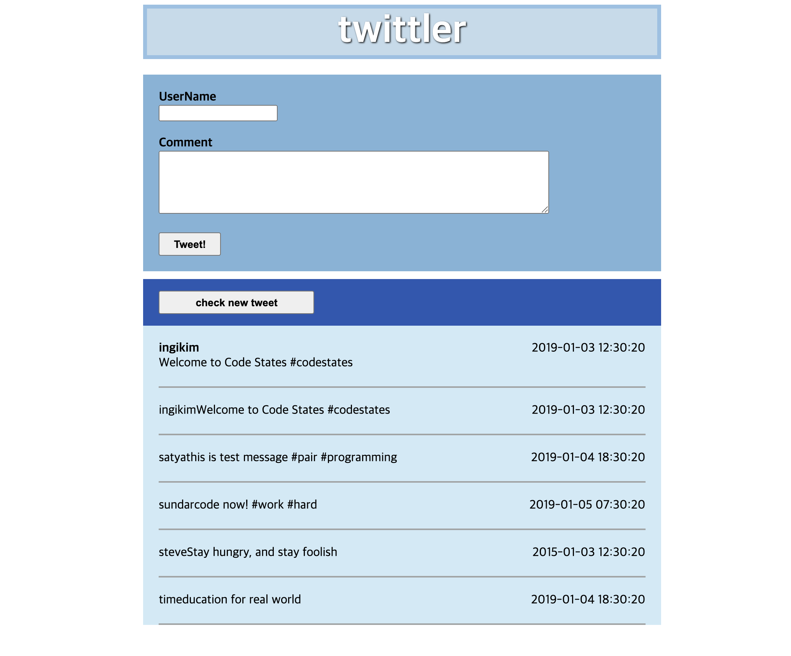

## 🛀08:05 - 기상 및 씻기

앞으로는 좀 더 일찍 자야 할 것 같다.
지금도 너무 피곤하다.
비타민제를 꾸준히 먹고 있으니 좀 더 나아질 거 같다.

## 😭09:00 - 12:00 - 유효성 검사

대략적으로 유효성 검사를 어떻게 하는 느낌인지는 알 거 같았다.
하지만 결정적으로 손가락이 키보드에 가지 않았다.

결국 html 인풋 폼 두개 집어넣고 멍청하게 있다가 멘탈이 살짝 흔들려 11시쯤 부터 어제 추천받은 1시간 분량의 강의를 또 보았다.

## 😔13:00 - 14:30 - 프론트 개발 Workflow2, undifined, twittler git fork

솔직히 감이 아직도 오지 않았다. 집중력이 확 떨어졌다.
전날 좀 일찍 자야 겠다.

## 💥14:30 - 18:00 - 페어 프로그래밍

페어님이 날 살렸다.
지금 나는 뭔가 느낌 소위 퓔을 받았다.

처음 인사 후 시작할 때는 잘 몰랐다. 그냥 페어님이 알려주시는 대로 코드 적고 그렇구나 이해하고 페어 시간 마치면 영상 보면서 또 노트에 적고 필기하면서
다시 공부해야 겠지 했다.

페어님이 나를 답답하게 여기지 않고 천천히 차근차근히 자세히 말씀해 주셨었다.
그럼에도 이게 뭔가 했었다.

일단 오늘 우리 페어팀이 해결해 본 과제는 어제 만든 트위틀러 목업에 구현되어 있는 하드코딩된 트윗 댓글들을 DATA 라는 배열 에서 가져와 html 에 연결하는 것이였다.

forEach () 반복문에 대해서도 알 수 있었고 그냥 append 와 appendChild 의 차이를 설명하진 못하겠지만 약간 어떻게 쓴다 라는 느낌이 왔다.

1. DATA 배열에서 하나씩 username, message, created_at 정보를 가져온다
2. 트윗을 추가할 때 필요한 div 나 span 엘리먼트를 만들어준다(내용없는 껍데기)
3. 만들어준 엘리먼트에 필요한 클래스를 추가해준다 (껍데기에 클래스만 추가)
4. 껍데기들을 알맞은 위치(html 안)에 넣어준다
5. 껍데기에 (1번에서 가져온)내용을 넣어준다

6. 만든 함수를 실행하는 코드를 적는다. (내부 DATA 변수를 담아서)

이렇게 해 보고 나니 조금은 이해가 된 거 같기는 한데 확신은 없었다.
약 4시 반경에 마무리를 하고 각자 줌을 켜둔 상태에서 나는 어제 따로 만든 트위틀러 목업을 켰다.

html 구조가 비슷하지만 보니까 약간 차이가 있었다.

최대한 이해하고 구글 개발자 도구에서 직접 입력해가면서 되는 결과를 다시 크롬 개발도구에서 vscode 로 옮겨 붙여보고 했다.

처음엔 위와 같이 시작했지만 오전의 좌절을 모두 만회시키겠다 하고 초집중했다.

잘 알려주신 페어님에게도 감사하고 뭔가 해냈다는 느낌이 들어 정말 뿌듯했다.

마지막으로 손으로 노트에 필기하고 이케 하는 공부가 아니라 일단 개발자 콘솔 창이든 뚜들뚜들 해야 뭐라도 나온다는 것을 느꼈다.
백날 동영상 보고 메모해 적고 다 부질없다는 것이다.

존나 뚜들뚜들 해야 된다. 볼펜이랑 다 집어 던져야 한다.

## 💤19:00 ~ 식사..

매생이 황태 국밥을 먹고 다시 data.js 를 본 순간 저 배열에 자동으로 넣게 하면 트윗이 들어가겠고마 하는 생각이 스쳤는데 오늘 너무 머리를 많이써서
집에 와서 일찍 자려고 했으나 오 이제 딱 열한시 이다.

아.. 화이팅!
