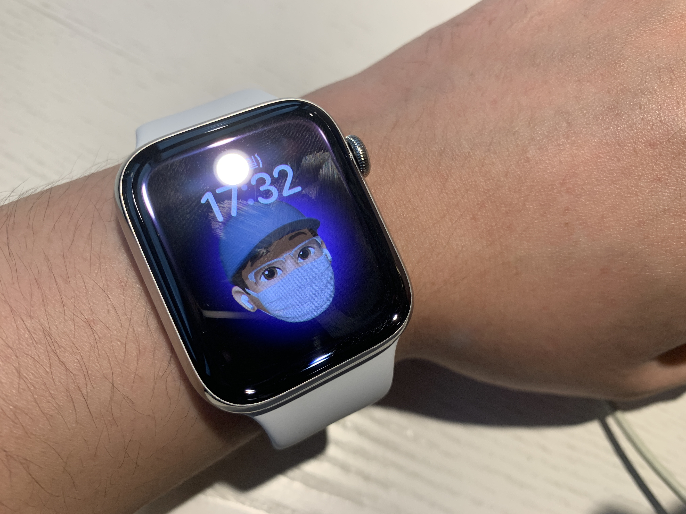

## 📆 5주차 (실질적으로는 4주차) 회고

비록 같이 하시는 다른 분들보다 속도는 늦을 수 있어도 매일 스스로 깨우쳐 간다는 것에 의의를 두며 학습하는 중이다.

오늘 하루는 리커전 에 대한 과제를 진행했다.
아직 더 진행해야 하지만 오늘 한 문제를 통과시켜서 뿌듯하다.

헬프 데스크 시스템은 정말 좋다고 생각한다.
옛날 옛적 중고등학교 학교 다닐 때 혹은 학원에서 뭔가 질문을 해야 한다면 선생님께 달려가지 않는가?

근데 교무실에 달려가 보니 질문할 학생들의 줄이 이만큼 길게 늘여져 있다.

오프라인 부트캠프의 단점은 그런게 아닐까 추측해 본다.
같이 함께 한다고 하지만 사실은 그게 더 비효율 적이겠다 라는 생각이 들었다.

코드스테이츠 헬프 데스크에 질문을 올리면 멋진 선생님들이 정성들인 답을 주신다.
물론 당연히 1 + 1 은 뭐에요? 이런 질문도 안되지만은 그렇다고 그게 2야 라고 알려주시지도 않는다.

난 헬프 데스크 의 질문과 답변의 방식이 너무 좋다.

그리고 페어 프로그래밍.

과정을 시작하기 전에는 그냥 혼자 하는게 낫지 않을까 생각했다.
그런데 내 경우에는 페어 프로그래밍을 통해 상대방의 관점을 배울 수 있어서 매우 좋았다.

물론 사람 마음이 다 자기 맘 같지 않기는 하다.
그치만 그건 나중에 개발자가 되어서도 여러 사람들과 협업을 할 텐데, 그 때를 위한 연습이 된다라고 하면 충분할 거 같다.

## ⌚︎글만 있음 심심하니까 애플워치 짤도 잇힝

## 🖌문제를 대하고 해결해 가는 과정

아직 과제를 다 하지는 않았지만 한 달 전의 나와 비교했을 때는 분명 확실히 달라진 나가 확실하다.

과제를 해결하려고 내가 굳이 의식적으로 신경을 쓰지 않아도 눈에 레이저가 쏴 지는 듯 하다.
그러다 보면 시간이 어느덧 훌쩍 훌쩍 가 있다.

코플잇이나 과제나 공통적인 것은 넘기 전에는 뭐랄까 참 높은 벽과 같다고 느껴진다.
그런데 그것을 해결 했을 때 두 손을 꽉 음켜쥐게 만드는 짜릿함이 있다.

레퍼런스를 거의 안보고 스스로 해결하려고 했다.
사람마다 스타일이 다르겠지만 붙잡고 늘어지면 풀리기는 하는 거 같다.

근데 답을 봐 버리면 상당히 찝찝 한 기분이 든다.

여튼 이것도 강약 조절이 필요하겠지만 말이다.

결론은 안 될때 한번 본거 또보고 두번하고 세번하고 네번하고 다섯번하면 되기는 된다.
그 끈을 놓지 않고 꾸준히 복습해야 또 새겨지기는 하지만 말이다.

## 🔪Hiring Assassin

무서운 암살자.. 다음주에 Hiring assessment 가 있다.
긴장의 끈이 아마도 남은 4달 5달 간 이어지겠지..

모두 잘 되었으면 좋겠다. 나도.
