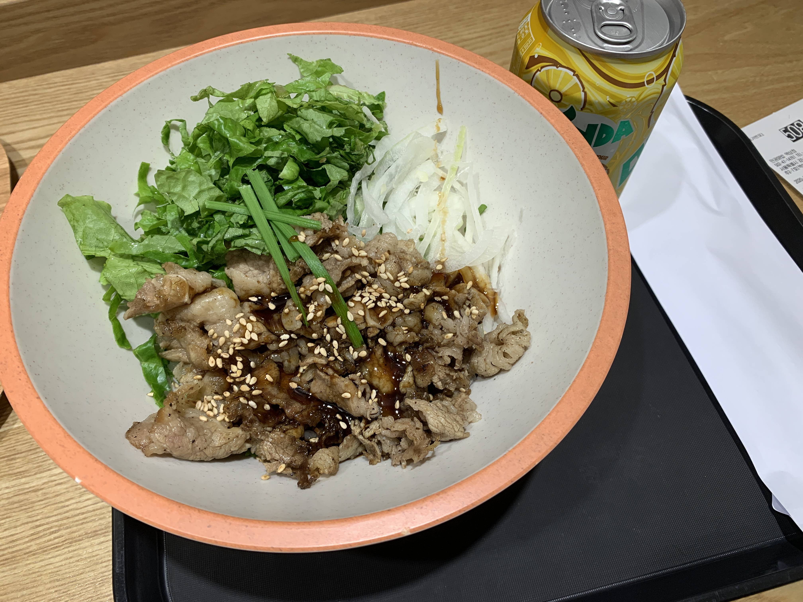

## 💤10:30 - 기상 및 씻기

어제 일이 있어 본가에 다녀왔다.
운전만 왔다갔다 하루를 다 쓴듯한 기분이였다.

어머니께 나주 배 좋은거로 사다드렸다.
모아둔 금액에서 곶감 빼먹듯 인출해서 쓰는 계좌로 이체 시켰는데 나를 위한 투자가 헛되지 않게 열심히 잘 하고 싶다.

그래서 여튼 늦게 일어났다..😱
하지만 시프티 출석은 알람을 맞춰 두어서 칼같이 누르고 잤다는..

## 🍳12:00 - 13:00 - 점심식사

지하 일층에 가면 먹을 곳이 있는데 주로 점심에 여기를 오는게 제일 나은 선택이고 교동짬뽕을 파는 곳이 있기는 한데 매콤한 것을 생각했는데 그렇지 않아 좀 그닥 이였다.

## 🌋13:00 - 15:00 - 리커전 과 그외 오피스아워

2시간이나 배정되어 있다니, 점심을 좀 빨리 먹고 자리를 잡았다.

현 시각 기준으로 리커전 과제 중 stringify.JSON 을 구현하는 과제 하나가 남아 있었다.
이 때, 어떻게 돌아가는 것인지 처음 보았다.

그리고 오피스아워 줌 링크로 접속했다.

어떤 부분이 다음 주 HA 에 등장할 거 같구나 라는 예상을 해 보면서 부족한 점을 떠올리게 할 수 있었던 시간이였고,
오후 세 시가 되어가기 직전 마지막으로 선생님께서 팁을 좀 주셨는데,

1. 매일 공부 열심히 하지만 하루는 크게 웃을 수 있는 뭔가 를 만들자.

2. 1137에 대해 한 시간, 하루, 삼일, 일주일 (에빙하우스 망각곡선)

3. 자기 직전에 뭔가 공부한거 보고 자면 좋다. (이건 실제로 그렇게 하는데 안되는 거 자꾸 떠올려서 꿈에 나온적도 있다.)

참조하면 좋을 사이트 : https://brunch.co.kr/@cholab/16

## 🛶15:00 - 18:00 - 리커전 stringifyJSON

오후 여섯시가 되어가기 약 10분전 객체인 조건을 제외하고는 배열 조건일 때 만족하는 코드를 작성했다.
재귀 함수를 사용하는데 작동되어서 뿌듯했다.

## 🍝18:00 - 19:00 - 저녁식사

교동짬뽕.
하지만 교동짬뽕 맛은 아니다.

## 😍19:00 - 23:00 - 리커전 stringifyJSON 완료

아 해결해 냈다. 테스트 케이스를 통과하고 초록색 체크박스가 뜨니 그동안 하면서 머리를 박박 긁어댔던게 만회가 되었다.

제출한 뒤 슬랙에 동기님이 추천해준 링크를 따라가서 깃허브 프로필 커스터 마이징을 해봤다.
