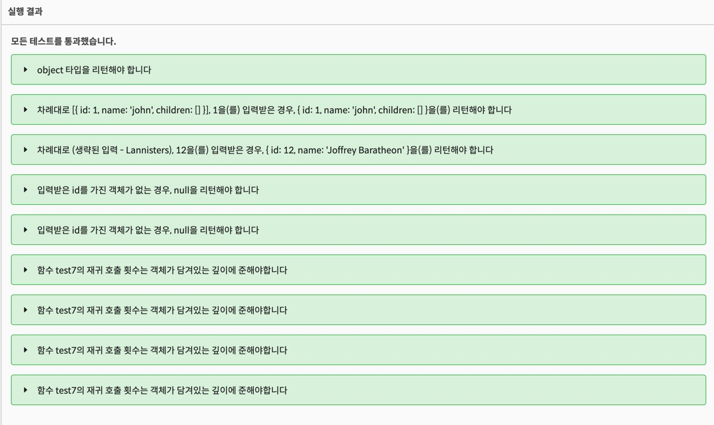

## 🍾11:00 - 일어나서 씻음

Hiring Assessment... A ㅏ ....
전날 밤 마음이 아파서 Al 로 시작하는 것을 오랜만에 마셨다.🍾

월요일날 시작해서 지금 시각은 목요일 0시 42분..

일단 쓰는김에 4주 회고를 같이 써보도록 한다.

## 📝Hiring Assessment

총 일곱 문제가 주어졌었는데, 월요일 오후 4시였나 그쯤 6번 문제까지 다 풀은 상태였다.
한 문제 풀고 커피타임 5-10분 하면서 풀었다.

7번 문제도 그렇게 보다보니 지금까지 왔다.

어떤 경우에 for 문을, 어떤 경우에 forEach 를 써야 하는지 좀 알거 같다.
forEach 는 내부에서 반복을 멈추고 나올 방법이 좀 애매하다.
또 재귀 함수를 그대로 실행하는지, 혹은 변수에 담았다가 적절한 상황 (truthy?) 일 때 리턴을 하게 한다든지 등등의 사항..들

기술적인 내용은 나중에 정리해 보기로 하고 일단 다 풀었지만 이제 내일부터 어떻게 공부를 할까.

첫번째로 언더바의 intersection.. 부터 다시 시작한다.
언더바 파트 투 마지막 아이들이 울고 있다.. 나 좀 살려주세요.. 라면서..
ㅇㅋ 내일 꼭 살려줄게 얘들아..

## 💻Pre-course 4주 회고

#### ⏱시작전 : 비자앙한 마음가짐.

뭐든 놓치지 않겠다는.. 근데 페어 프로그래밍이 진짜 도움이 될까? 혼자하는게 낫지 않나?

#### 🥰1주차 : 페어 프로그래밍의 시작.

오 뭔가 페어 프로그래밍이라는 신선한 방식이다. 시작 전에 느낀 생각과는 달랐다. 그리고 좀 어렵긴 했지만 못풀고 좌절할 만한 문제는 없었다. 페어님과 풀 때 내가 내비게이터 일 때는 내 화면으로 문제를 풀지 않았으므로, 페어 프로그래밍이 끝난 후 따로 혼자 쓱싹쓱싹 풀어보고 페어님께 요청한 같이 푼 코드와 비교해보는 식으로 학습하니 좋았다. 물론 스스로에게도 크으~ 하면서 혼자 으쓱? 도 해보고.

#### 🐣2주차 : 알고리즘, GIT, Scope & Closure, Koans, Testbuilder

지금 다시 보면 그 충격이 조금 덜하기는 하지만 그때 당시 알고리즘 문제라.. 생각하면 페어님과 나 모두 멘탈이 조금 나가지 않았던가.. 이게 뭐지..
GIT 의 경우에는 개츠비 블로그를 만드는걸 따라하면서 좀 익숙해서인지 이해하기가 수월했다.
스코프와 클로저는 처음보는 용어라 조금 당황해서 질문을 많이 올렸던 거 같다. 아마 다시 복습하면 좋을거 같다.
Koans 를 풀면서 스코프, 클로저에 대해 더 공부할 수 있었고 객체의 복사 얕은 복사, 깊은 복사 에 대해서도 얕은 복사에는 어디까지 만 변수가 바라보는 주소가 서로 같은지도 알게 되었다.
Testbuilder 는 제출은 했는데 지금 기억이 잘 안난다 ㅎㅎ

#### 👹3주차 : HTML, DOM, Twittler, 고차함수

페어 프로그래밍이 베리굿 남바완 이라는 것을 깨달은 3주차였다.
HTML 하면서 페어님과 함께 하다가 시간이 끝나고 바로 나혼자 따로 뚝딱뚝딱 만드는게 너무 재밌었다.
물론 다음날 DOM 하면서 살짝 흔들리긴 했는데, 페어님과 멋진 동기님들의 지원사격으로 난 이해할 수 있었고 과제도 제출하는 쾌감을 맛보았다.

그런데 3주차 금요일에 처음으로 멘탈이 나갔고, 페어님이 쉽게 설명해주시려 노력하는 것 같았지만 난 하나도 모르겠어서 그날 일찍 집에 들어와서 혼자 속상해했다.
슬퍼했다. 이슈 쉐어링을 처음으로 남겨 보았다.

그 주 일요일날 난 다시 새로워졌다. 물음표가 아닌 느낌표로 새로워 졌다.
https://dev-seolleung2.netlify.app/development/Array_function_for_HOF/

#### 🦑4주차 : Underbar, 추석

전날 공부한 고차함수가 빛을 발했다.
월요일에 파트1 을 다 풀었는데 전 주 금요일과 사뭇 달랐다. 진정한 상호 페어 프로그래밍을 맛볼 수 있었다.
하지만 다음 날 파트2는 페어님이 멱살잡고 끌고 가주셨다.
현재 혼자 언더바 파트 2 교집합 전까지는 내가 혼자 스스로 풀어낸 상태이다.

그리고 추석. 이틀 쉬고 올라왔다.
오랜만에 내가 좋아하는 와인 소고기.. 부모님께 너무 감사하다.
나중에 부모님 더 멋진 집에서 살게 해드리고 싶다.

#### 🌊5주차 : Recursion, 재귀함수

페어님과 재귀함수 코플잇까지는 함께 풀었지만 그 이후 과제는 각자 풀기로 했다.
1 ~ 4주차 까지 느꼈지만 헬프 데스크 시스템이 정말 좋다고 생각했다.
선생님들께서 내가 스스로 해결할 수 있게 도움을 주신다.

재귀 과제는 트위틀러 다음으로 재미있었다. 언더바 파트 2가 제일 무섭ㄷ..

#### 📜6주차 : Hiring Assessment

월요일 이 되기 전 걱정을 많이 했다. 뭔가 슬랙에 선생님께서는 시험 테스트가 아니라 자신을 진단하는 과정이라 하셨지만은 한국인 특성상 시험?같은 거라면 뭔가 불타오르는? 게 있지 않는가.
이걸 못 풀면 안될 것만 같은 그런거..?

문제를 다 풀어냈지만은 한편으로 내가 무엇이 부족한지 지금까지 공부하면서 느낀 것을 보완해 나가고자 남은 4일을 잘 사용해야 겠다.
이머시브 코스는 이거보다 훠얼씬 어렵다는데 어렵지만 재밌는 과정이였으면 하는 소망이 있다.

## 막짤은.. 손에땀이 많아 생긴 키보드 자국..😭

# ✋✋✋✋✋
