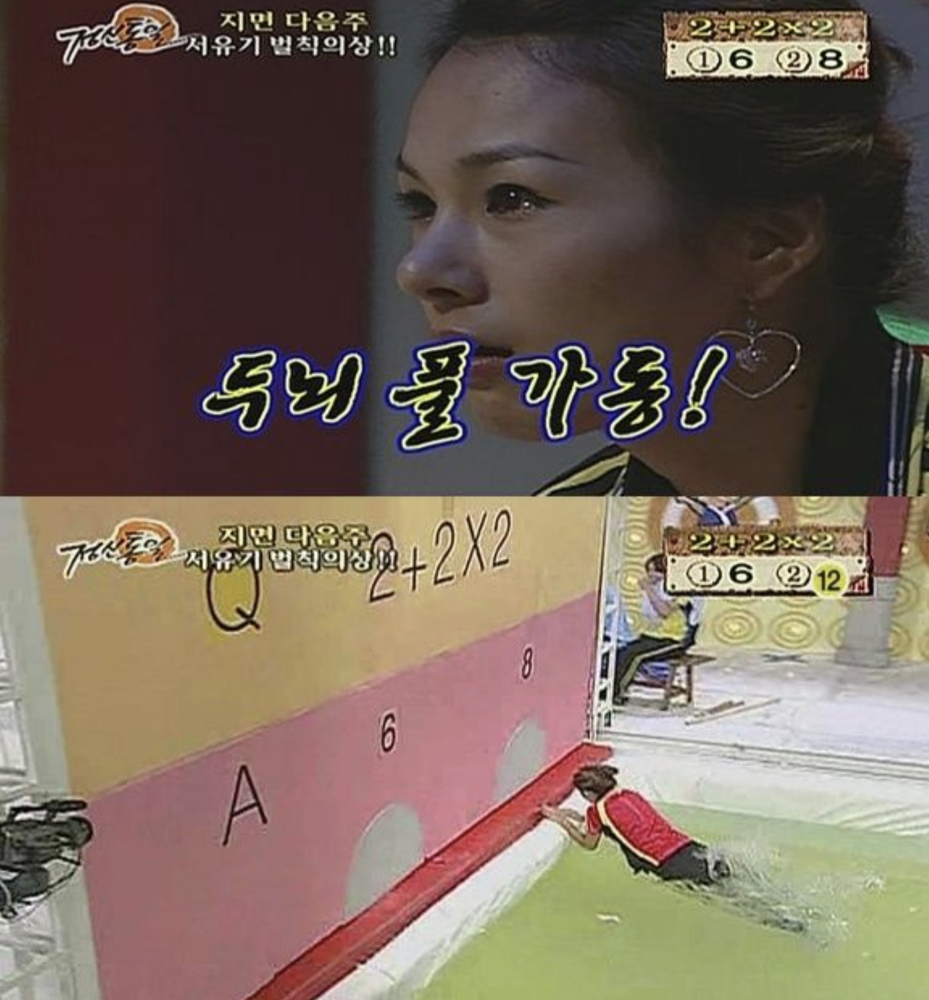

갑자기 자바스크립트라는 코딩의 세계에 빠져든 나.


대략 이런 느낌이다. 어리둥절..

## 🛀07:50 - 기상 및 씻기

과정을 시작하기 전에는 혼자 막 유튜브 보고 혼자 낄낄 대다가 잠이 오지 않아서 폰 만지작 거리다가 새벽 4-5 시에 잠들고 오전 11시 쯤 일어나서 점심을 먹었다고 하면, 지금 현 상태로 말하자면 침대에 누워서 눈만 감으면 바로 꿈나라 워프 게이트가 열린다.

그래서인가 7시, 7시 15분에 알람을 맞춰 놓고 아침에 울리면 아 좀만더 좀만더 자야지 하다가 여덟시가 임박해오면서 위기의식에 일어나게 된다.

## 👟08:20 - 학습 장소로 이동

아침 한정으로 파는 삼각김밥 (주먹밥사이즈다) 2개를 사고, 근처의 공유 오피스로 향한다.
참고로 공유 오피스는 금액을 선결제 하고 일정 기간 계약을 해 놓았다. 아주 쾌적하다.

## 💡09:00 - 11:00 - 페어프로그래밍 객체

페어님과 함께 코플잇 객체 부분을 풀었다.
2문제 정도 남았는데 약정한 시간이 끝났다.

내가 푸는 방식, 페어 님이 푸는 문제 해결 과정을 서로 비교해보고 생각해보는 과정에서 도움이 많이 된다는걸 느끼고 있다.
그리고 나도 모르게 상대방의 발언을 멈추게 하는 것 같다고 스스로 느꼈다.
드라이버와 네비게이터의 역할을 잘 숙지해서 차근차근 상대가 편하게 자기 생각을 할 수 있게 하고 싶다.

수학의 정석도 앞에 애기 문제 들은 설명 읽고 바로 풀리지만 연습문제에서 어려움을 겪듯이,
코딩 문제도 이론과 문제의 난이도 격차가 크다 라는 것을 느꼈다.

그런데 어떻게 억지로 꾸역꾸역 풀어 지기는 한다.
레퍼런스를 보면 실력이 안는다고 생각해서 답을 최대한 안보고 해결하고 있다.

원금이 2배 이상 되는데 걸리는 시간을 구하라고 해서 도대체 어떻게 해야 되나 싶다가 72의 법칙이라는 게 있다 라는 걸 검색을 통해 알게 되었다.

https://blog.toss.im/2019/10/31/money/life/compound-interest/

사이트 글의 제목은 내 돈이 2배가 되기까지 걸리는 시간을 계산하기 위한 계산법, ‘72법칙’ 인데

내 원금이 2배가 되기까지 걸리는 시간이 되려나 싶어서 72를 이자율로 나눈걸 소수점 내림 해 버렸다.

풀라고 하면 아래 코드처럼 72의 법칙으로 강제로 푸는 것도 시도하니 되기는 된다.

ㅎㅎㅎ;

```js
function computeWhenDouble(interestRate) {
  if (interestRate === 1) {
    return 70
  } else if (interestRate === 2.3) {
    return 31
  }
  let result = Math.ceil(72 / interestRate)
  return result
}
```

## 🚀11:00 - 12:00 - 오피스 아워

객체에 대해 다시 한번 엔지니어 님께서 리뷰 해주셨다.
뭔가 이렇게 아는지 모르는지 애매한 사항을 잘 정리 해주셔서 보고 아 이렇구나 다시 이해를 다지는데 도움이 많이 된다고 생각했다.

모르는 내용도 집중해서 보고, 혹시나 아는 내용은 더 집중해서 보고..

배가 고파진다.

## 🍱12:00 - Lunch Time

드링킹 레몬라임수..

## 📝13:00 - 14:00 - 알고리즘 푸는 아이디어, 알아보기 쉬운 코드 작성법 lesson

## 😱14:00 - 19:00 - 페어 프로그래밍, 알고리즘



대략 이런 느낌이다.
뇌에 과부하가 걸려 퓨즈가 나갈랑 말랑 한다.

슬랙으로 공지 메세지 뜨는 거 보고 여섯시 라는 걸 알았다.

## 🍎19:30 - 애플스토어 아이패드 프로 수령

종이 노트에 쓰다보니까 중구난방 정리가 안되어서 데리고 왔다.

## 📅1주차 회고

당장 배운거 머리에 넣기에도 바빠서 예습은 상상도 못한다. 매일 새로운 정보가 머릿속에 주입되는 느낌인데, 어제 배웠던 뭔가 기억은 안나는데 문제에 써먹으면 될거같은데? 그런 느낌 이 뇌리를 스치기도 한다.

처음에 코드스테이츠를 떠올리며 느꼈던 생각은 인터넷 강의 같은 시스템을 떠올렸는데 전혀 아니였다.

생면부지인 페어님과 문제 해결을 위해 으쌰으쌰 하는 과정도, 그 안에 내가 빠져들어서 내가 말을 우스꽝 스럽게 하든 전혀 1도 신경 안쓰게 되고 가나다 밖에 모르는데 갑자기 어떻게 어떻게 강제로라도 스스로 해결해 보면서 뿌듯함도 느끼게 되고 아직 코알못이지만 뭔가 스파르타 느낌이 나쁘지는 않다.

주말 시간을 이용해서 공부했던 거 문제 풀 때 어떤 사고로 했는지 이 때 알게 된 문법 코드는 뭐뭐가 있었는지 블로그에 정리도 하고 복습도 잘 하고 !

주말은 11시에 일어나보자 ㅠㅠ 으워.. 일주일을 해낸 나에게도 박수를..
