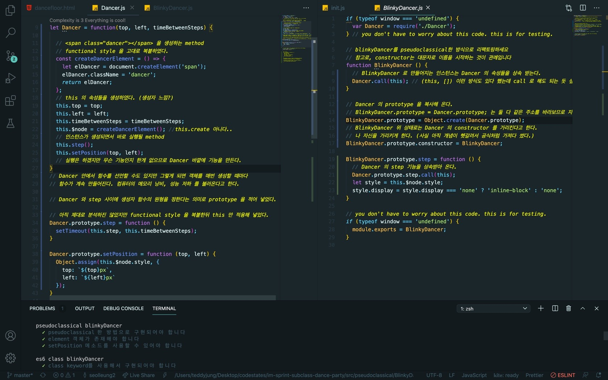

## 🤔오늘의 몇 줄 요약

#### 1. Inheritance Patterns

50여분짜리 영상이였는데 잘 이해가 되지 않았다. 대략적으로 아 이렇구나 하다 보니 새로운 페어님과의 첫 페어 프로그래밍 시작이였다.

#### 2. BeesBeesBees

BeesBeesBees 스프린트를 통해 es6, pseudoclassical 한 방식으로 클래스를 구현하고 상속을 하는 법에 대해 익혔다.

오피스 아워에서 정확히 내가 뭘 모르는지 짚어주는 거 같았지만 느낌 적으로만 이해하려 했고 그렇게 또 다음 스프린트로 넘어갔다..

#### 3. Subclass Dance Party

줌을 켜놓고 춤추는 것인줄 알았다.

난 코드 한 줄도 제대로 쓰지 못했고 페어님도 함께 멘붕을 겪다가 오후 여섯시가 되었다.

#### 4. 반 배정 동기 분들과 줌 미팅

시험이라는 단어는 정말 무섭게 만든다.. 으으.. 나의 종특.. 한국의 종특..

#### 5. Subclass Dance Party 절반 클리어

pseudoclassical 한 방법에 대해 고민하다가 이걸 현재 듣고 정리하던 영상을 다 보고 풀까 하다가,

어느 세월에 강의 다 볼거 보고 하나 싶어서 그냥 아는 지식 한도 내에서 절반은 이해하고 절반은 때려맞추기? 식으로 해서

pseudoclassical 한 방법 에 대한 구현을 마쳤다.

functional method 가 구현되어 있었기에 그대로 갖다 썼을 뿐 내가 잘 이해해서 한 게 아니란 걸 잘 안다.

그러므로.

## 🎖해결책

1. 보던 강의를 내일 혹은 주말에 다 보고 블로그 정리 한다.

2. 문제가 새롭게 보이면 장땡. 아니면 다시 고민의 나락으로..

내일도 Cheers..

