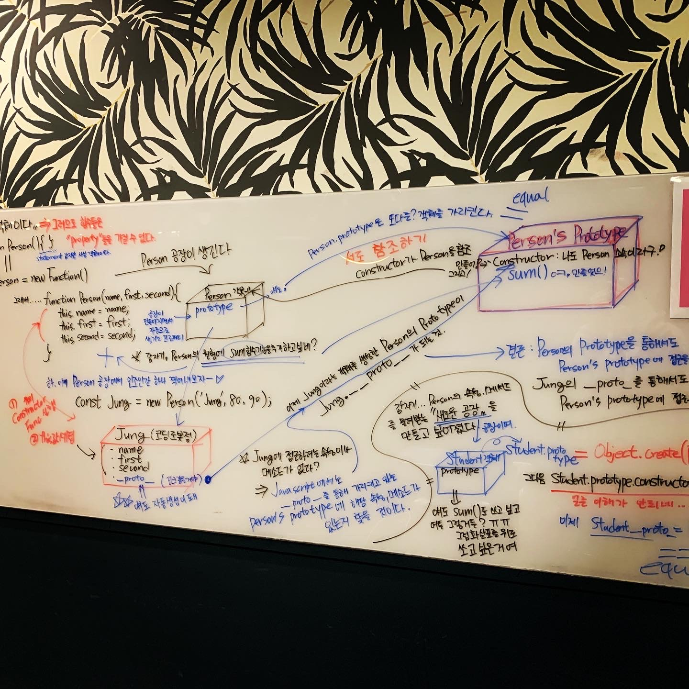

## 🍠오늘의 몇 줄 요약

NQueens.. 문제 너무 어렵다..

열정적으로 임하는 페어님을 보면서 나도 힘이 난다.

이번 스프린트는 절반의 성공 같은 느낌이다.

solvers.js 에 퀸 문제는 전혀 손도 못댔다.

하지만 solvers.js 에 findNRooksSolution 부분은 나의 방법 하나, 페어님 방법 하나 이렇게 총 두가지 방법을 터득하였다.

나는 이중 포문으로 간단하게 끝냈다 하면 페어님은 재귀적인 문제 해결을 구사해 내는 세련된 방식 이였다.

이 다음으로는 도저히 머리를 짜낼 수 없었고..

거의 과정 시작한지 두번째로 (첫번쨰는 아마 그 pre course 배열 함수 할 때) 일찍 집에 들어왔다.

하나 잡으면 놓지 못하는 성격인데.. 내가 굴복?하는 느낌이 들어서 속상하다.

내일 시험 이 걱정되지만은 그냥 제대로 깨진 뒤 남은 솔로위크를 열심히 공부해야겠다는 마음뿐이다.

나는 즐겁고 재밌게 하고 있다.

어렵지만 다음날 다시 보았을 때 스스로 보고 싶게 만드는 재미를 길들인다.

스스로 알게 된 내용을 칠판에 휘갈겨 쓰면서 이해한 다는 것을 느낄 때 재미있다.

매일 무한 도전의 연속이고 매번 가파른 산을 오르는 느낌이지만 더 좋은 것을 위해 내가 맞닥뜨려야 하는 귀중한 순간이라고 여기고 있다.
