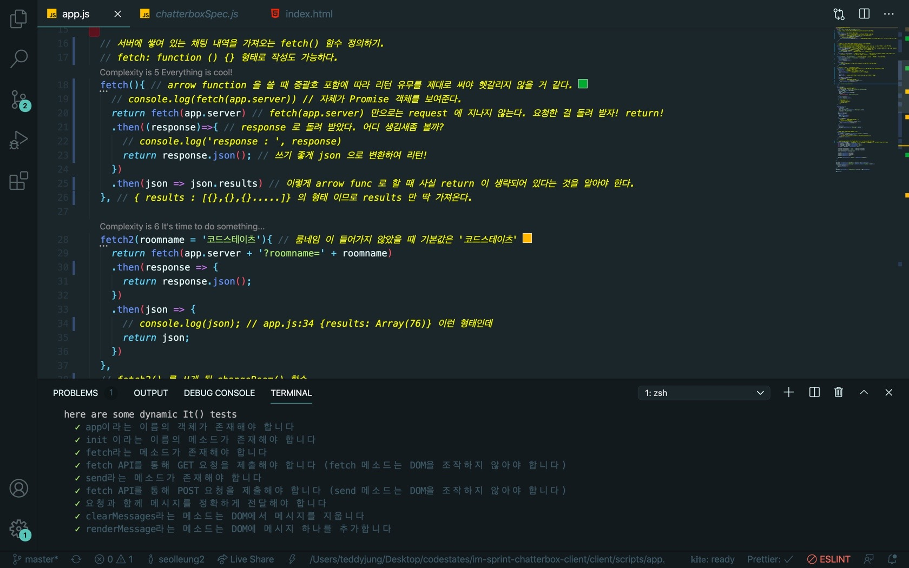
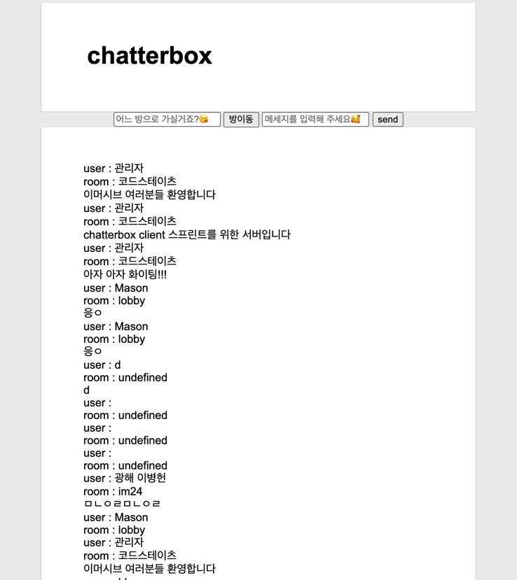
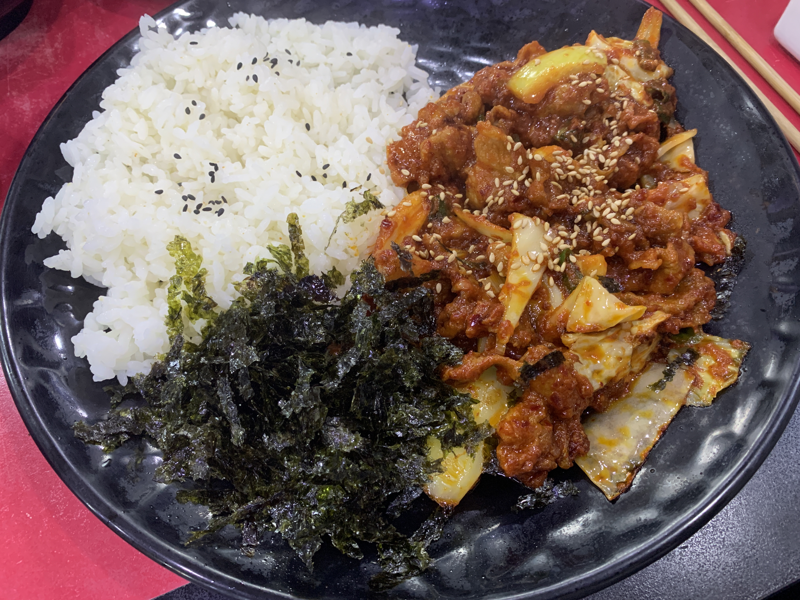

## 👨🏻‍오늘의 몇줄 요약

chatterbox 스프린트를 마무리짓는 하루지만 난 현재도 하고 있다.

제출을 다 했는데 코드를 리팩토링 하기 위해 처음부터 다시 주석을 싹 달아보다가,

몇 가지 재미있는 기능을 추가 해야겠다 라는 생각이 들었다.

페어님과의 페어 프로그래밍에서 우리는 이미 키보드 이벤트를 추가했다.

버튼을 누르지 않고도 Enter 키를 치면 메시지 초기화와 동시에 전송이 되고 브라우저에 바로 찍힌다.

방 카테고리를 어떻게 정할까 고민하다가 아무래도 방 이름이 워낙 다양할 것 같아서

페어님과 버튼만 가지고 구현해 놓은 것을 현재 수정해 보고 있다.

유어클래스 이미지에 나온 방식 보다는 input 과 버튼을 사용하는게 나을 거 같아서 시도해 보고 있는데 재미있다.

김밥집에서 파는 제육 덮밥에 제대로 꽃혀 버렸다.

사진 투척 그럼 오늘의 나 고행했어!!

