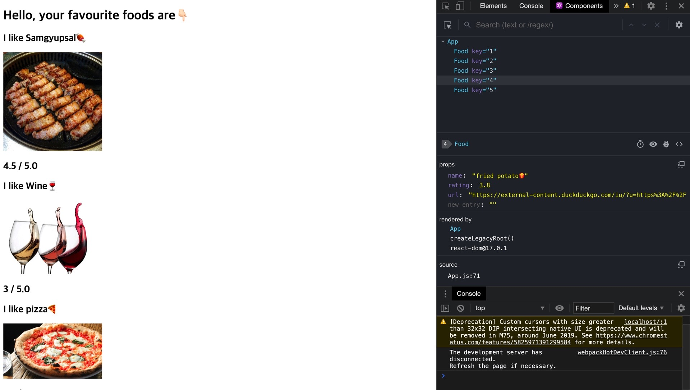

## 👩🏻‍🦳오늘의 몇줄 요약

서버 에서 데이터를 가져오는 fetch 에서 부터.. 이번 주에 생전 처음 접한 아토믹 스러운 로고의 react library 까지.

코드스테이츠에서 내 입에 찹쌀떡을 한 개씩 집어넣고 있는데,

👦🏻나 : 어읔..읔... 찹쌀떡.. 배불러요.. 천천히..

👩🏻‍💼코드스테이츠 : 괜찮아요 잘할 수 있어요.

👦🏻나 : 찹쌀떡 .. 아직 소화 덜 되었어요.. 좀만 천천히 먹음 안대여?ㅠ..

👩🏻‍💼코드스테이츠 : 괜찮아요 잘할 수 있어요.

👦🏻나 : 네.. 근데 소화가 안되어서 더 못먹겠어여 ㅠㅠ

👩🏻‍💼코드스테이츠 : 괜찮아요 토하고 다시 찹쌀떡 아~~ 해보세요. 들어간다~

여튼 힘겹게 소화를 시도하고 있다.

뭔가 배우고 만드는 데 있어 중요한 건 수능 공부하듯이 필기하는 게 정답은 아니다 라는 느낌이 닿았던 한 주였다.

늦게 자고 컨디션 miss 나게 하지 않고 차라리 일찍 자고(?) 제 때 일어나서 할 수 있게 리듬을 되찾아야 겠다.

그리고 먹는 거로 대입해서 자꾸 공부하니까 배도 고파지면서 학습 능률이 오르는 거 같다.

