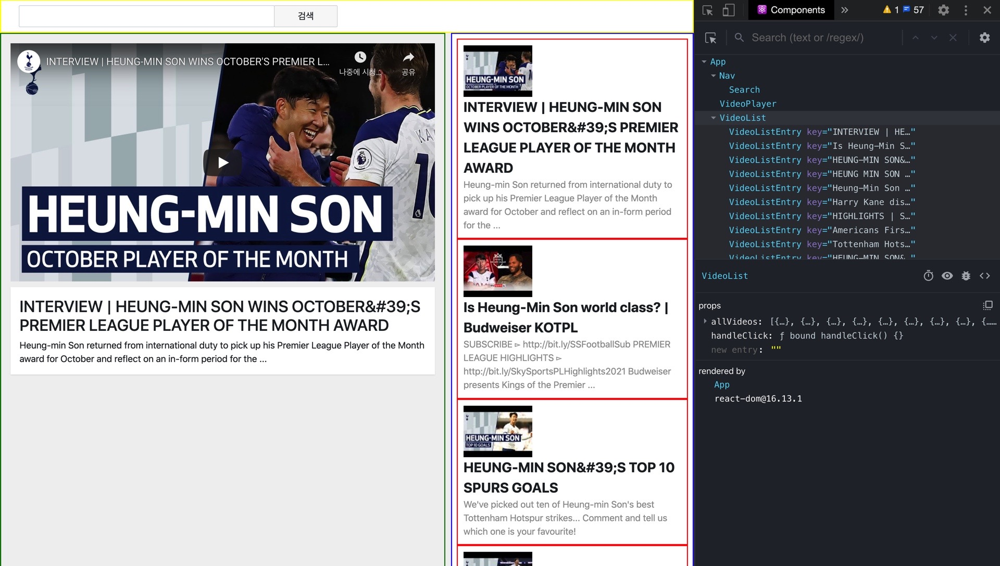

## 👀오늘의 몇줄 요약

recast.ly (유튜브 만들기 sprint) 과제.. 어렵다..

금요일 페어님이 알려주셨던 것들을 떠올려가며 과제 repo 를 별도의 prac 디렉토리로 클론해와서 혼자 다시 처음부터 진행해 봤다.

어제는 노마드 코더의 react 기초 강의를 듣고 뭔가를 만들어봤다.

조금 느낌이 오는가 싶었는데..

유튜브 API 를 보고 어떻게 내가 그 해당 정보를 가져올까 를 생각해 낸다는 것이 어렵다.

하지만 헬프 데스크 글들 찾아 보면서 어찌어찌 오기는 했다.

잘 해야 될텐데..

