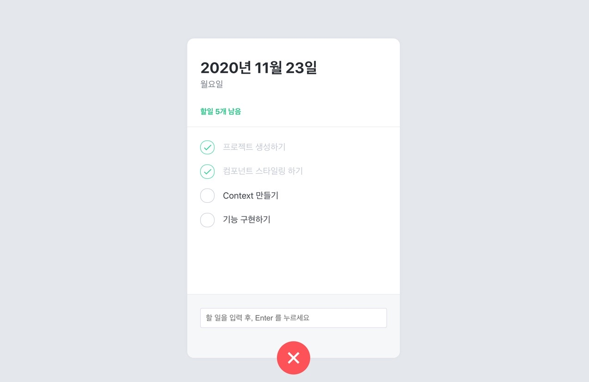

## 👨🏿‍🌾오늘의 몇줄 요약

recast.ly 스프린트를 제출했다.

뭔가 이론 글은 한없이 어렵기만 한데 막상 다 걷어차고 해보니 그래도 어렵긴 하지만 작동이 되었을 때 그 느낌이 아주 좋다.

추가로 버튼 클릭 뿐만 아니라 검색어를 입력하고 Enter 를 치면 바로 get 요청으로 가저오는 키보드 이벤트 함수도 적용해 보고 페어님께 알려 드렸다.

전반적으로 페어님께 많이 배웠던 스프린트 였던 거 같다.

외부 API 를 다른 거 연결 해서 해볼랬는데 일단 너무 앞서 가지 말고 했던 거 계속 반복해야겠다.

추가로 todolist 를 만들어 보는 걸 시도하고 있다.

css 를 특이한 방식으로 사용해 나가는 튜토리얼 을 보면서 진행하고 있는데 일단 한 바퀴 정주행 하고 또 보면 시야가 달라질 거 같다.

절대 처음부터 세세히 하나 하나 깊이 파고들지 않는다.

원래 이런성격 아닌데 그냥 세상 털털 모드가 될 것이다.

