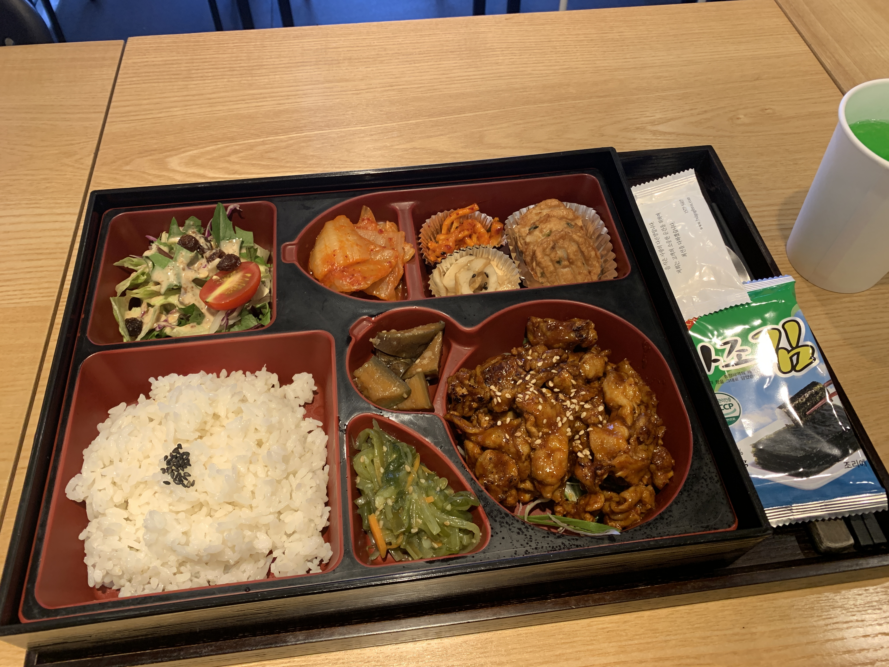

## 🛀08:00 - 기상 및 씻기

넘 졸려서 8시가 되어 씻게 되었다.

## 👟08:40 - 학습 장소 도착

여전히 코플잇 문제에 대한 집착과 미련이 남아 있는 상태이다.

코플잇 반복문 마지막부터 4문제 (이중 for 문과 관련이 있다..)
객체 한 열문제 가량 (페어와 풀었는데 이 때 내가 네비게이터 역할이여서 제출 안한 상태)
헬고리즘..

아주 듬성듬성 블랙홀이 난무하다.

## 💡09:00 - 10:00 - 개발자 도구 설치

- vscode 와 git 을 설치

- 코스 시작하기 전에 노마드 코더 보면서 미리 깔았었다.

## 🖥10:00 - 11:00 - Command Line 학습

이건 마치 어렸을 적 집에 컴퓨터가 없어가지고 (그래도 중학교 때 현주컴퓨터라는 브랜드 피씨를 부모님이 사주시기는 했다.. 이걸로 브루드워..를) 친구네 집에 가서 마치 내것인양 키보드를 두들기며 도스 게임을 했던 때가 떠오르는데...

그 때 명령어 비슷한 뉘앙스 같다는 느낌?

그리고 lesson 퀴즈에서 드라이버님의 터미널 화면은 사과가 있고 컴퓨터 정보가 한눈에 나와있길래 나도 따라해보자 싶어서, brew 라는 것을 설치해 봤고 여기서 brew install neofetch 하고 neofetch 쓰니까 설치가 되드라 하하..

## 🙇🏻‍♂️11:00 - 12:00 - Git 학습

약간 대략 감으로 얼렁뚱땅 하게 인지하고 있던 내용을 좀 더 확실히 알게 되었던 거 같다.

https://rogerdudler.github.io/git-guide/index.ko.html

여기 사이트에서 좀 더 보며 보완해 보았다.

## 👝12:00 - 13:00 - 오전 배운 내용 블로그 정리

## 🌈13:00 - 15:00 - Scope lesson

이해가 될 듯 말 듯 어려워 졌다. 그래도 스코프 까지는 최대한 이해해 보려고 하니 나쁘진 않았다.

## 📝15:00 - 16:00 - Socrative Checkpoint Scope

10문제 풀었는데 앞에 3번째 문제 였나 를 제외하고는 맞추기는 했다.

## 😱16:00 - 17:00 - Closure lesson

이게 무슨 내용이지.. 멍..
생각해보니 지금 여기서 객체 지향 레슨 영상도 같이 봤다..

이건 더욱 뭔소린지 모르겠다.

## ⏰17:00 - 18:00 - Socrative Checkpoint Closure

제대로 이해하지 못하는 느낌을 받아서 문제를 풀고 (4문제 였나) 아무튼 시간이 남아 다시 강의를 들었다.

## 🍱18:00 - 19:00 - 저녁식사 타임

복습 장소를 옮기고자 이동을 하다가 코엑스 몰을 발견하게 되고 그 안에 있는 도시락집에서 매콤제육 인가를 먹었다.

오 좀 든든해졌다.

## 🖌20:00 - 22:30 복습용 블로그 작성하기

스코프에 대한 복습 블로그 를 작성했다.

그리고 클로저 학습은 영상을 다시 보면서 노트에 정리를 하고 실행해 보았다.
약간 느낌이 오는 거 같기도 하다.

## 🤪남은 것

- 클로저 학습한 거 복습 블로그 작성하기
- 내일 아침 오피스아워 시간에 뭐 물어 볼지 생각하기
- 코플잇 반복문 마지막 4문제 해결 시도하기 (이거 다하면 객체 남은거 시도하기)

1주차에 진행한 문법 배운 사항 블로그 정리 및 헬고리즘은 일단 잠시 빼둔다.

계속 밀리면 밀림으로 인해 고통받을 거 같은 느낌이 든다.
