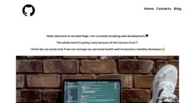

## 🛀08:05 - 기상 및 씻기

눈이 무겁지만 씻고 나갈 준비를 한다.

## 🙇🏻‍♂️09:00 - 10:30 - Lesson HTML

html 은 생활 코딩으로 처음에 접해본 기억이 있어서 크게 부담감 없이 여러 영상을 보고 노트에 필기해 보고 따라 해 보면서 진행했다.

주의 깊게 본 것은 semantic tag 에 대해 찾아보니 main, article, section, nav, header, footer 등의 태그들이 있었다.

뭐랄까 html 문서를 만든다고 div 나 span 으로 도배하다 시피 하는 경우가 있는데, 그렇게 되면 html 의 코드를 볼 때 어디서부터가 시작이고 본문인지 구조를 파악하기 힘들다.

그럴 때 div 와 같은 기능을 하지만 태그 자체가 의미를 가지고 있어서 사용했을 때 아 메뉴바 부분이구나, 본문이구나를 알 수 있게 해주기 위함이라는 것 같다.

html 은 태그가 무척 많지만 일일이 하나하나 다 외울 필요는 없다고 한다. 하지만 많이 쓰는 것 정도는 알아놔야겠지. 많이 몰라서 문제이지만..

그리고 나중에 input, button, textarea 등은 웹이나 앱에서 많이 쓰인다고 했다.

## 😱09:30 - 12:00 - Lesson CSS

셀렉터 까지는 고개를 끄덕이면서 영상을 봤는데 슬라이드 말미에 Learn Yourself 라고 나온 레이아웃이나 박스 모델 등은 뭔가 딱 봐도 어려워 보였다.

마진, 디스플레이 요소, 패딩, 플렉스, 포지션.. 등등..

## 🤔13:00 - 14:00 - 프론트엔드 개발 WorkFlow

HTML 로 웹, 앱의 구조 잡기라는 주제를 통해 목업 폰의 예시를 들어 만들고자 하려는 웹 페이지를 큰 틀에서 영역을 나누고,
각 영역을 태그로 표현하는 방법에 대해 학습했다.

## 😭14:00 - 17:00 - Profile 웹 페이지 HTML 문서 만들기

시간이 빨리 갔던 거 같다. 하지만 몇개 할 수 있는 게 없었다.

대체 css 에서 모든 요소를 어떻게 가운데 정렬을 할 수 있단 말인가. 찾아보니 margin 0 auto 했는데도 안되고.. 저 리스트 모음을 오른쪽으로 어케어케 해서 저 맨 끝으로 넣고 싶은데..

li 태그에 있는 점은 어떻게 지우고..

구글에 그냥 한글로 다 검색해서 해봤다.

지금은 한숨짓는 수준이지만 더 잘 할 수 있을 거다. 부족한 만큼 학습을 해야겠다는 마음이 생겨 버리니까.

## 🖌17:00 - 18:00 - 오피스아워

오늘 자습의 시간이 많았다. 그래서 그 학습한 사항들을 한 번 정리해 주는 시간이 되었다.

오늘 하루로 인해서 html css 를 다 알았다. 라고 말할 수 있음 좋겠지만 절대 그렇지는 않고 다만 아 이런게 있구나 정도 이해했다.

## 🐛19:00 - 자습

html, css를 어떻게 하면 더 효과적으로 공부할까 고민 하고 있다.
슬랙에 많은 분들이 좋은 자료를 공유해주셔서 그걸로 참고해 보아야 겠다.

그리고 드디어 점심시간에 반복문 18번 문제를 해결했다.
헬프데스크에 다 작동되는데 25, 35 ... 만 안된다고 질문을 올렸었는데 한 번 더 생각할 기회를 주셨다.

그리고 해결했다. 레퍼런스 코드와는 완전히 다르기도 하고 이 문제로 수 시간 이상 쓴 것이 미련하기도 하지만 그래도 너무 기분이 좋았다.
