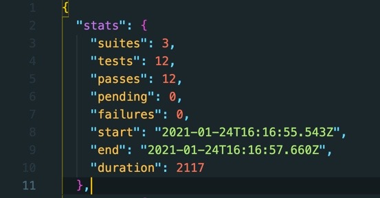
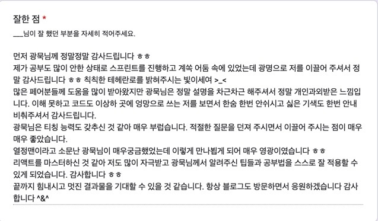
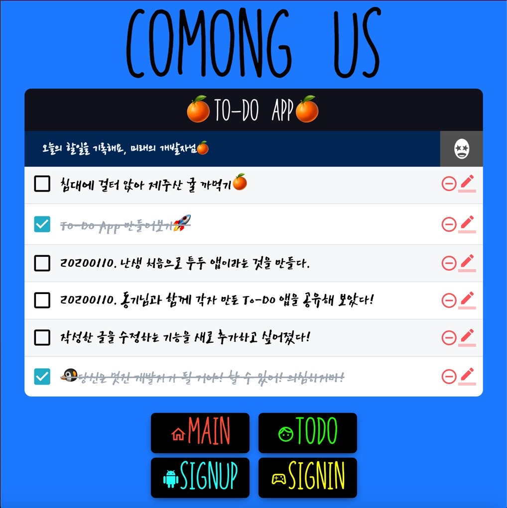
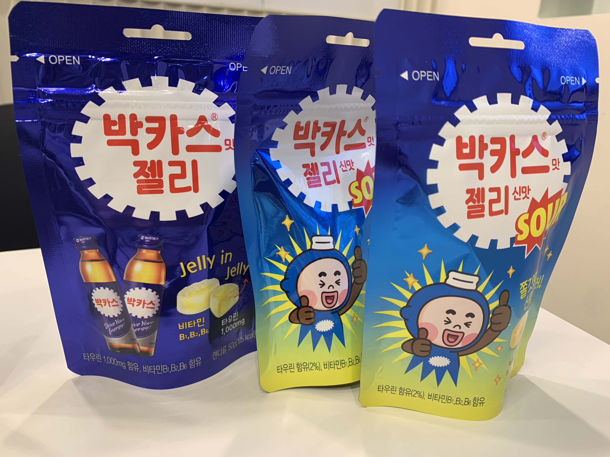

## 🐝Keep 꼬잉

2020년 12월 17일에 마지막 HA 를 시도해보고서 남긴 아래의 링크이다.

https://dev-seolleung2.netlify.app/CodeStates%20TIL/Day%20102%20DevLog%20(Thu)/

전날 일요일을 돌아보자면 저번주 인증과 관련된 토큰 과 관련해서 씨름끝에 스프린트 과제를 제출해 내는데 성공했다.

아니 왜 테스트 케이스가 통과가 아니 되는 것인가? 정상적으로 서버에서 데이터를 받아오는데 말이지...

테스트 케이스가 통과되지 않았다고 아 테스트 케이스 이상하게 만들어 놓았어 라며 푸념하지 않고 여유롭게 하지만 끈질기게 찾아 내보았다.

테스트 케이스를 통과시키고 npm run submit 을 한 뒤에 생성되는 report.json 을 확인해보니 duration 이 2천번? 을 넘었는데 보고 놀랐다.

그리고 당장 HA 가 내일인데.. 시험을 위한 나름의 공부가 부족한 듯 하여 새벽 네시까지 키보드를 만지작 만지작 거렸다.

그리고 오늘 아침 아홉시에 나는 다시 12월 14일 월요일로 타임머신을 타고 날아갔다.

## 🐝HA 제출

왜 그 때는 너무나 어려워서 눈앞이 어두워지는 경험을 했을까?

12월의 HA 는 나에게 너무나 무서운 존재로 느껴져서 그야말로 낫 놓고 기역자도 몰랐었던 거 같았는데,

지금 다시 보니 문제가 (쉽진 않았지만) 조금 귀엽게 느껴졌다.

조기에 HA 문제를 해결하고 제출했는데 이 기억 또한 남겨야 겠기에 블로그를 작성하게 되었다.

## 🐝Immersive 회고

### 1. 토이 알고리즘

24기에서 25기로 기수 이동을 하게 되면서 그 때 당시에는 내가 부족한 부분을 어떻게 어떻게 개선하겠다 하면서 생각했었는데,

좋은 부분도 있지만 잘 지켜지지 않았던 부분도 있다.

그것은 바로.. Toy Problem 인데..

그 안하는 습관을 깨고자 최근 나와 페어를 재밌게 진행하신 분과 둘이서 깃허브에 올려진 자바스크립트 알고리즘을 매일 하나씩 노션에 블로깅을 진행하고 있다.

하지만 이 또한 토이 프로블럼 과 비교해 난이도가 극악으로 올라갈 것 같다.

뭔가 문법이 부족해서 다시 처음부터 책을 훑어보고서 알고리즘을 풀어야 할까? 이거이거 또 백투더처음 병이 도지기 시작한다..!

### 2. 페어 프로그래밍

24기 때는 그래도 다들 슬랙 제너럴에서 안부도 묻고 해서 어색함이 없었는데, 아무래도 기수이동을 한 만큼 내가 좀 다가가야 겠다는 생각을 했다.

아 물론 지금도 앞에서 나서서 말하고 그러는 것을 상당히 부끄러워 한다.

하지만 일단 페어 하는 분이 정해지고 나면 나는 온전히 그 페어님에게 정신을 집중하려고 노력했다.

대부분의 페어님 들은 네비게이터 역할보다는 자신의 화면을 공유하며 진행하는 드라이버 역할을 선호하시는 거 같았다.

이전 기수에서 내가 드라이버를 한 적이 있었는데 네비게이터 입장인 페어가 내 화면을 보면서 같이 해결하려 하기 보다 자신의 화면에만 집중하는 것 같았기에,

그걸 느낀 후 차라리 그럴 바에야 내가 네비게이터를 하겠다 라는 마인드로 바뀌었다.

그렇게 하고 나면 내가 fork 및 clone 한 디렉토리는 아주 깨끗 하므로 저녁 먹고 이제 또 나름 혼자 다시 진행한다.

이게 내 학습 효율을 배로 높여 버리는 결과가 되어 버렸다.

그리고 좋은 분들을 많이 알게 되었고 페어 리뷰가 독서 감상문 급으로 길게 정성들여 작성해 주신 분들 에게도 너무나 감사했다.

좋은 분들과 가까워져서 너무나 기분이 좋다. 무엇보다 좋은 분들과 페어 프로그래밍 이라는 경험은 앞으로 정말 좋은 자산이 될 거라 생각한다.

그리고 앞으로 나는 누가 소문내지 않아도 알아서 자연히 좋은 향기가 나는 사람이 되고 싶다.

### 3. 코몽어스

그 때 다짐했었다. 매일 배운 것을 하나씩 내 작업물에 녹여 보겠다고.

이번주 내로 죽이 되든 밥이되든 무조건 배포까지 시켜 놓는 것이 목표이다.

투두 앱을 리액트 클래스 - 리액트 훅스 - 리덕스로 바꾸게 코드를 작성한 것은 나도 스스로 해놓고 놀랐다. 오 되네?

### 4. 블로그 작성

거의 매일 했다. 이머시브 마지막 스프린트였던 인증에 관련된 블로깅은 오늘부터 하나씩 복습 차원에서 진행할 것이다.

### 5. 적극적인 HELP-DESK 소통하기

저번 기수 이머시브 단 2회, 두 번 질문해 보았던 게 다였는데 이번에는 최대한 헬프 데스크에 내 질문을 올리고 많이 배워갔다.

## 🐝결론

넘기 전엔 무서운 장벽 같았는데 극복해보니 좋은 경험이였다.

앞으로 만날 프로젝트 에서 수많은 장벽들을 만날텐데 계속 앞으로 전진하자. 좋은 미래의 개발자 분들과 함께라면 두렵지 않다!
