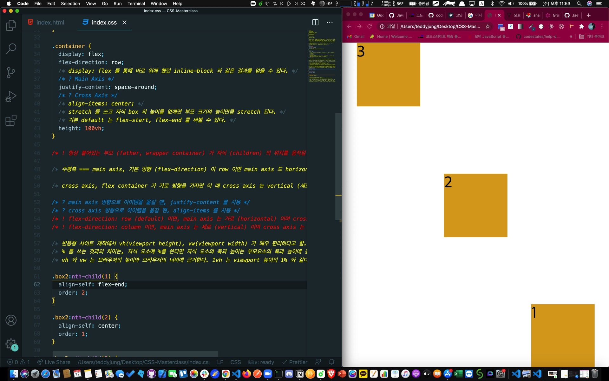

## 🐝일반적인 Display 속성 되짚기

display의 대표 속성 세 가지는 block, inline-block, inline 이 있다.

block 은 너비와 높이가 있으며, 옆에는 어떠한 것도 옆으로 붙어 올 수 없다.

inline block 은 block 속성을 (너비와 높이가 있는 속성) 유지하게 해주며 일직선으로 옆으로 붙어 올 수 있게 한다.

inline 은 box 가 아니다. 너비와 높이가 없다. 유동적이기 때문이라 한다.
딱 자기 크기만큼의 공간을 가진다. 대표적인 예가 바로 text.

결론 : 쌩 마진 짜맞추기로 중간을 맞추기 위해 마진을 조절하지만, 그마저도 브라우저의 크기를 조절하면 모든 레이아웃이 다 어긋나진다!

Flex 를 배우는 이유이다!

## 🐝Flexbox 의 규칙

항상 붙어있는 부모 (father, wrapper container) 가 자식 (children) 의 위치를 움직일 수 있다.

1. flexbox 에서 뭔가를 움직이고자 할 때는 children 과 이야기하지 않는다.

2. flexbox container (즉, 부모 컨테이너) 를 만들어야 한다.
