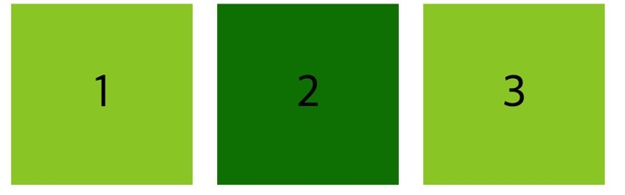
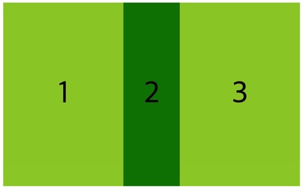
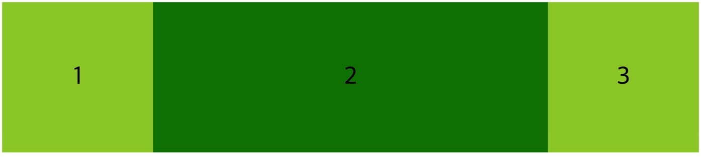
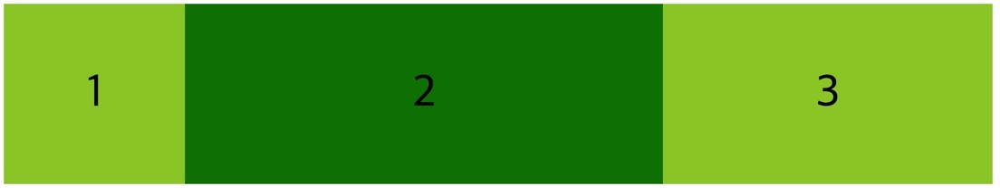

## 🍙창을 줄일 때, 특정 요소를 다른 요소들보다 배로 줄이는 flex-shrink

flex-grow, flex-shrink 는 child 에게 줄 수 있는 property 이다.

부모 요소에 flex를 주었을 때, (flex-wrap : nowrap 인 상태) <u>브라우저를 줄이면 설정한 width 에 상관없이 찌그러든다.</u>

그런데 이 때 어떤 item 이 다른 item 들보다 더 찌그러질 지 정할 수 있다고 한다.

그게 바로 <strong>flex-shrink 이며 디폴트 값은 1</strong>이다.

아래 그림은 일반적인 flex 속성을 준 상태의 모습이지만,



두번째 item 의 flex-shrink 를 2로 두면, 첫번째와 세번째 item 의 width 보다 2배로 더 줄어든다. 매우 유용한 property 이다.

```css
.child:nth-child(2) {
  background: green;
  flex-shrink: 2;
}
```



박스들을 똑같은 비율로 줄어들게 하고 싶지 않을 때 사용한다! 3 혹은 4 를 적용해보자.

## 🍙창을 키울 때, 비어있는 공간을 다 삼켜서 몸집을 키우는 flex-grow

flex-grow 는 flex-shrink 와 같지만 반대로 작용한다.

특정 박스 item 을 다른 item 의 비율보다 더 크게!? 원상태로 복구해 놓고 시작해보자.

flex-grow 의 default value 는 0 이다. 그래서 2번째 child 를 1로 줘보니!

```css
.child:nth-child(2) {
  background: green;
  flex-grow: 1;
}
```

남아있는 빈 공간을 모두 가져오거나, 박스아이템 2가 가질 수 있는 만큼 커지게 된다.



즉 여분의 공간이 있으면 flex-grow 는 그 안으로 들어가서 더 크게 만든다. 줄어들때는 똑같이 되어버리면서 말이다.

(모바일 환경에는 사이즈가 서로 똑같게, 브라우저 환경에서는 크기를 차등을 두고자 할때 사용하면 굿이겠다!)

이번에는 flex-grow 로 빈 공간을 박스2 와 박스 3이 나눠서 가져가게 해보자.

```css
.child:nth-child(2) {
  background: green;
  flex-grow: 2;
}

.child:nth-child(3) {
  flex-grow: 1;
}
```

이제 남아있는 공간을 3번 child 가 1/3 을 (flex-grow:1), 2번 child 가 2/3 을 (flex-grow:2) 가져간다.



<strong>결론 : flex-grow 는 box 주변의 공간을 가진다 (먹는다)>
