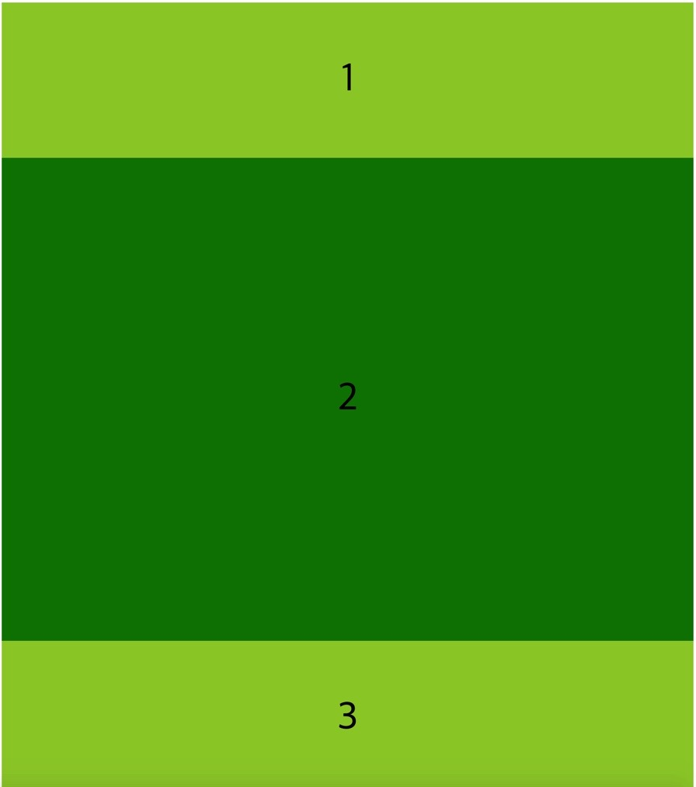

## 🐞Element 의 기본 크기를 정하는 flex-basis

어떤 빈 공간이 나뉘기 전에, 즉 커지거나 줄어들기 전에 element 의 기본 크기를 정하는 속성이 바로 flex-basis 라고 한다.

flex-basis 는 flex 부모의 child 에 적용하며, flex-basis 는 element 에게 처음(initial) 크기를 주는거라 한다.

처음 크기 이지만 실제 크기가 아닌 이유는, flex-grow 와 flex-shrink 에 의해 크기가 바뀌기 때문이다.

flex-basis 는 main axis 에서 작용하므로 flex-direction 이 row 일때, flex-basis 는 width 이다.

그런데 flex-direction 이 column 이면, flex-basis 는 height 가 된다. 이때 부모 요소에 높이가 지정되어 있어야 제대로 보이게 된다.

하지만 flex-basis 는 width 로 대체될 수 있다.

flex-basis 가 변하지 않으면 flex-basis 는 width 와 같다.
