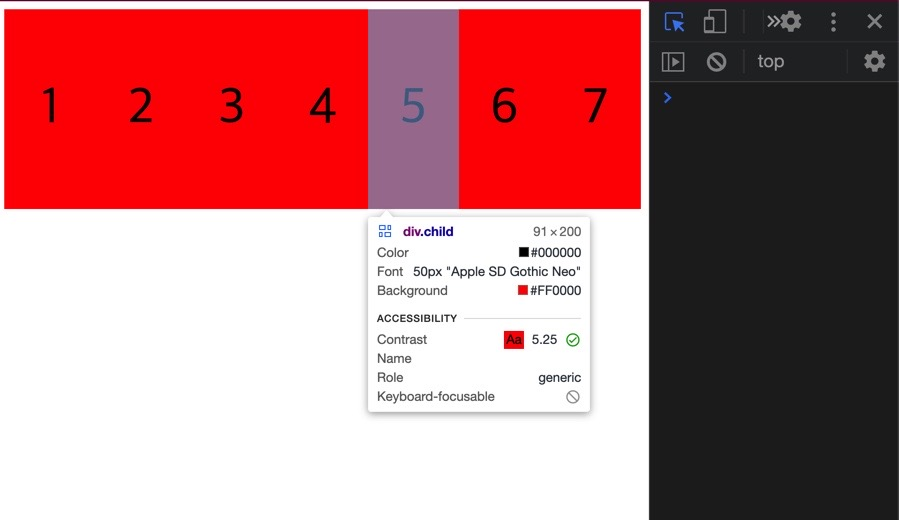

## 🚀display: flex 는 한줄에 item 들을 때려넣는 압축기

아래의 css 코드와 이미지는 동일한 결과이다.

```css
.child {
  display: flex;
  justify-content: center;
  align-items: center;
  width: 200px;
  height: 200px;
  background: red;
  font-size: 50px;
}

.father {
  display: flex;
  /* ? Main Axis */
  justify-content: space-around;
  height: 100vh;
}
```



display: flex 일 때, 여러 child 가 나란히 있고 높이는 같으나 너비가 줄어들어 있는 것을 확인할 수 있다.

보다시피 설정한 width 가 200px 인데 사진을 보면 아니지 않은가?

flexbox 는 각각의 item 들이 모두 같은 줄에 있도록 유지해 준다. 하지만 그 너비는 지정해 둔 너비보다 줄어들게 될지라도 말이다.

## 🚀flex-wrap: nowrap (default)

flexbox 는 오로지 item 들이 같은 줄에 있게 만드는 역할이다.

각각의 item 들에 width = 200px 이라 설정했어도 소용없다. 그림처럼 다 꾸겨져 들어가게 된다. 다 깨진다.

그것은 <u>flex-wrap 속성이 기본 (default) nowrap 으로 되어 있기 때문</u>이다.

즉, flex item 들은 모두 같은 줄에 있어야 해! 라고 말하는 것과 같다.

그럼 저 flex-wrap 속성을 바꾸면 무슨 일이 일어날라나?

## 🚀flex-wrap: wrap


flex-wrap: wrap 은 child 의 width (너비) 크기를 유지하게 한다.

브라우저 폭이 줄어들수록 child 가 하나씩 다음 줄로 내려가게 된다.
