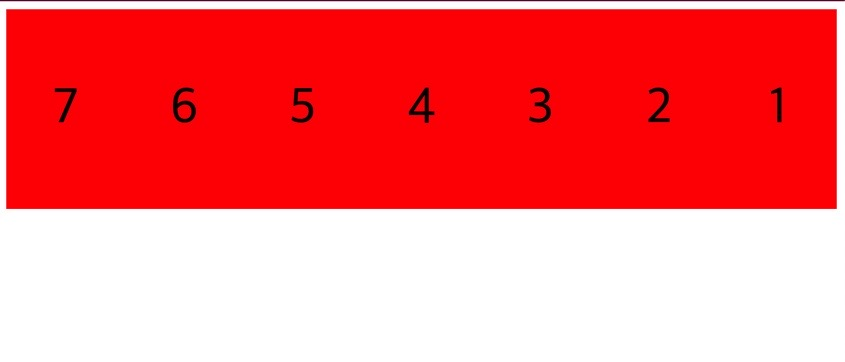
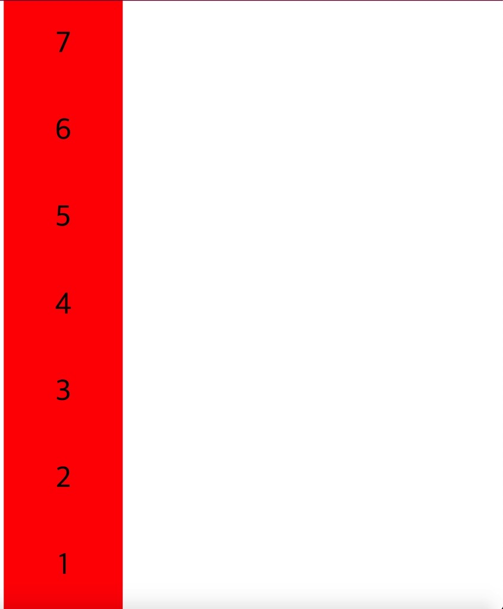
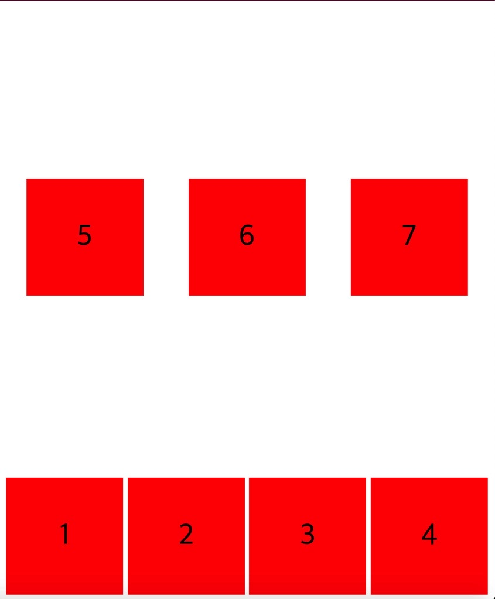
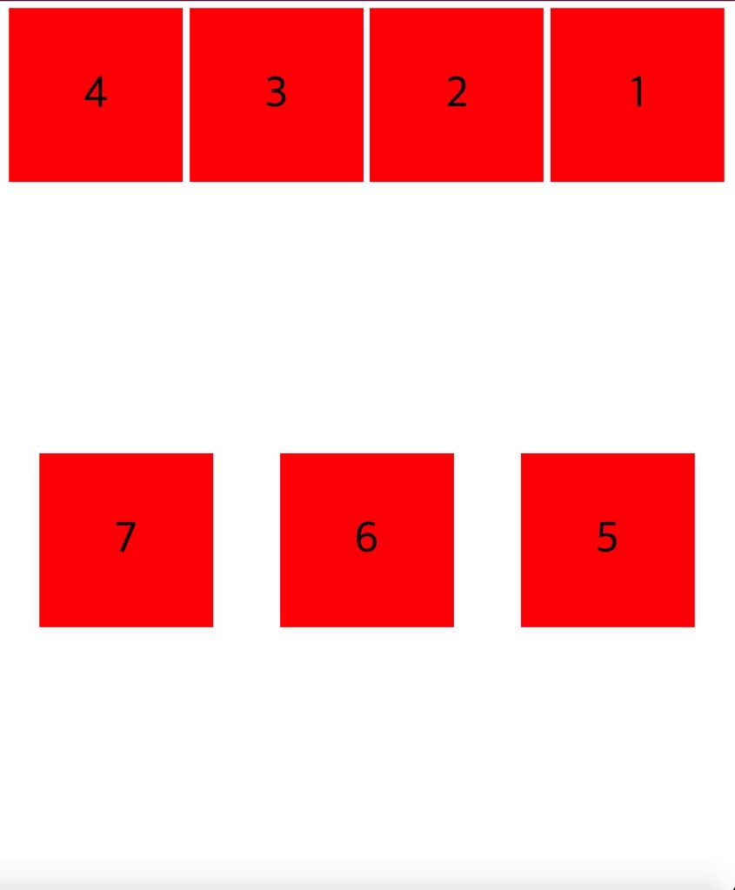
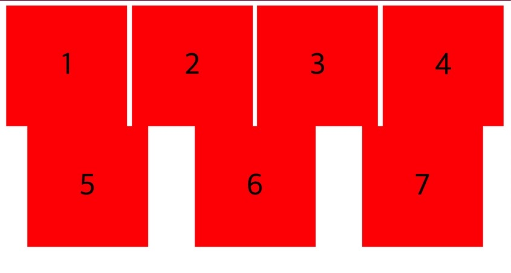

## 🚀display: flex 는 한줄에 item 들을 때려넣는 압축기

아래의 css 코드와 이미지는 동일한 결과이다.

```css
.child {
  display: flex;
  justify-content: center;
  align-items: center;
  width: 200px;
  height: 200px;
  background: red;
  font-size: 50px;
}

.father {
  display: flex;
  /* ? Main Axis */
  justify-content: space-around;
  height: 100vh;
}
```


display: flex 일 때, 여러 child 가 나란히 있고 높이는 같으나 너비가 줄어들어 있는 것을 확인할 수 있다.

보다시피 설정한 width 가 200px 인데 사진을 보면 아니지 않은가?

flexbox 는 각각의 item 들이 모두 같은 줄에 있도록 유지해 준다. 하지만 그 너비는 지정해 둔 너비보다 줄어들게 될지라도 말이다.

## 🚀flex-wrap: nowrap (default)

flexbox 는 오로지 item 들이 같은 줄에 있게 만드는 역할이다.

각각의 item 들에 width = 200px 이라 설정했어도 소용없다. 그림처럼 다 꾸겨져 들어가게 된다. 다 깨진다.

그것은 <u>flex-wrap 속성이 기본 (default) nowrap 으로 되어 있기 때문</u>이다.

즉, flex item 들은 모두 같은 줄에 있어야 해! 라고 말하는 것과 같다.

그럼 저 flex-wrap 속성을 바꾸면 무슨 일이 일어날라나?

## 🚀flex-wrap: wrap


flex-wrap: wrap 은 child 의 width (너비) 크기를 유지하게 한다.

브라우저 폭이 줄어들수록 child 가 하나씩 다음 줄로 내려가게 된다.

아하.. 이번에는 이 <u>flex-wrap 속성을 잠시 주석처리 (flex-wrap: nowrap)</u> 해 두고, flex-direction 을 수정해 보았다.

## 🚀flex-direction: row-reverse, column-reverse

flex-direction: row-reverse 는 HTML 을 건들지 않고도 박스의 방향 (순서) 을 뒤집을 수 있다.



flex-direction 의 기본값은 row 인 점을 다시 떠올려 보면 이해가 된다.

flex-direction: column-reverse 로 하면 아래 이미지 의 모습이다.



이제 다시 flex-direction 을 주석처리 해 두자.

## 🚀flex-wrap: wrap-reverse

flex-wrap: wrap-reverse 를 주었을 때의 모습은 아래 그림이다.



flex-direction 을 row-reverse 로 주고 동시에 flex-wrap 을 wrap 으로 준 아래 그림과 비교해보자.



그런데 줄 사이의 간격, 공백을 어떻게 조절할까? 너무 떨어져 있어서 완전 붙여 보고도 싶은데 말이다.

## 🚀align-content, 박스 사이의 line space 를 조절해주기.

박스 위에 줄과 아래 줄에 있는 빈 공간, line-space 를 어떻게 처리해 줄 수 있을까?

이 공간을 align-content 라고 부른다.

father 에 flex 를 선언하듯이, 마찬가지로 align-content: flex-start 로 줘보자.



윗 줄 아랫줄 사이의 빈 공간이 없어져 버린다.

center 로 주니까 전부 가운데로 옮겨져 가기도 한다.

또는 space-between, space-around(default) 등을 써서 line 간격을 변경할 수도 있었다.
