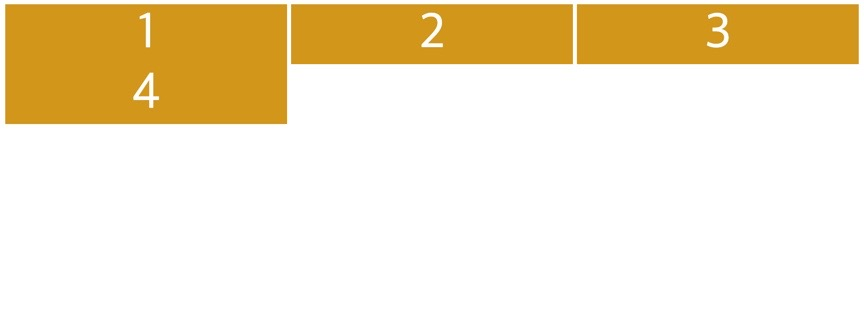
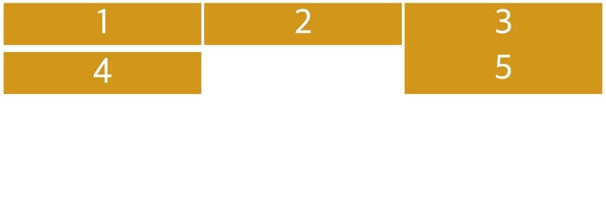
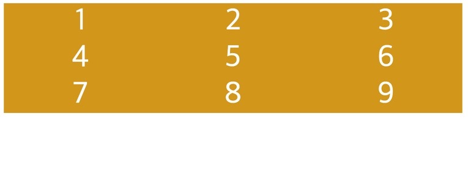
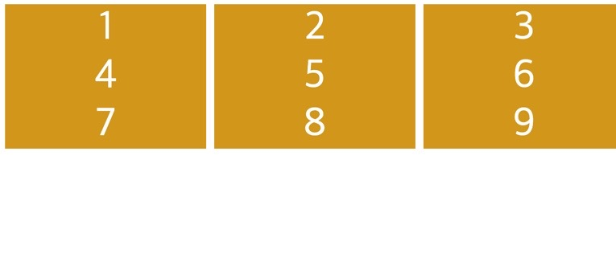
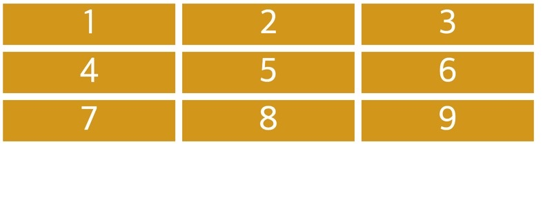
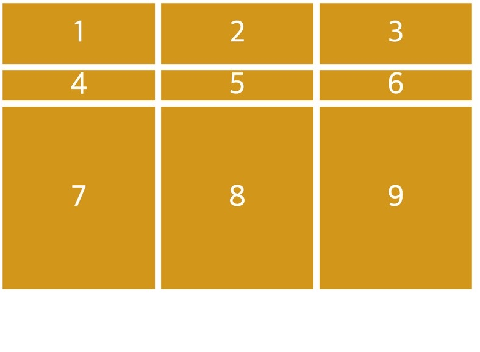

## 🧙🏻‍♂️Flex 만 쓰면 되지 Grid 는 뭣할라고 써?

```css
/* 3 columns 를 가지고 싶어서 flex-wrap: wrap 속성을 줬는데, */

.father {
  display: flex;
  flex-wrap: wrap;
  justify-content: space-between;
}
/* space-between 도 주었다. */

.child {
  background: goldenrod;
  flex-basis: 33%;
  color: white;
  font-size: 50px;
  display: flex;
  justify-content: center;
  align-items: center;
}
```

컬럼이 세개인 것을 표현하고자 flex-basis 를 33% 를 주고 부모 요소의 flex-wrap 을 wrap 으로 주었더니 적절 한 모양이 나온다.

그런데 html 에서 자식 박스를 하나 더 넣어서 총 네개가 된 모습은 어떤가?

그림을 확인해 보자.



음.. 1번 박스와 4번 박스의 간격 (마진) 을 띄우기 위해 다음과 같은 코드를 작성하는 수고를 한다.

첫번째와 네 번째 박스의 간격을 띄우려고 마진을 개별적으로!!!! 주는 수고를 한다 는 의미이다.

```css
.child:nth-child(4) {
  margin-top: 10px;
}
```

떨어진다 하지만 다섯번째 박스가 등장한다면 어떨까?

그 다섯번째 박스에서 내가 의도하려는 바는 2번 박스 아래에 박스 5번이 위치하게 하는건데.. 말이다.



Flex 를 쓰고 space-between 을 쓰고.. 하 안된다. 안돼.

이게 바로 Flex 의 한계이고 그래서 바로 그리드(Grid) 를 배워야 하는 이유이다.

## 🧙🏻‍♂️grid-template- 와 -gap 으로 Grid 템플릿 (엑셀) 만들기

박스는 세 개 정도 놓고, 처음 css 의 코드는 다음과 같다.

Flexbox 처럼 Grid 도 부모 요소에서 컨트롤하게 되므로 아래처럼 작성했다.

```css
.father {
  display: grid;
}

.child {
  background: goldenrod;
  color: white;
  font-size: 50px;

  display: flex;
  justify-content: center;
  align-items: center;
}
```

3 column grid 를 만들기 위해서 어떤 속성을 사용해야 할까?

### 1. grid-template-columns, column-gap, row-gap

html 상에서 child 박스를 아홉개 정도 만들어 놓고 아래의 속성을 적용해 보자.

```css
grid-template-columns: 250px 250px 250px;
```



오호.. 좋다좋아.. 근데 세로 줄로 하나, 둘, 셋 총 3줄의 컬럼을 가지고 있다. 서로 좀 간격을 띄워주고 싶지 않을까?

```css
column-gap: 10px;
```



오오 띄워지는구만, 그런데 첫째 행 부터 각 행마다 gap 을 주고 싶다.

```css
row-gap: 10px;
```



오호, 그런데 gap 이 컬럼, 로우 모두 같다면 아래의 css 코드로 한줄 표현이 가능하다.

```css
gap: 10px;
```

### 2. grid-template-rows

1번의 column 과 마찬가지로 각 행 (row) 에 높이를 주기 위해 row grid 를 만들자.

```css
grid-template-rows: 100px 50px 300px;
```



오호라, 이런 느낌이구나.

## 🧙🏻‍♂️ 최종 CSS 코드

```css
.father {
  display: grid;
  grid-template-columns: 250px 250px 250px;
  gap: 10px;
  grid-template-rows: 100px 50px 300px;
}

.child {
  background: goldenrod;
  color: white;
  font-size: 50px;
  display: flex;
  justify-content: center;
  align-items: center;
}
```

이제 궁금한 것은 저 한칸 한칸의 Cell 을 어떻게 병합 해서 레이아웃을 구성할 것인가 이다.
