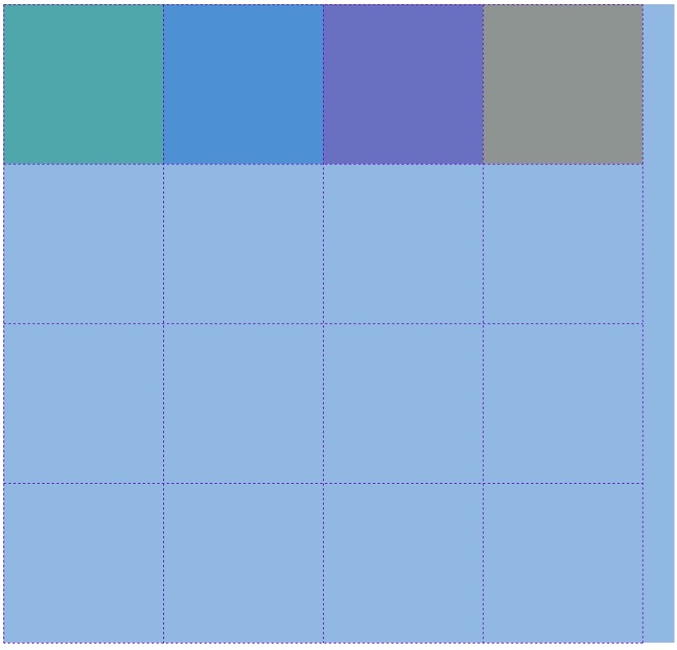
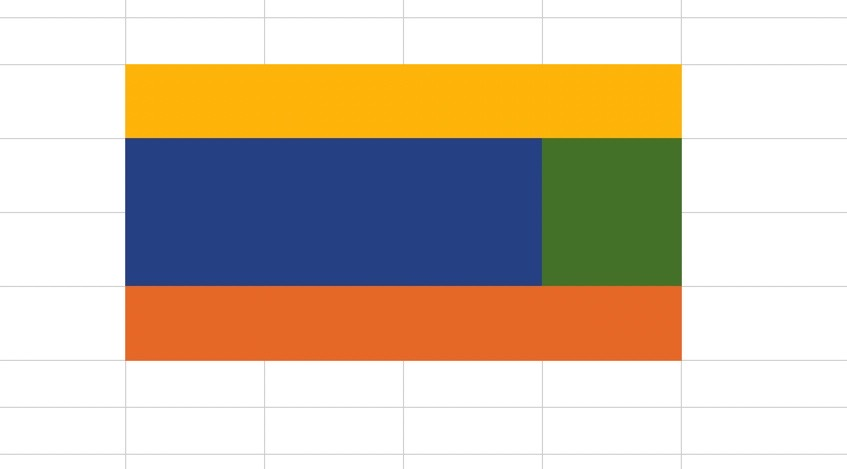
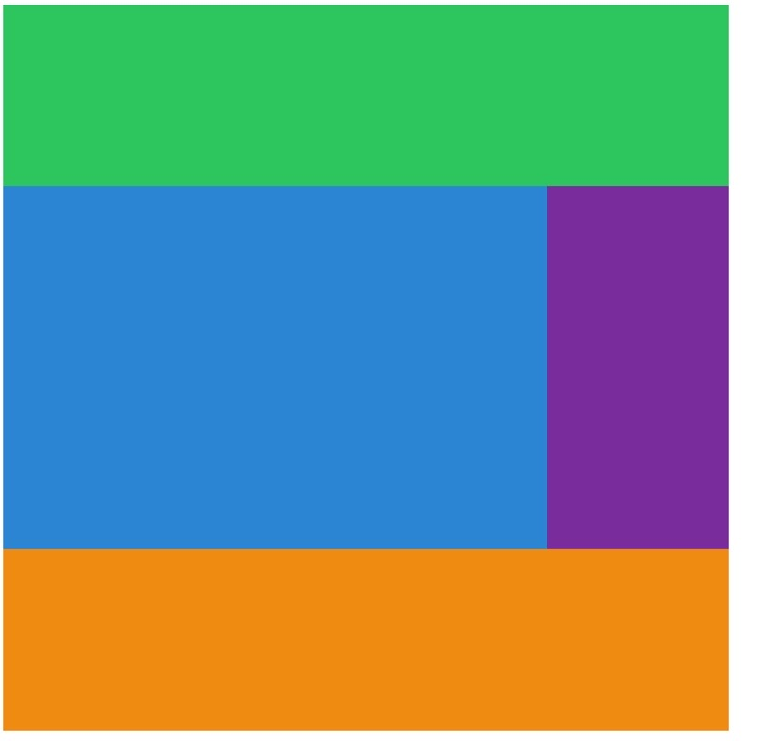

## 🧙🏻‍♂️grid-template-columns, rows, 그리고 repeat()

html 을 아래와 같이 구성했다.

```html
<body>
  <div class="grid">
    <div class="header"></div>
    <div class="content"></div>
    <div class="nav"></div>
    <div class="footer"></div>
  </div>
</body>
```

그리고 css 로 부모요소에 display 속성을 grid 로 주었으며, 각 클래스마다 색상을 주었다.

```css
.grid {
  display: grid;
}

.header {
  background: #2ecc71;
}
.content {
  background: #3498db;
}
.nav {
  background: #8e44ad;
}
.footer {
  background: #f39c12;
}
```

이 상태에서는 브라우저에서 모습을 확인할 수 없다.

부모 요소인 .grid 에 grid-template-column, grid-template-row 를 적용해 주었다.

```css
grid-template-columns: 200px 200px 200px 200px;
grid-template-rows: 200px 200px 200px 200px;
```

columns 4 X rows 4 = 16 개의 그리드 템플릿이 그려진다.



### grid 가 가진 함수를 사용(repeat) 해서 반복 피하기

위처럼 반복해서 pixel 을 적는 것보다, grid 가 가진 함수 repeat 을 사용하면 쉽다!

사용 방법은,

repeat(반복횟수, pixel 크기) 이다.

앞서 작성했던 코드를 아래와 같이 수정했다. 똑같이 작동된다.

```css
grid-template-columns: repeat(4, 200px);
grid-template-rows: repeat(4, 200px);
```

## 🧙🏻‍♂️Grid 마법학교 1학년, grid-template-areas

<u>grid-template-areas 는 쉽게 엑셀 표처럼 레이아웃을 디자인 한다</u>고 생각하면 쉽다.

좀전에 columns 4 X rows 4 = 16 개의 그리드 템플릿을 만들었다. 4 BY 4 다.

header 가 맨 위에 있게 하고, content/nav 가 같이 있으며 맨 아래에는 footer 가 있도록 위치시켜 보자.



```css
.grid {
  display: grid;
  grid-template-columns: repeat(4, 200px);
  grid-template-rows: repeat(4, 200px);
  grid-template-areas:
    'header header header header'
    'content content content nav'
    'content content content nav'
    'footer footer footer footer';
}
```

위의 코드처럼 grid-template-areas 에 공간을 차지했으면 하는 속성?(이름?) 을 4 BY 4 로 적어주었다.

template 을 만들었으면 이제 각 클래스에 <u>grid-area 로 네임 속성을</u> 줘야 한다.

```css
.header {
  background: #2ecc71;
  grid-area: header;
}
.content {
  background: #3498db;
  grid-area: content;
}
.nav {
  background: #8e44ad;
  grid-area: nav;
}
.footer {
  background: #f39c12;
  grid-area: footer;
}
```



오 정말 템플릿 대로 레이아웃이 구성되는 것을 확인할 수 있었다.

단, <strong>grid-area 에 있는 이름과 grid-template-areas 에 지정한 이름이 같아야</strong> 한다.

그리고 그림을 보면 오른쪽에 하얀 빈 공간이 있는 것으로 보아 만든 그리드 레이아웃이 화면에 꽉 차 보이지는 않는 듯 싶다.

grid-template-columns: repeat(4, 200px); 대신에,

grid-template-columns: <b>auto</b> 200px; 를 사용하면 아래 그림처럼 화면에 꽉 차게 된다.

```css
grid-template-columns: auto 200px;
```


그리고 기존에 grid-template-rows 는 4 rows 모두 200px 로 동일하게 했지만,

헤더 부분과 푸터 부분은 100px 로 하는 등의 차이를 주기 위해 다음과 같은 속성을 적용했다.

<u>repeat 과 px 들을 혼용해서 쓸 수 있다는 것</u>을 알게 되었다.

```css
grid-template-rows: 100px repeat(2, 200px) 100px;
```


아하 화면 구성 (레이아웃) 을 이렇게 쉽게 쉽게 가져갈 수 있구나!
