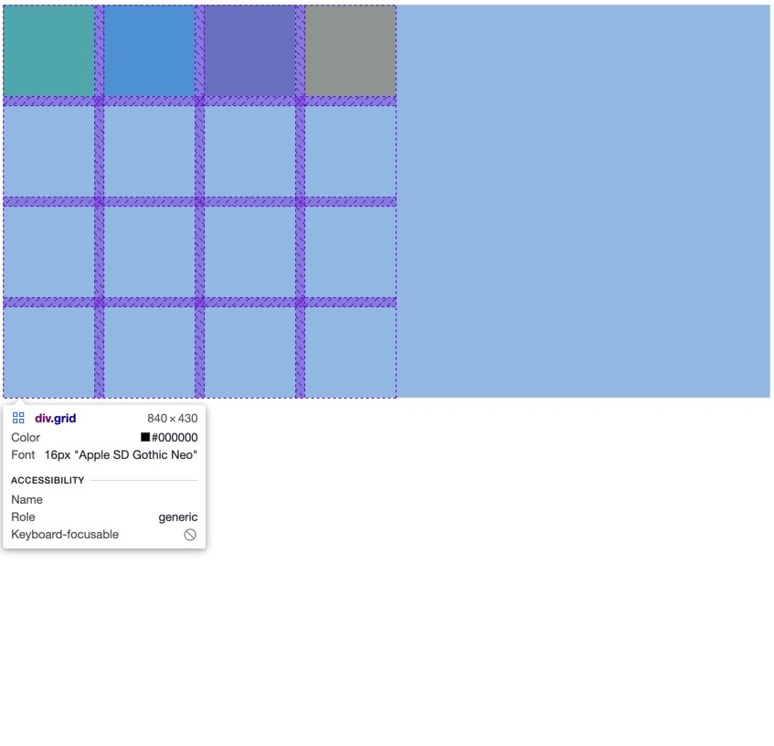

## 💁🏻‍♂️grid-template-area 안 쓰고 더 쉽게 만들기

```css
grid-template-areas:
  'header header header header'
  'content content content nav'
  'content content content nav'
  'footer footer footer footer';
```

이렇게 grid-template 을 작성하고 해당 이름마다 클래스에 가서 grid-area 이름을 동기화 시켜줘야 되는게 여간 불편하다.


위와 같은 모습을 만들 것이지만, 현재 초기 코드는 다음과 같다.

```css
.grid {
  display: grid;
  gap: 10px;
  grid-template-columns: repeat(4, 100px);
  grid-template-rows: repeat(4, 100px);
}

.header {
  background: #2ecc71;
}
.content {
  background: #3498db;
}
.nav {
  background: #8e44ad;
}
.footer {
  background: #f39c12;
}
```



현재 브라우저에 비치는 모습이다.

이제 여기서 header 의 시작과 끝을 더 쉽게 만들어 보자,

column 그리고 row 가 어디에서 시작하고 끝나는지를 정해주면 아까보다 더 쉽게 레이아웃을 짤 수 있게 된다.

## 💁🏻‍♂️grid-column(row)-start, grid-column(row)-end 의 사용!

### 1. header 부분 조절하기

header 부분 (클래스명 header, 컬러 초록색) 을 column 방향으로 템플릿 최대한도로 (4) 늘리려 한다.

그러려면 grid-column-start 와 grid-column-end 를 적용해야 한다.

```css
.header {
  background: #2ecc71;

  grid-column-start: 1;
  grid-column-end: 5;
}
```

gap 속성으로 각 박스를 보기 쉽게 떨어트려 놓았는데,

속성의 숫자는 column 의 line 을 의미한다. 왼쪽부터 1번라인 2번라인 이러한 식이다.

end 를 늘림에 따라 나머지는 밑으로 자연스레 내려간다.

end 가 5 이면 현재 템플릿 상에서는 컬럼 맨 끝 부분을 가리킨다.


오호라 header 부분이 column 방향으로 쫙! 스트레치 되었다.

### 2. content 부분 조절하기

마찬가지로 grid-column-start 와 grid-column-end 를 적용 했다.

그러고 보니 content 부분이 row 방향으로도 몸집을 차지 해야 한다는 것을 깨닫고,

grid-row-start 와 grid-row-end 를 적용했다.

```css
.content {
  background: #3498db;
  grid-column-start: 1;
  grid-column-end: 4;

  grid-row-start: 2;
  grid-row-end: 4;
}
```


### 3. nav 부분 조절하기

```css
.nav {
  background: #8e44ad;
  grid-row-start: 2;
  grid-row-end: 4;
}
```


### 4. footer 부분 조절하기

맨 아래 footer 부분은 컬럼 방향으로 끝까지 차지 하도록 만들면 된다.

```css
.footer {
  background: #f39c12;
  grid-column-start: 1;
  grid-column-end: 5;
}
```


다음 번에는 매번 grid-column-start 와 grid-column-end 를 쓰지 않고 한 줄로 줄이는 등의

지름길 방식을 알아보도록 하겠다.
