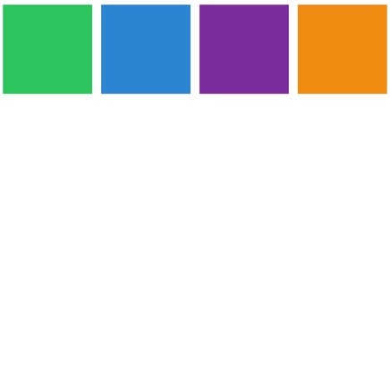
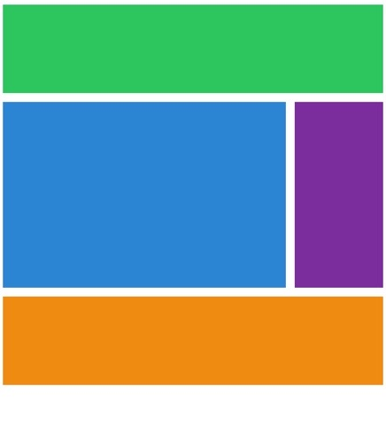

## 🌳grid 시작점과 끝점을 설정하는 지름길

아래 css 코드처럼 grid-column-start, grid-row-start, grid-column-end, grid-row-end 로 그리드의 시작과 끝을 설정해서 레이아웃을 구성했었다.

```css
.content {
  background: #3498db;
  grid-column-start: 1;
  grid-column-end: 4;

  grid-row-start: 2;
  grid-row-end: 4;
}
```

하지만 이 조차도 써야 되는데 시간이 너무 오래 걸리는 것 같다.

오늘은 그것을 좀 더 쉽게 쓰기 위한 코드에 대해 알아보려 한다.



초기 모습은 다시 위의 그림과 같다. 코드는 아래와 같이 시작했다.

```css
.grid {
  display: grid;
  gap: 10px;
  grid-template-columns: repeat(4, 100px);
  grid-template-rows: repeat(4, 100px);
}

.header {
  background: #2ecc71;
}
.content {
  background: #3498db;
}
.nav {
  background: #8e44ad;
}
.footer {
  background: #f39c12;
}
```

## 🌳ShortCut-1. start 와 end 를 한 줄로 표기하기

grid-column-start, grid-column-end 를 두 번 쓰는 대신 한번에 한 줄로 코드 작성이 가능하다.

```css
grid-column: start / end;
grid-row: start / end;

/* start 와 end 는 숫자 */
```

이런 방식으로 종전과 달리 한 줄로 표시가 가능하다.

자식 요소의 각 클래스 별로 grid-column-start 와 grid-column-end 를 두 번 써서 원하는 레이아웃을 구성하는 대신에,

코드를 한 줄로 줄여서 작성해 보았더니 원했던 그림이 나온다.



```css
.header {
  background: #2ecc71;
  grid-column: 1 / 5;
}
.content {
  background: #3498db;
  grid-column: 1 / 4;
  grid-row: 2 / 4;
}
.nav {
  background: #8e44ad;
  grid-row: 2 / 4;
}
.footer {
  background: #f39c12;
  grid-column: 1 / 5;
}
```

## 🌳ShortCut-2. 끝점(end) 을 지정하는 새로운 방식, -1

만약 column 이 무척 많다면 맨 끝이 몇까지 있는지 모를 수 있다. 맨 앞에서 부터 일일이 셀 수 없다면,

grid-column : 1 / ???? 어떻게 쓸지 난감할 것이다.

<strong>이 때 -1 이 바로 맨 끝의 line 을 의미한다.</strong>

마치 자바스크립트 문법 중에서 배열을 배울 때 배열의 마지막 인덱스가 -1 이듯이 말이다.

즉, grid-column: 1 / -1; 끝이 어디인지 숫자가 뭔지 알 필요가 없다.

맨 끝이 -1 이라 하면 -2, -3, -4 로 맨 끝에서 몇번째 식으로 셀 수도 있다.

다시 css 코드를 수정해 보았다.

```css
.header {
  background: #2ecc71;

  grid-column: 1 / -1;
}
.content {
  background: #3498db;

  grid-column: 1 / -2;

  grid-row: 2 / 4;
}
.nav {
  background: #8e44ad;

  grid-row: 2 / 4;
}
.footer {
  background: #f39c12;

  grid-column: 1 / -1;
}
```

마찬가지로 동일한 결과를 보여준다.


## 🌳ShortCut-3. span 의 사용

grid-column, grid-row 에 시작과 끝을 적는 대신 span 을 사용할 수 있다.

시작점과 끝점을 적는 예로 <b>grid-column: 1 / -1; 을 span 이 대신</b>할 수 있다.

<b>span 하나가 grid 에서의 cell 하나를 의미</b>한다.

고로 컬럼 네 칸을 먹어야 한다면, grid-column: span 4; 이렇게 쓰면 된다.

시작점이 없어서 엉망이 될 때는,

<b>시작점 / span 숫자</b> 와 같은 방식으로 혼용하여 작성할 수도 있다.

아래와 같이 css 코드를 고쳐 보았다.

```css
.header {
  background: #2ecc71;

  grid-column: span 4;
}
.content {
  background: #3498db;

  grid-column: 1 / -2;

  grid-row: span 2;
}
.nav {
  background: #8e44ad;

  grid-row: span 2;
}
.footer {
  background: #f39c12;

  grid-column: span 4;
}
```

여기서 클래스 content 의 grid-row 는 아래와 같이 바꾸어 쓸 수도 있다.

```css
.content {
  background: #3498db;

  grid-column: 1 / -2;

  grid-row: 2 / span 2;
}
```
