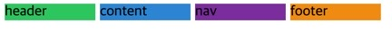
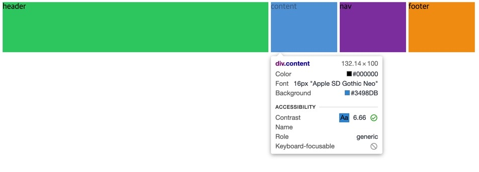
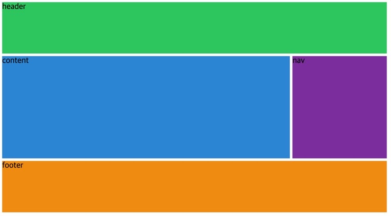

## 🍄Fraction (부분) 에 대해

그리드 에서의 fr 은 fraction (부분), pixel, % 같은 측정 단위라고 한다.

```css
/* fr : fraction (부분), pixel, % 같은 측정 단위임 */
.grid {
  display: grid;
  gap: 5px;
  width: 500px;
  grid-template-columns: repeat(4, 100px);
}

.header {
  background: #2ecc71;
}
.content {
  background: #3498db;
}
.nav {
  background: #8e44ad;
}
.footer {
  background: #f39c12;
}
```



초기 코드와 그 때 보여지는 레이아웃이다. 그리드에 width 를 줘서 딱 해당 폭 만큼의 그리드가 생성되었다.

## 🍄100px 대신 1fr 을 적용해 보기


grid width 폭을 없애고

```css
grid-template-columns: repeat(4, 1fr);
```

를 적용해 주었다. 기존 두번째 인자에 100px 을 넣었었는데 1fr 로 변경했다.

1fr 씩 차지하게 했고 브라우저에서 전체 column 을 보면 body 의 모든 부분을 가지게 된다.

fraction : Grid 에서 사용 가능한 공간을 의미하며,

그리드의 너비가 500px 이라면 해당 공간만큼만 fraction 을 가지게 된디.

## 🍄컬럼별로 fr 적용해 보기



```css
grid-template-columns: 4fr 1fr 1fr 1fr;
grid-template-rows: repeat(4, 100px);
```

이번에는 좀 더 보기 좋게 rows 를 추가해 주었다.

컬럼 첫 번째에 4fr 은 다른 컬럼의 폭보다 네 배 더 크다는 의미가 된다. 전부 4fr 로 바꿔도 어차피 비율 기준이라 모두 1fr 한 것과 똑같이 된다.

## 🍄컬럼별로 fr 적용해 보기 2

이렇게 하니까 grid 가 사라져버렸다?! 브라우저의 수직으로는 공간이 없기, 즉 grid 의 높이가 없기 때문이다.

그래서 높이를 주었다.

```css
grid-template-columns: repeat(4, 1fr);
grid-template-rows: repeat(4, 1fr);

height: 50vh;
```

이러면 화면의 절반 에서 1/4 가 1fr 이 된다.

## 🍄grid-template 와 fr 을 동시 사용해 보기

위에 적용사항을 주석처리 해준 뒤, 그리드 템플릿을 만들자.

저번과는 다르게 컬럼을 만들면서 그 row 의 높이가 얼마나 되는지 추가로 작성하였다.

```css
grid-template:
  'header header header header' 1fr
  'content content content nav' 2fr
  'footer footer footer footer' 1fr / 1fr 1fr 1fr 1fr;
```

컬럼을 만들면서 맨 오른쪽에는 해당 row 의 높이를 fr 로 표기했다.

마지막 slash 다음에는 각 column 마다 폭(width) 이 얼마나 되는지 구체적으로 적었다.

이제 grid-template 을 썼으니, 다음으로 각 클래스에 grid-area 로 이름을 주자.

```css
.header {
  background: #2ecc71;
  grid-area: header;
}
.content {
  background: #3498db;
  grid-area: content;
}
.nav {
  background: #8e44ad;
  grid-area: nav;
}
.footer {
  background: #f39c12;
  grid-area: footer;
}
```



여튼 요점은 브라우저를 늘리거나 줄여도 항상 같은 비율로 유지한다는 것이다. 바로 fr 덕분에!
