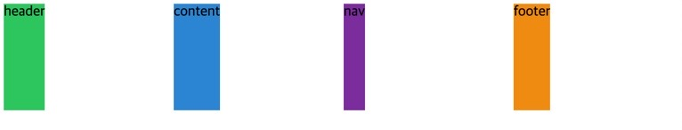
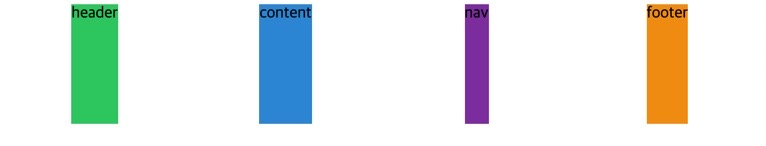
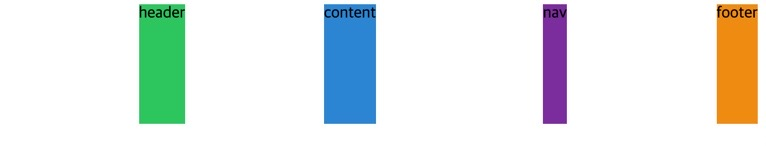

## 🌵Place Items on Grid

```html
<body>
  <div class="grid">
    <div class="header">header</div>
    <div class="content">content</div>
    <div class="nav">nav</div>
    <div class="footer">footer</div>
  </div>
</body>
```

각각의 div 들은 (.header, .content, .nav, .footer) 컨텐츠 (text) 를 가지고 있다.

아이템들을 위치시키는 justify-items 와 align-items 에 대해 알아보았다.

마찬가지로 부모 속성에서 (.grid) 사용한다.

아래는 초기 코드이고 여기에 justify-items 와 align-items 를 적용시켜 보겠다.

```css
.grid {
  display: grid;
  gap: 10px;
  height: 50vh;
  grid-template-columns: repeat(4, 1fr);
  grid-template-rows: repeat(4, 1fr);
}

.header {
  background: #2ecc71;
}
.content {
  background: #3498db;
}
.nav {
  background: #8e44ad;
}
.footer {
  background: #f39c12;
}
```

## 🌵justify-items: stretch (by default)

```css
justify-items: stretch;
```

justify-items(수평, 가로), stretch 가 기본 디폴트 이다.

stretch 는 grid-container 가 grid 를 가지고 있고 grid 를 늘여서 grid 자체를 채우도록 한다.

그런데 justify-items 를 start, center, end 로 바꿔보면 아래 그림과 같다.

```css
justify-items: start;
```



```css
justify-items: center;
```



```css
justify-items: end;
```



## 🌵align-items: stretch (by default)

위와 마찬가지 이지만 align-items (수직, 세로) 방향에 사용된다는 점이 다르다.

이 또한 start, center, end 옵션을 줄 수 있다.

## 🌵justify-items 와 align-items 동시 사용하기

justify-items 와 align-items 가 stretch 가 아니면서 각 아이템의 content 가 없을 경우 (text) 브라우저에는 역시 아무것도 안나온다.

높이와 너비가 없기 때문이다. 하지만 stretch 일 때는 컨텐츠(text) 가 있고 없고를 떠나서 브라우저에 나온다. 왜?일까?

그래서 header, content, nav, footer 클래스에 높이와 너비를 40px 로 부여하고 justify-items 와 align-items 를 동시 사용해 보았다.

```css
justify-items: end;
align-items: start;
```

여튼 각 클래스 별로 height, width 를 부여하면 나타난다.


기본 사이즈를 (width, height) 부여하면 justify-items, align-items 에 stretch 를 줘도 늘어나지 않는다.

이미 기본 사이즈를 지정해 줬기 때문이다.

## 🌵justify-items 와 align-items 의 shortcut, place-items

justify-items 와 align-items 를 한 줄로 작성할 수 있는 shortcut 이 있다.

기본 형태는

place-items: 수직 y 수평 x; 의 형태로 작성한다.

```css
place-items: stretch center;
```
