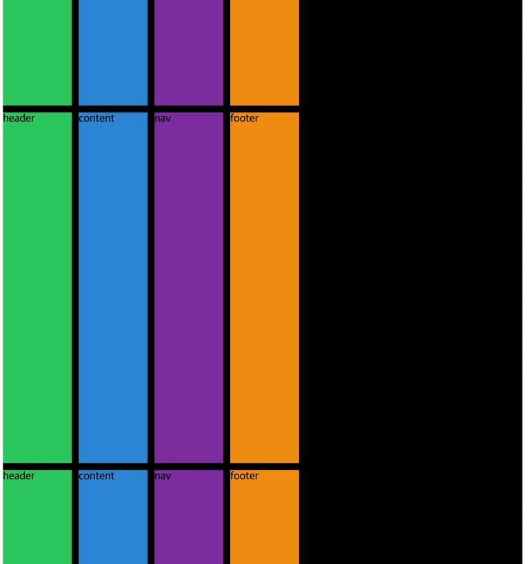

## 🌵Place Content on Grid

items 는 cell 중에 하나이며, 각 각 개별적으로 하나 하나를 의미힌디.

하지만 content 는 전체 그리드 이다.

전체 Grid 의 컨텐츠를 정렬하러 떠나보자.

```css
.grid {
  display: grid;
  background: black;
  gap: 10px;
  height: 250vh;
  grid-template-columns: repeat(4, 100px);
  grid-template-rows: repeat(4, 100px);

  /* 여기 아래에 작성 예정  */
}

.header {
  background: #2ecc71;
}
.content {
  background: #3498db;
}
.nav {
  background: #8e44ad;
}
.footer {
  background: #f39c12;
}
```

## 🌵전체 그리드를 수평 정렬하는 justify-content

전체 그리드를 수평 정렬하는 justify-content, start 가 기본값이며 전체 그리드를 움직이게 한다.

center, end, start, space-between 등의 속성도 넣어 보았다.

```css
justify-content: start;
```

## 🌵전체 그리드를 수직 정렬하는 align-content

그리드의 높이가 충분하지 않으면 수직 정렬을 해도 결과가 나타나지 않는다.

높이를 250vh 정도로 수정했다.

근데 flex 배울 때 align-items 아니였나, 얘는 align-content 라고 쓰는구나?

전체 그리드를 수직 정렬하는 align-content 도 start, end, center, space- 써먹어 보자.

```html
<div class="grid">
  <div class="header"></div>
  <div class="content"></div>
  <div class="nav"></div>
  <div class="footer"></div>
  <div class="header">header</div>
  <div class="content">content</div>
  <div class="nav">nav</div>
  <div class="footer">footer</div>
  <div class="header">header</div>
  <div class="content">content</div>
  <div class="nav">nav</div>
  <div class="footer">footer</div>
  <div class="header">header</div>
  <div class="content">content</div>
  <div class="nav">nav</div>
  <div class="footer">footer</div>
</div>
```

```css
justify-content: start;
align-content: space-between;
```

align-content 를 stretch 로 바꾸고 grid-template-rows 에 100px 을 1fr 로 바꿔보자, 늘어난다.



```css
grid-template-columns: repeat(4, 100px);
grid-template-rows: repeat(4, 1fr);
align-content: stretch;
```

## 🌵justify-content 와 align-content 의 shortcut, place-content

place-content: 수직정렬, 수평정렬 의 형태로 작성한다.

```css
place-content: end center;
```

## 🌵결론

place-items 와 place-content 는 사용하는 성격이 다르다는 점을 염두해야 한다.

## 🌵align-self, justify-self, shortcut: place-self

아래 코드 참조

```css
.header {
  background: #2ecc71;
  align-self: end;
  /* align 그 자체에만 적용된다. */
  justify-self: center;

  /* align-self, justify-self 의 Shortcut 도 있다. */
  place-self: start end;
}
.content {
  background: #3498db;
}
.nav {
  background: #8e44ad;
}
.footer {
  background: #f39c12;
}
```
