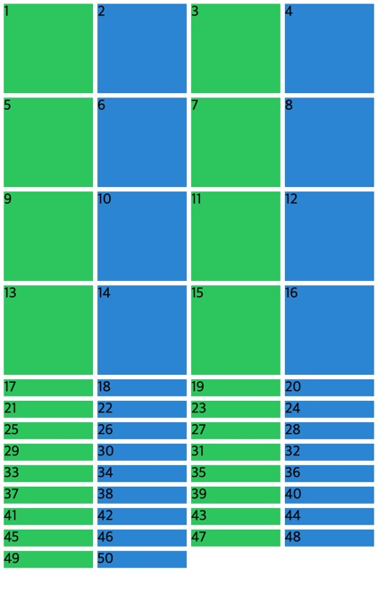
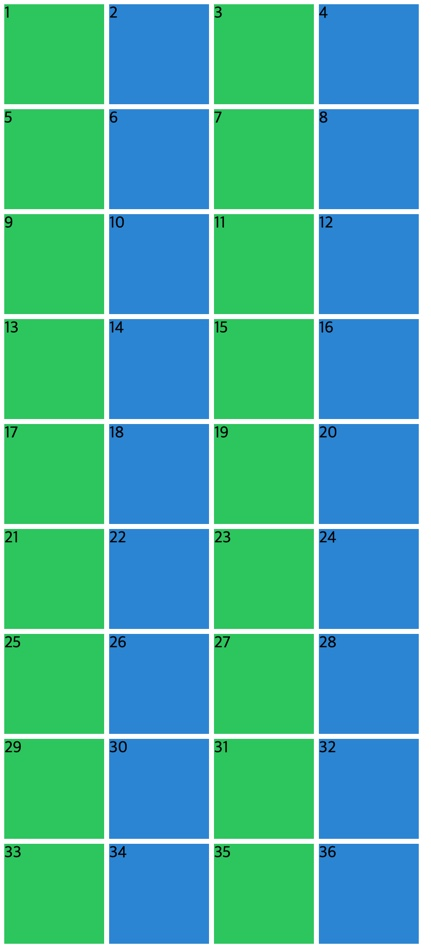
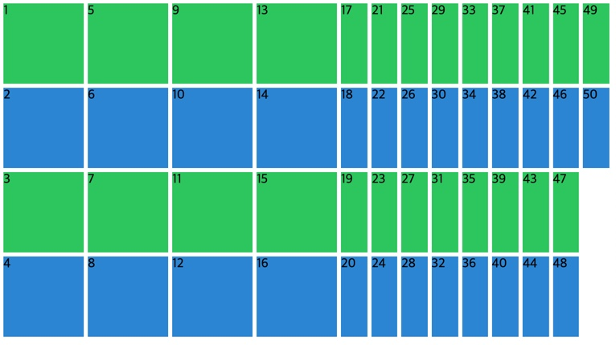
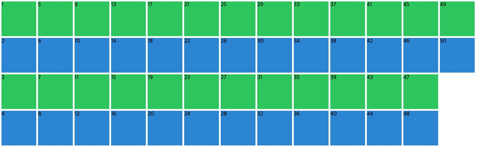

## 🍩Auto Columns and Rows

초기 css 코드이다.

```css
.grid {
  display: grid;
  gap: 5px;
  height: 50vh;
  grid-template-columns: repeat(4, 100px);
  grid-template-rows: repeat(4, 100px);
}

.item:nth-child(odd) {
  background: #2ecc71;
}

.item:nth-child(even) {
  background: #3498db;
}
```



item 들이 50개 일 때 컬럼은 맞아 떨어지지만 rows 를 4로 지정해 주었기에, 5번째 row 부터는 저렇게 높이가 없이 뜬다.

그럼 grid-template-rows: repeat(50, 100px) 하면 되는거 아니야?

되기는 하지만 이건 좋은 해결책이 아니다.

이 경우에 대한 해결책으로 grid-auto-rows 를 사용할 것이다.

## 🍩grid-auto-rows

grid-template-rows 에 지정한 4개의 row 를 넘어가면 즉 더 많은 컨텐츠가 들어가도, 따로 rows 를 지정해주지 않아도,

디폴트 밸류를 자동으로 줘서 row 를 생성하게 할 것이다.

기본 지정한 4개 이외에 지정하지 않은 더 많은 row 들도 자동적으로 row 를 생성하게 하기 위해 다음과 같이 코드를 작성했다.

```css
grid-auto-rows: 100px;
```

내가 설정한 row 보다 더 많은 content 가 오게 될 때 (from server) grid-auto-rows 가 작동할 것이다.

기본으로 rows 를 설정하지 않고 grid-auto-rows 만 썼을 때에도 자동적으로 생성하게 된다.



## 🍩grid-auto-flow 와 grid-auto-columns

새로운 rows 를 생성하는 것 말고 새로운 columns 를 생성하고 싶다면 어떻게 할까?

grid-auto-flow 를 사용해 보자.

```css
grid-auto-flow: column;
```



와 방향이 바뀌어 버린다. flow 가 바뀌어 버린다. 이제 grid-auto-columns 를 써보자.

```css
grid-auto-columns: 100px;
```


