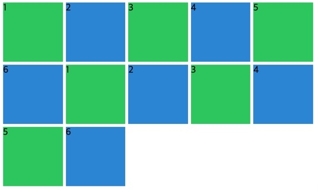

## 🏖minmax

브라우저 화면이 줄어 들 때에 최소값과, 화면이 커질 때 최대값을 지정하도록 하는 속성이다.

```css
.grid {
  display: grid;
  gap: 5px;
  height: 50vh;

  grid-template-columns: repeat(10, 1fr);
  grid-template-rows: repeat(4, 100px);
  grid-auto-columns: 100px;
}

.item:nth-child(odd) {
  background: #2ecc71;
}

.item:nth-child(even) {
  background: #3498db;
}
```

이렇게 했을 때 10개의 컬럼이 생기고 각각의 크기는 1fr, 화면이 줄어들면 비율대로 쪼그라든다.


하지만 이때, 쪼그라드는 너비의 최소값 그리고 화면이 커질때 늘어나는 너비의 최대값을 지정해 주면 의도하는 바대로 만들 수 있다.

위의 grid-template-columns 의 코드를 수정해 보았다.

```css
grid-template-columns: repeat(10, minmax(100px, 1fr));
```

minmax 의 첫번째 인자는 브라우저가 줄어 들 때의 최소 크기, 두 번째 인자는 브라우저 사이즈가 커질 때 최대 크기를 의미한다.



이제 화면을 줄여도 가로 스크롤이 생겨서 cell 하나 가 너비 100px 이하로는 줄어들지 않는다.

화면을 늘였다 줄였다 테스트 해보니 조금 느꼈다, 내가 최소 사이즈를 정할 수 있었다. 최대값 역시도.
