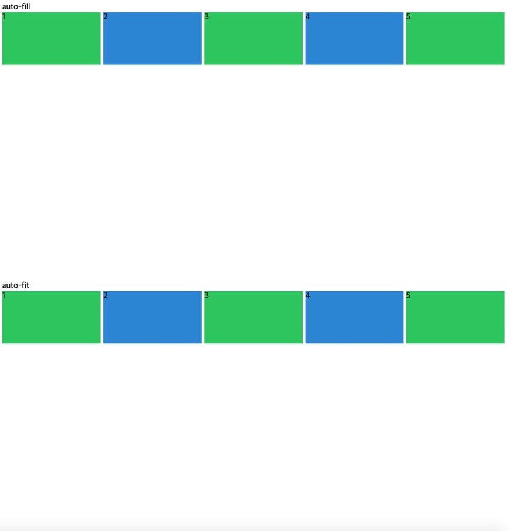
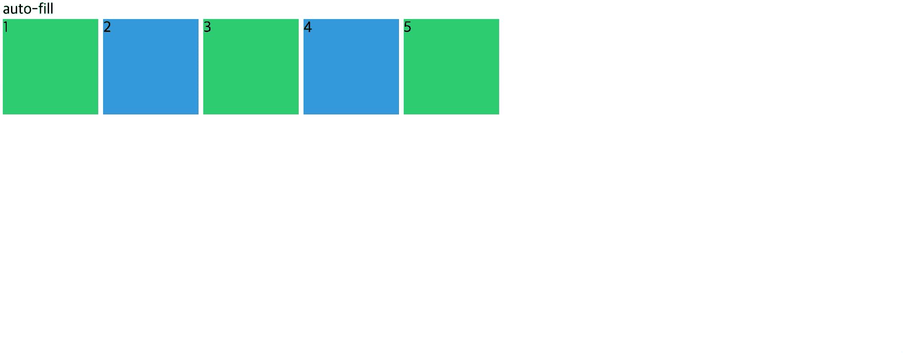
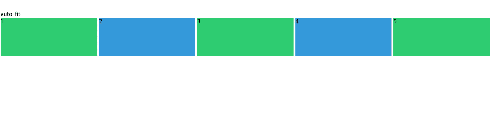

## 🚧기본적인 반응형 을 위한 auto-fit, auto-fill

html 은 아래와 같이 적용하였다.

```html
<body>
  auto-fill
  <div class="grid">
    <div class="item">1</div>
    <div class="item">2</div>
    <div class="item">3</div>
    <div class="item">4</div>
    <div class="item">5</div>
  </div>
  auto-fit
  <div class="grid">
    <div class="item">1</div>
    <div class="item">2</div>
    <div class="item">3</div>
    <div class="item">4</div>
    <div class="item">5</div>
  </div>
</body>
```

css 의 초기 코드는 다음과 같다.

```css
.grid {
  display: grid;
  gap: 5px;
  height: 50vh;
  grid-auto-rows: 100px;
}

.grid:first-child {
  grid-template-columns: repeat(5, minmax(100px, 1fr));
}

.grid:last-child {
  grid-template-columns: repeat(5, minmax(100px, 1fr));
}

.item:nth-child(odd) {
  background: #2ecc71;
}

.item:nth-child(even) {
  background: #3498db;
}
```



아직까지는 위와 아래가 동일하다.

## 🚧해당 row 를 채워 나가는 auto-fill

auto-fill 은 빈 컬럼이(공간) 있는 만큼 가능한 많이 채운다. 보다 정확한 사이즈를 원할 때 사용한다.

```css
.grid:first-child {
  grid-template-columns: repeat(auto-fill, minmax(100px, 1fr));
}
```



## 🚧row 에 딱 맞게 (fit) 하는 auto-fit

auto-fit 속성은 현재의 element 를 쭉 늘려서 row 에 딱 맞게 (fit) 하는 것이다.

반응형에서 유동적인 사이즈를 위한 것, auto-fit 은 빈 공간이 없다!

```css
.grid:last-child {
  grid-template-columns: repeat(auto-fit, minmax(100px, 1fr));
}
```



모바일 반응형에서 화면을 키워나갈 때

element 들을 같은 사이즈로 맞추게 하거나 (auto-fill)

element 들의 크기도 동시에 커졌으면 하는가 (auto-fit) 의 차이이다.


