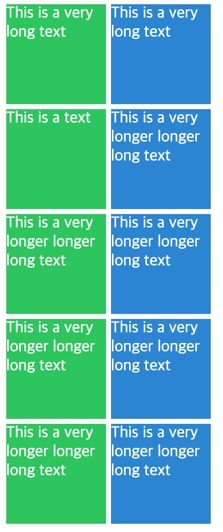
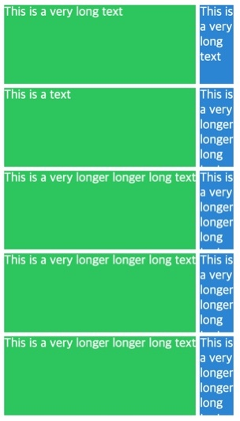

## ⛱min-content, max-content

생각했던 content size 를 직접 디자인 하게 해준다.

content 란? div 안에 있는 텍스트를 일컫는다.

```html
<body>
  <div class="grid">
    <div class="item">This is a very long text</div>
    <div class="item">This is a very long text</div>
    <div class="item">This is a text</div>
    <div class="item">This is a very longer longer long text</div>
    <div class="item">This is a very longer longer long text</div>
    <div class="item">This is a very longer longer long text</div>
    <div class="item">This is a very longer longer long text</div>
    <div class="item">This is a very longer longer long text</div>
    <div class="item">This is a very longer longer long text</div>
    <div class="item">This is a very longer longer long text</div>
  </div>
</body>
```

div 안에 있는 content 를 어떻게 보이게 할까 에 대한 옵션을 주기 위함 이다.

min-content 와 max-content 는 fr 과 같이 size 이다.

min-content 는 content (여기서는 text) 가 작아질 수 있는 만큼 작아지게 만드는 속성이다.

max-content 는 박스를 content (text 의 길이) 가 필요로 하는 사이즈만큼 크게 만드는 것이다.

## ⛱CSS 코드

```css
.grid {
  color: white;
  display: grid;
  gap: 5px;

  grid-template-columns: 100px 100px;

  grid-auto-rows: 100px;
  margin-bottom: 30px;
}

.item:nth-child(odd) {
  background: #2ecc71;
}

.item:nth-child(even) {
  background: #3498db;
}
```



별 특이사항은 없어 보인다. 그런데 이제 여기서,

grid-template-columns 를 다음과 같이 수정해 보았다.

## ⛱min-content, max-content 적용하기

```css
grid-template-columns: max-content min-content;
```



첫 번째 컬럼은 content (text 의 길이) 가 허용하는 최대치, 필요로 하는 사이즈만큼 크게 만들어졌다.

그런데 두 번째 컬럼은 content 가 작아질 수 있는 만큼 작아지게 만들어졌다는 것을 확인할 수 있다.

## ⛱minmax 와 함께 써본 max-content

```css
grid-template-columns: repeat(5, minmax(max-content, 1fr));
```

컬럼을 5개를 생성하고 minmax 로 브라우저 화면이 줄어 들 때의 최소 길이를 max-content 로 주고,

화면이 늘어날 때의 최대 길이를 1fr 로 주었다.


이제 화면이 줄어 들어도 content 즉, 텍스트 크기가 필요로 하는 크기 이하로는 절대 떨어지지 않는다.

## ⛱minmax 와 함께 써본 min-content

grind-template-columns 를 다시 수정하였다. 이번에는 브라우저 화면이 줄어 들 때의 최소 길이를 min-content 로 주기 위함이였다.

```css
grid-template-columns: repeat(5, minmax(min-content, 1fr));
```


이제 화면이 줄어 들면 content, 텍스트가 작아질 수 있는 만큼 최대한 쪼그라 들어 버리게 된다.

## ⛱auto-fill, auto-fit 과의 결합

이번에는 움짤 없이 코드만으로 어떻게 될지 상상에 맡겨 보자.

```css
grid-template-columns: repeat(auto-fill, minmax(20px, max-content));
```

```css
grid-template-columns: repeat(auto-fit, minmax(20px, max-content));
```
