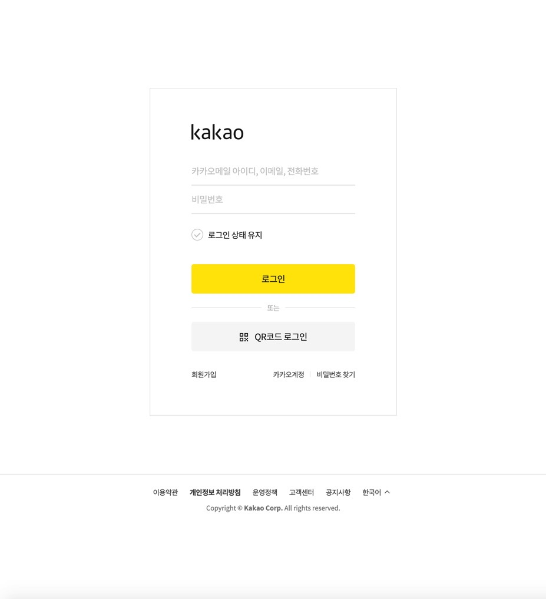
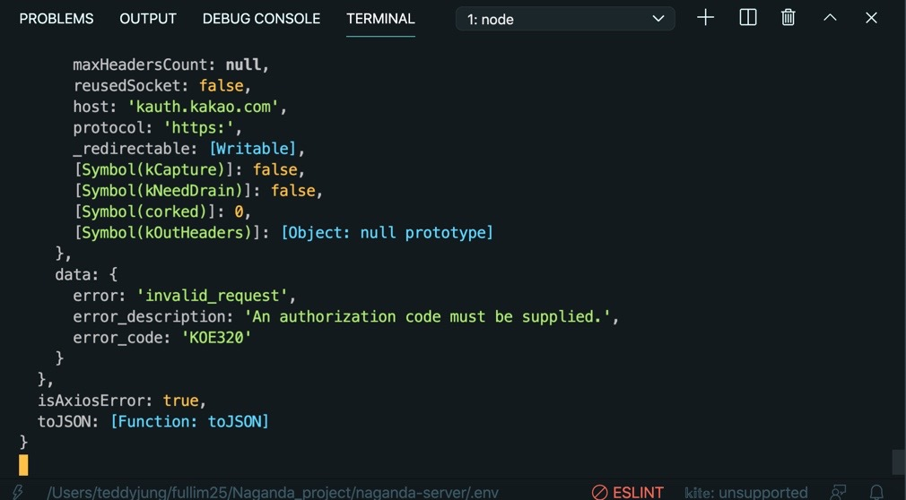
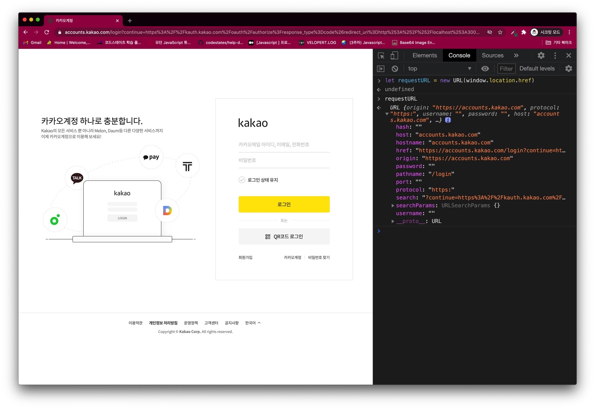
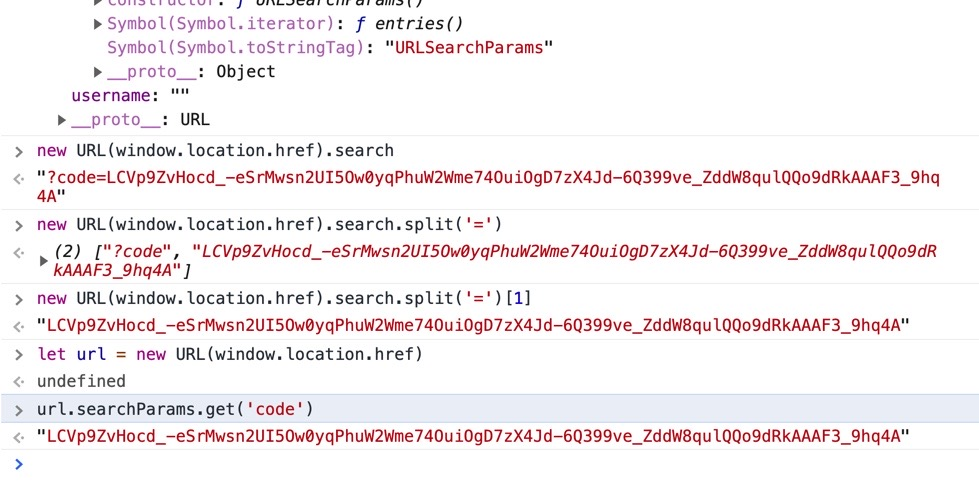
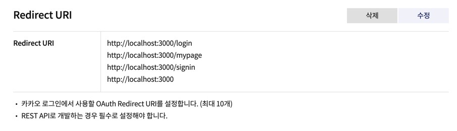
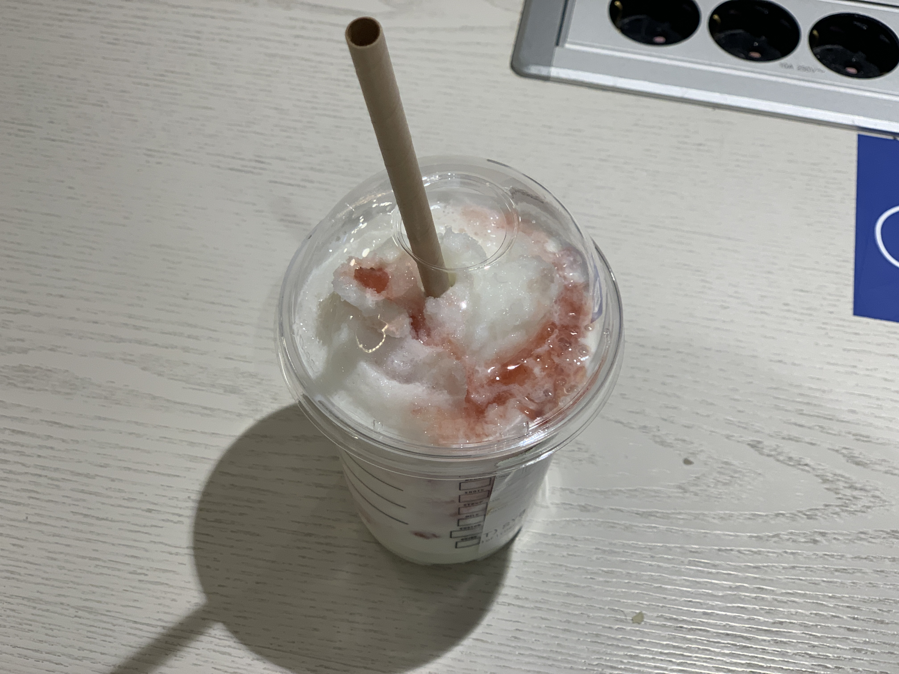

## 🐝KAKAO LOGIN

파이널 프로젝트를 시작한 지 이제 3주 차 를 넘어가고 있다.

여러 크고 작은 어려움과 문제 해결을 담은 사항을 매일 정리 하기에는 CSS 와 기능구현의 빠듯함(?)이 나를 그리고 내 스스로를 매일매일 몰아붙였기에 블로그를 쓰지 못했다.

그런데 이 카카오 로그인은 그냥 넘길 수 없어서 블로그를 써야만 하겠다.

## 🚨공식문서 따라 해보기

자세한 공식 문서의 내용은

https://developers.kakao.com/docs/latest/ko/kakaologin/prerequisite

에 잘 소개되어 있다.


공식 문서에 있는 해당 이미지가 과정을 잘 설명해 주고 있다.

비록 삽질? 을 조금 심하게 했지만, 프론트 엔드의 입장에서 카카오 서버에 인증 코드를 요청하고,

그 인증코드를 받아서 백엔드의 서버로 전달해주면 이제 백엔드 에서는 해당 인증코드로 카카오에 토큰을 요청하고,

프론트엔드에서는 이제 비로소 응답으로 access_token 과 refresh_token 을 받게 되고 토큰 유효성 확인을 통해

비로소 카카오 로그인에 성공하게 되는 과정이다.

### 1. 삽질의 기억, Rest API vs SDK for JS

카카오 로그인 구현을 하기 위해 설정하는 과정은 이미 진행되어서 아래 링크로 대신한다.

https://developers.kakao.com/docs/latest/ko/kakaologin/prerequisite

나는 자바스크립트 SDK 를 이용한 카카오 로그인 구현 문서를 보면서 진행했다.

결론부터 말하자면 우리 프로젝트는 'Rest API 를 이용한 카카오 로그인' 의 문서를 보면서 진행하는 것이 포인트였다.

백엔드 분들이 열심히 설명해 주셨던 거 같은데 제대로 듣지 못했던 게 일단 첫번째 삽질의 시작이 되었다.

여튼 https://developers.kakao.com/docs/latest/ko/getting-started/sdk-js 링크를 보면서

먼저 React 내 public 폴더 안에 있는 index.html 내 head 태그에 다음의 코드를 추가했다.

```html
<script src="https://developers.kakao.com/sdk/js/kakao.js"></script>
<script>
  Kakao.init('939d6088cefbb5aaceb178768be8be0c')
  console.log(Kakao.isInitialized())
</script>
```

이렇게 시작했던 이유를 다시 떠올려 보니까, 나는 이전에 카카오 로그인을 시도해 본적 이 있어서였다.

하지만 그 때는 내가 썼던 Kakao SDK for JavaScript 를 사용했던 방식 이였다.

그리고 아래의 코드를 만들고

```js
const loginWithKakao = () => {
  window.Kakao.Auth.login({
    success: authObj => {
      console.log(authObj)
      axios('http://localhost/users/kakao', {
        method: 'POST',
        headers: {
          Authorization: authObj.access_token,
        },
      })
        .then(res => res.json())
        .then(res => {
          if (res.token) {
            localStorage.setItem('CC_Token', res.token)
            console.log('로그인 되었습니다.')
            history.push('/')
          } else {
            console.log('다시 확인해 주세요.')
          }
        })
    },
    fail: function(err) {
      console.log('에러', err)
    },
  })
}
```

onClick 이벤트로 만들어 놓은 카카오 로그인 버튼에 loginWithKakao 함수를 연결해 주면 그대로 끝나는 것이라 생각했다.

하지만 그렇지가 않았다.

### 2. 어어? 로그인이 되는 것 같은데? 안되네..



오? 로그인 창이 뜨네? 오 되나보다 하고 냅다 로그인을 시도한다. 하지만 그 이후에 아무창도 뜨지 않았다.

axios 로 서버 엔드포인트로 요청을 했으니 응답이 오거나 에러 메시지가 와야 하는데, 콘솔 로그로 확인해 보니

아예 응답 자체가 되지 않았고, 백엔드에서의 서버 코드를 req.query 가 잘 못 되었나 싶어서 req 로 console.log 를 찍어서

한참을 확인해 보았다.

위의 코드 포맷에서 크게 벗어나지 않고 뭔가를 수정하다 보니까 401 에러가 400 에러로 바뀌는 것 같기도 했다.

내가 보낸 access_token 이 서버 헤더의 Authorization 에 들어가기도 했다.



여튼 결과적으로 잘못된 접근이였지만,

https://developers.kakao.com/docs/latest/ko/kakaologin/trouble-shooting

인가 관련 코드 에러에 대한 내용을 덕분에 잘 보고 찾아 볼 수 있기는 했다.

그리고 밤늦게 (사실은 새벽) 하다가 지쳐 떨어져 나갈 때쯤 내가 진행한 방식이 잘못되었다는 것을 느꼈다.

팀 프로젝트 관련 노션 페이지에 팀원분께서 친절히 설명해 놓은 글을 이 때 보고 탄식을 했다.

REST API 로 구현하는 카카오 로그인이였어야 했다.

https://developers.kakao.com/docs/latest/ko/kakaologin/rest-api

이 링크를 위주로 참고해서 진행했어야 하는 부분이라는 뜻이였고 나는 자꾸 access_token 을 보내려 했지만,

토큰이 아니라 카카오 서버에 "인증 코드" 를 요청하고 응답으로 받아서 백엔드 서버에 전달해 주어야 하는 것이였다.

## 🚨백엔드 분들과 페어 프로그래밍

```html
https://kauth.kakao.com/oauth/authorize?response_type=code&client_id=1234567890abcdefghijklmnopqrstuvw&redirect_uri=http://localhost:3000/signin
```

위 코드에서 client_id 는 '내 애플리케이션 > 앱 설정 > 앱 키' 에 있는 REST API 키 이다.

팀원분께서 검색해 보셨는데, 해당 키는 공개가 되어도 괜찮다고 한다.

무튼 위의 링크를 타고 들어가면 카카오 로그인 페이지가 나온다.

그리고 로그인을 하고 나면,

```html
localhost:3000/login?code=ASKDJASIN12231KNsakdasdl1210SSALadk5234
```

위와 같이 주소가 바뀌는데 바로 저 code= 뒤에 있는 것들이 "인증 코드" 이다.

<p align="center"></p>

음 그럼 저 인증 코드를 어떻게 가져올까?

### 1. window.location.href

window.location.href 는 현재 브라우저의 URI 주소를 불러온다.

네이x 에서 개발자 도구에 window.location.href 를 치면 해당 주소가 나온다.

팀원 분께서 친절히 찾아주셔서 그 존재에 대해 알게 되었고 추가 검색을 해 보았다.

### 2. new URL()

https://developer.mozilla.org/ko/docs/Web/API/URL/URL

URL() 생성자는 매개변수로 제공한 URL을 나타내는 새로운 URL 객체를 반환합니다. 라고 설명되어 있다.

```html
https://kauth.kakao.com/oauth/authorize?response_type=code&client_id=1234567890abcdefghijklmnopqrstuvw&redirect_uri=http://localhost:3000/signin
```

위 주소를 직접 복사해서 들어가게 되면 로그인 창이 나오고, 해당 화면에서 개발자 도구를 열어

```html
let requestURL = new URL(window.location.href)
```

위의 코드를 입력해서 확인해 보면 아래 이미지와 같이 확인할 수 있다.



위의 이미지에서 보듯 개발자 도구에서 확인해 보았을 때, 이제 new URL 이라는 해당 인스턴스 에서

'search' 라는 키에 주목해야 한다.

### 3. new URL() 에서 search 키를 어떻게 가져오지?

이제 로그인을 하고 난 뒤 바뀌는 URL 에서 "인증 코드" 를 가져와야 한다.



페어 프로그래밍을 할 때 나는 split 을 생각해 냈다.

```html
new URL(window.location.href).search.split('=')[1]
```

로 가져올 수 있다고 생각했다.

하지만 팀원분께서는 더 좋은 제안을 해주셨다. 그것은,

```html
new URL(window.location.href).searchParams.get('code')
```

new URL 인스턴스에 자세히 보니까 searchParams 라는 키가 있었고, get('code') 를 통해 code 뒤 물음표 파라미터 뒤에 있는 내용을 모두 가져오는 것이였다.

오호 좋았으! 이제 가져왔으니 그대로 이 코드를 백엔드 서버로 보내면 되겠군?

아니.. 아직 한 발 더 남았다.


### 4. 인증 코드가 전달되는 Redirect URL 확인 및 리액트 컴포넌트 설정.

일단 내 리액트의 코드는 로그인과 회원가입, 카카오로그인이 모두 있는 SignInUp 이라는 컴포넌트가 있고

하위 자식 컴포넌트로 SignIn, SignUp 등이 있는데 카카오 로그인을 진행하는 SocialLogin 컴포넌트 또한 만들어져 있었다.

이 부분이 아직 명확히 이해가 되진 않지만,

자식 컴포넌트인 SocialLogin 에서 axios 를 통해 서버로 요청을 넣는 시도를 했었고 분명 인증 코드를 넣어서 전달했는데!

console.log 에는 인증 코드가 전혀 찍히질 않았다.

카카오 디벨로퍼에 Redirect URL 설정을 SignInUp 컴포넌트로 연결 되는 주소로 해두었다.

```html
http://localhost:3000/signin
```



생각해보니, 이메일과 비밀번호를 입력해 카카오 로그인을 시도하면 Redirect URL 인

```js
// localhost:3000/signin
<Route path="/signin" component={SignInUp} />
```

로 이동되고 거기에서 (리액트의 SignInUp 컴포넌트) 인증 코드를 받을 수 있는 것인데,

나는 계속 SignInUp 컴포넌트의 자식 요소인 SocialLogin 컴포넌트에서 자꾸 요청을 보내니 요청을 보낼 때마다 /signin 으로

리다이렉트 되는데 인증 코드가 콘솔 로그에 찍힐 리가 없었다.

### 5. 새로운 페이지를 로드하는 window.location.assign()

그럼 이 코드를 어떻게 개선해 볼까 하다가 팀원 분께서 window.location.assign() 이라는 것을 찾아 주셨다.

이 코드는 개발자 도구에서

window.location.assign("http://www.google.com") 이라고 치면

구글 로 이동이 되는, 즉 해당 url 페이지를 로드시키는 코드이다.

SignInUp Component - SocialLogin 로 내려가는 계층 컴포넌트 구조에서

SocialLogin 컴포넌트 를 아래와 같은 코드로 고쳤다.

```js
const SocialLogin = () => {
  const kakaoApi = `https://kauth.kakao.com/oauth/authorize?response_type=code&client_id=1234567890abcdefghskldlasdlksalk&redirect_uri=http://localhost:3000/signin`

  const kakaoLoginHandler = () => {
    window.location.assign(kakaoApi)
  }

  return (
    <div className="social-login">
      <h1>Want Social Login?</h1>
      <button className="kakao-btn" type="button" onClick={kakaoLoginHandler}>
        <span className="btn-active">Login with kakao</span>
      </button>
    </div>
  )
}
```

자 이제 'Login with kakao' 버튼을 누르면 아까 우리가 주소창에 주소를 그대로 복사 붙여넣기해서 카카오 로그인창을 볼 수 있었던 것과 똑같이 진행할 수 있게 된다.

그리고 백엔드의 API 로 요청을 하는 것은, 카카오 디벨로퍼에서 설정한 Redirect URL 이 위치한 "SignInUp" 컴포넌트에서 진행해야 한다!

### 6. SignInUp 컴포넌트에서 백엔드 서버로 요청 보내기

비동기의 Syntactic Sugar 인 async, await 을 적절히 사용한 아래의 코드이다.

이로써 카카오 로그인을 구현해 볼 수 있었다.

```js
useEffect(async () => {
  const getAccessToken = async authorizationCode => {
    let tokenData = await axios
      .post('http://localhost:4000/users/kakao', {
        authorizationCode,
      })
      .then(res => {
        // console.log(res.data);
        let accessToken = res.data.accessToken
        let refreshToken = res.headers['refresh-token']
        localStorage.setItem('CC_Token', accessToken)
        localStorage.setItem('RF_Token', refreshToken)
        history.push(`/mypage`)
      })
  }
  const url = new URL(window.location.href)
  const authorizationCode = url.searchParams.get('code')
  // console.log('인증 코드', authorizationCode);
  if (authorizationCode) {
    await getAccessToken(authorizationCode)
  }
}, [])
```

### 7. 느낀 점

팀원 분들과도 워낙 소통이 잘 된다고 느꼈지만 다시 한 번 같이 페어 프로그래밍을 진행 할 때 팀원 분들의 내용을 잘 귀담아 들어야 겠다는 생각을 했다.

그리고 분명 삽질이 있었고 해결하지 못했던 순간이 있었지만 다른 방면에 대해 배워 볼 수 있었던 시간이 되었던 거 같다.

또한 항상 어떤 생각이나 계획이 항상 다 맞지 않는다는 것을 염두에 두고 깊이 들어갔을 때 스스로 인지하고 빠져 나올줄 아는 시야 또한 길러야 할 거 같다.

마지막으로,



오랜만에 달달한 음료를 맛보게 되어서 너무 좋았다. ㅎㅎ 단 걸 먹으니까 머리도 더 잘 돌아가는 듯 했다!

감사합니다 😆😆😆😆😆😆😆😆😆😆😆😆😆😆😆😆😆😆
