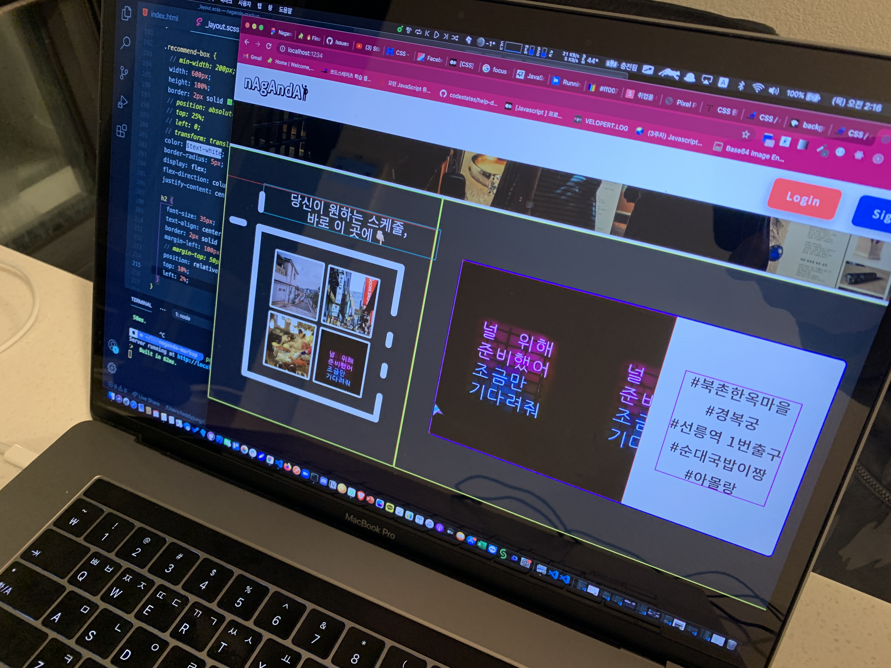
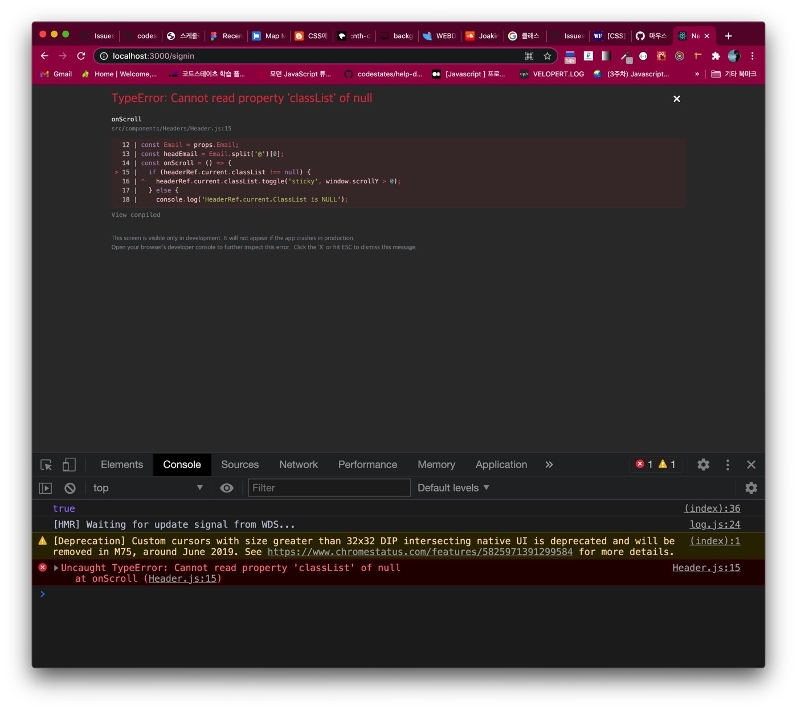

## 🎨CSS 는 어땠어?

일단 프론트엔드 관점에서 바라본 우리가 만들고자 하는 웹 서비스를 양대 축으로 나눠 보았다.

첫 번째 축은, 메인 랜딩페이지를 주축으로 한 로그인, 마이페이지 부분과

두 번째 축은, 회원가입 페이지와 서비스의 실제 기능을 선보이는 스케줄러 페이지와 메인화면에서 검색을 했을 때 이동하는 서치 페이지가 그것이였다.

같이 프론트엔드를 담당하는 분에게 먼저 선택권을 드리고 보니 나는 첫 번째 축을 담당하였고 회원가입 페이지 부분은 진행하다 보니 통합이 이루어져 자연스레
내가 맡아 한번에 진행하게 되었다.

추후 리팩토링 시 팀원들과 이야기를 나누어 폰트의 크기나 종류 등 너무 토이? 스러운 듯한 웹 서비스의 이미지를 살짝 달리 해 보는 시도를 하려고 한다.

### 1. Main LandingPage


사용자 입장에서 제일 먼저 보게 되는 얼굴이 될 페이지라 정말 잘 만들어야 겠다고 생각했다.

처음엔 분명 어려웠지만 계속 시도하고 적용해보니 지금 생각으로는 메인 랜딩페이지 CSS 작업이 정말 재밌고 뿌듯함을 느꼈던 파트였다.



여기에 멈추지 않고 푸터 부분도 만들어 보았고,

한 발 더 나아가 태블릿과 모바일로의 3단 변신이 가능하도록 반응형 웹을 적용하기도 했다.


무엇보다도 gif 영상에서도 확인할 수 있듯이 헤더 부분을 스크롤 할 시 헤더 디자인과 버튼이 바뀌며 고정되도록 만들었던 것도 뿌듯함이 남았다.

하지만 이 스크롤 이벤트는 처음에 DOM 요소를 선택해서 이벤트가 실행되는 코드를 짰었는데, 리액트에서는 상태 요소를 직접적으로 수정하면 안되므로

useRef() 라는 속성을 사용해서 이벤트를 걸어 주어야 했다.

그럼에도 불구하고 간헐적인 에러가 나서 무슨 문제일까 싶다가,



useRef 로 생성된 객체 내에는 current 라는게 들어가 있고,

```js
headerRef.current.classList.toggle('sticky', window.scrollY > 0); 
```

이라는 코드를 통해 스크롤 y축이 0보다 커질 때 (스크롤이 될때) sticky 라는 클래스가 부여가 되면서 해당 CSS 가 적용이 되게 하는 것이다.

바로 이 current의 값이 null 일 경우의 처리를 해주지 않아 간헐적인 에러가 났던 것이다.


코드를 수정하니 더 이상 에러가 나지 않았는데 메인 페이지에서 이러한 버그를 찾아 해결한 점도 좋았다고 생각한다.

### 2. 회원가입, 로그인 페이지 만들기

회원가입과 로그인도 처음에는 각기 따로 페이지를 구성하려 했는데 버튼 토글을 통해 회원가입 또는 로그인 페이지를 나타나게 했다.

처음 피그마 레이아웃이 애매했어서 디자인이 꽤 괜찮게 나왔다는 평가를 들었다.

여기에서 회원가입 기능, 그리고 일반 로그인과 소셜 로그인 마지막으로 게스트 로그인까지 백엔드 API 를 받아 구현을 완료했다.

이 때부터 회원 인증 관련 API 요청 로직을 Redux 를 사용해서 상태를 관리하도록 하는 시도를 했고 결과적으로 잘 되었다.

axios 요청을 매번 사용하니까 이것을 모듈화 해서 쓰는 시도도 했다. 하지만 나중에 코드가 복잡해 지면서 모듈화된 요청 대신 axios 를 직접 쓰는

방식도 동시에 취하기는 했다.

이 부분에서 회원 로그인 시 백엔드로부터 받는 토큰을 어떻게 관리하는지, 카카오 로그인 연결 에서의 접근 방식, Redirect URI 에서 넘겨받은 URL 에 있는 값을 어떻게 백엔드로 전달해 주는 지에 대한 과정을 배우고 알게 되었다.


무엇보다 소통이 정말 중요하고 머리가 많을 수록 해결이 수월해 진다 라는 것을 느꼈다!

모르면 혼자 끙끙 앓는 시간도 중요하지만, 어떤 부분을 어떻게 막히고 어려움을 느끼는지 잘 공유하는 것도 개발자의 덕목이라 생각했다.

### 3. 마이 페이지

이 부분을 구성하면서 제일 기억에 남는 점은, multer 백엔드 요청을 하기 위해서는 프론트엔드에서 formData 라는 방식으로 이미지 데이터를 넘겨 줘야 한다는 점과

비 인가된 사용자가 마이페이지로 접근 (url 직접 입력을 통해) 했을 때 모달 창을 띄워서 회원가입을 유도하게 만들었던 점이다.


처음에는 비인가 사용자 접근 시 바로 홈으로 튕기게만 하려고 했었는데 그 부분은 뭔가 사용자를 배려한 느낌이 아니라고 생각했다.

그리고 마이 페이지의 사용자 정보를 수정할 수 있도록 로직을 작성하였다.

multer 구현을 위한 프론트엔드 에서의 처리를 어떻게 할까 검색해 보다 formData 로 넘겨줘야 한다는 것을 알게 되었고 이 때 백엔드 측에서 넘겨줘야 하는 코드 또한 수정이 필요하다는 것을 알게 되어 팀원들과 공유하여 해결했다는 것도 뿌듯했다.


탈퇴 처리 시 한 번 더 물어봐서 확실히 탈퇴 여부를 정하는 모달창도 만들어 보았고, 마이페이지 아래의 스케줄러 미리보기 카드도 flex 를 통해 구현해 볼 수 있는 좋은 기회가 되었다.

3편은... 내일 써보자!!


