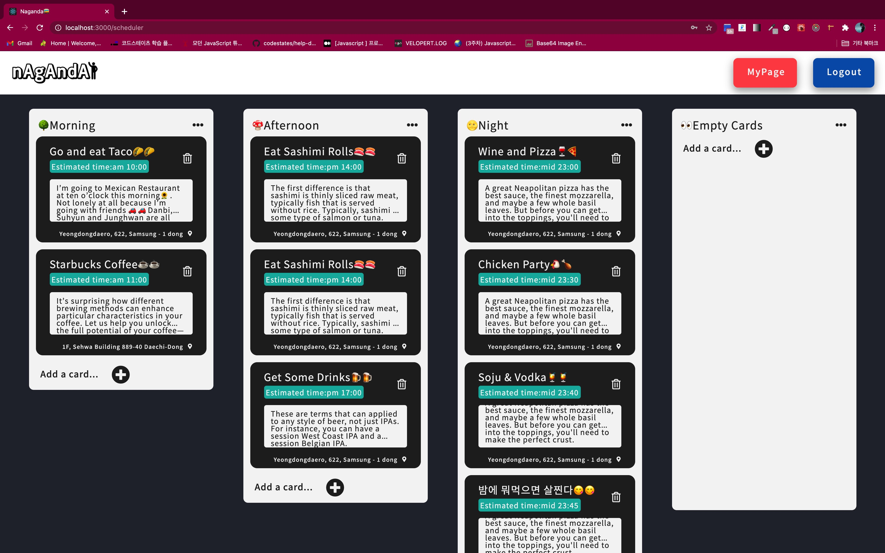
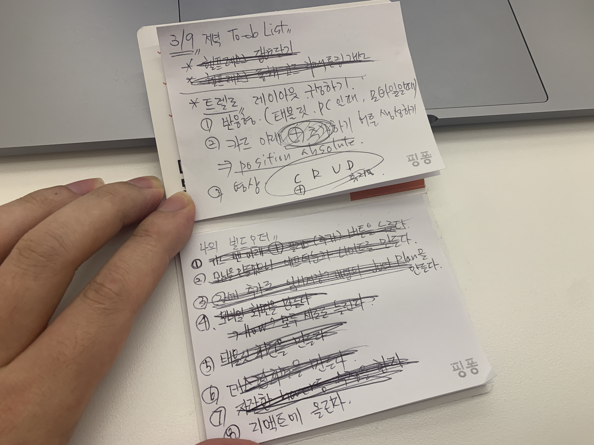

## 🎓수료

오늘 드디어 이머시브 25기를 졸업했다. 크게 감흥이 없었는데 전 기수분들의 연락이라든지.. 같은 기수에서 학습했던 분들에게 연락을 받으면서..

아 드디어 코드 스테이츠의 공식 일정은 마무리 되었구나.. 싶었다.

하지만 아직 끝나지 않았다.

## 🎨아직 더 다듬을 부분

스케줄러 부분은 우리가 알고 있는 트렐로 서비스 처럼 실제 사용자가 유저가 카드를 추가하고 수정하고 지우는 칸반 보드 처럼 만들어가기로 기획했다.

CSS 로 구현해 나가는데 까지는 그럭저럭 괜찮았다.

React-beautiful-dnd 를 통한 Drag and Drop 이 가능 하도록 코드를 작성해 나가는 것은 같이 진행하는 프론트엔드 팀원분께서 참고할 영상과 본인이 작성한

코드를 같이 보여주시며 함께 진행해 나갔기에 완벽하지는 않지만 가능하게 로직을 작성할 수 있었다.

하지만 해당 기능을 리덕스로 구현해야 하는데 해당 영상의 코드를 울며 겨자먹기로 따라 해 봐도 도저히 적용해 보기가 힘들었다.

이 부분은 같이 도와주신 팀원 분과 내가 프로젝트 중에서 제일 큰 산을 만나게 된 셈이였다.

결론은 내가 리덕스를 제대로 이해하지 않았다는 점이였고, 그것이 안타깝지만 바로 인정해야 될 부분이였다.

마지막 4주차 중반에 이 어려움을 맞닥 뜨려서 스스로 밤을 새워보면서 시도해 봐도 잘 되지는 않았다.

발표를 앞두고 있으니까 일단 gif 영상을 통해 우리 팀이 의도하는 기능은 적어도 이러한 것을 의미했다는 정도는 알려줘야 했다.

그래서 백엔드와의 실제 요청과 응답이 오고 가지는 않지만, React 내에서 스케줄 카드 하나가 추가되고 삭제되며 이동하는 것 까지는 구현하여 발표 전날

gif 영상을 찍을 수 있었다.

## 🚨내가 고쳐야 할 점

4주 간의 프로젝트 기간 중 4주차 초반 까지는 팀원들의 상호 소통과 도움으로 회원 인증 및 정보 수정 과 관련된 CRUD 는 거의 구현할 수 있었다.

스케줄러 페이지 구현을 시작하면서 백엔드 파트 팀원분들에게 API 수정을 조금 강하게 요청 드렸던 부분이 떠오른다.

스케줄러 부분이 썸네일 이미지나 스케줄러 타이틀 등의 정보를 바꾸는 파트와 아래 칸반 보드가 있는 두 부분으로 되어 있으니 요청을 나누어 달라고 했었던 것인데,

지금 생각해보면 왜 그랬는지 잘 모르겠지만 약간 나만의 생각? 으로 확신에 차서 말했었던 거 같다.

백엔드 에서 코드를 하나로 합쳐서 하는 것이 어쩌면 더 효율적 일 수도 있는데 말이다.

무슨 일이든 확실한 것은 하나도 없다. 우리가 짜는 코드도 마찬가지 인데 조금 더 신중한 태도를 가지고 팀원 분들과 더 많은 대화를 통해 맞춰나가도록 노력해야 겠다.

그리고 같은 프론트엔드 팀원 분과 초반에 CSS 강의를 듣고 역할을 서로 둘로 나누었다.

하지만 예상 밖으로 팀원 분께서 구현에 어려움을 많이 겪으시는 듯 했다.

프로젝트가 워낙 바쁘게 진행되기도 하기에 그렇다는 변명을 할 수도 있지만 같이 하는 팀원 분의 어려움을 잘 살피고 보다 더 챙겨 드렸어야 했는데,

이 부분에서 조금 부족했던 거 같다.

이 부분은 차주 팀원분과 줌에서 미팅을 통해 그동안 진행했던 코드들에 대해 잘 설명드리고 함께 추가 학습을 진행해 나가며 함께 보완해 나가려고 한다.

팀원 분들과 머리를 맞대고 (줌 화상으로 ㅎㅎ) 고민하다가 해결책을 찾고, 그 코드 로직이 실현이 될 때 그 기쁨은 이루 말로 다 할 수 없을 정도였다.

이러한 경험을 할 수 있게 도와준 이머시브 25기 6팀 ZoomInCenter 팀원 분들에게 정말 감사하다.

## 🌟계획

차주 부터 팀원들과 코드 리팩토링 진행을 통해 레이아웃, CSS, 기능 구현을 최대한 시도하고 완성할 예정이다.

면접 준비도, 알고리즘 문제 풀이도 무엇 하나 놓칠 것이 없다.

계획을 잘 세우고 어쩌면 프로젝트 때보다 더 더 올빼미족이 되어야 할 것만 같다.

급하게 이력서를 제출하고 구직을 하기 보다는 일주일 정도는 빡세게 나를 몰아붙여서 자신감 2g 한스푼 더 채우고 본 게임에 들어가려 한다.

화이팅!!😁😁😁😁😁😁😁😁😁😁😁😁😁😁😁😁😁

