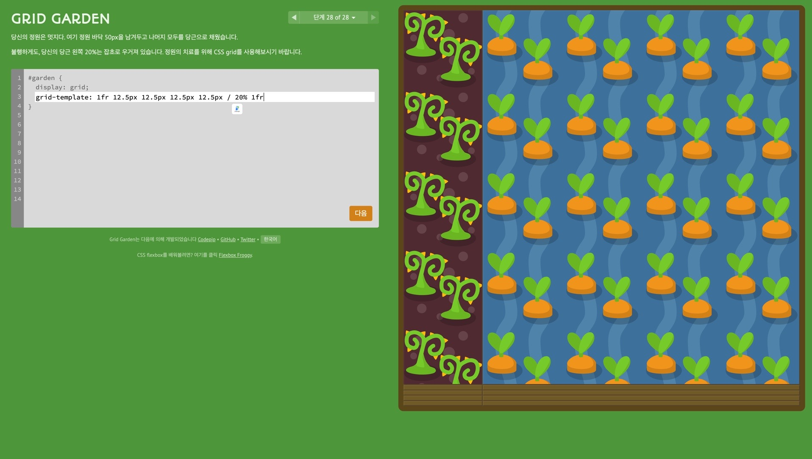
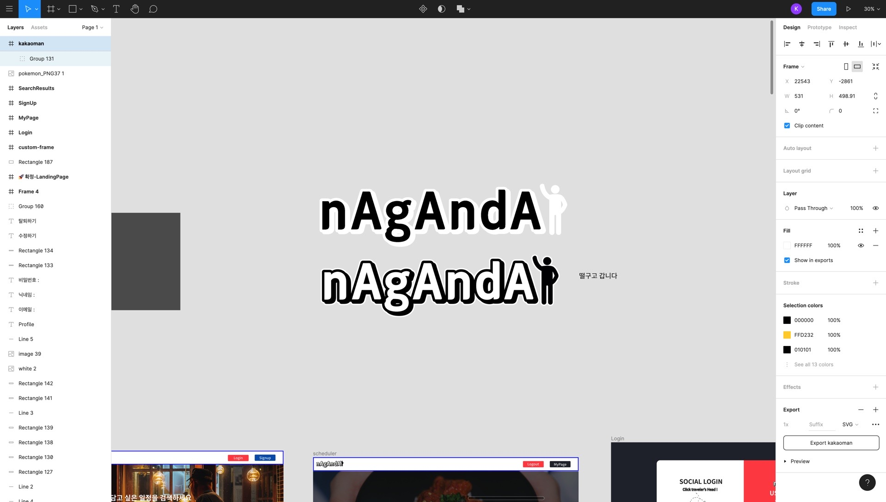
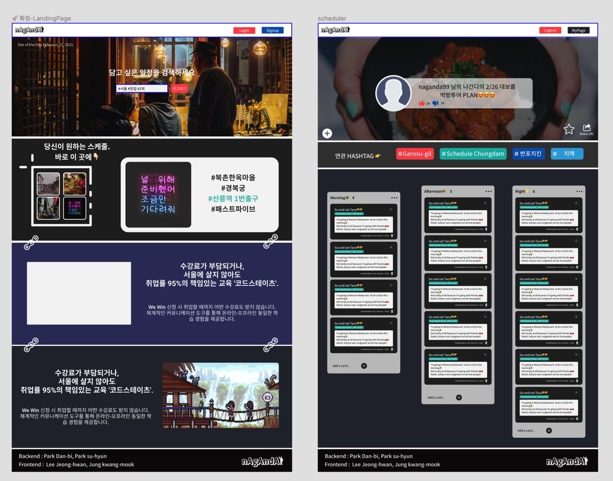

## 😅다시 돌아보는 내 블로그

CSS 를 학습하기 위해 일주일 간 팀원님과 함께 학습하면서 블로그를 썼던 것, 카카오톡 로그인을 시도했던 블로그 를 제외하고는,

내 블로그가 너무 낯설었다.

그리고 밤늦게 하고 낮에 졸리는 패턴이 계속되었어서 일찍 잠들었다 한시간만에 숙면을 느껴 다시 일어나 블로그를 쓰게 되었다.

프로젝트 또한 막판 마무리 단계가 필요하지만 앞으로 매일 블로그를 작성해 나가면서 가꾸어 나가야 겠다.

## 🤔4주동안의 파이널 프로젝트

좋은 점도 있었고 나를 다시 반성하고 돌아보게 된 시간도 있었던 4주간의 파이널 프로젝트.

생각나는 대로 적어 보면서 내가 발전한 점 그리고 개선할 점을 찾아보겠다.

## 👍팀원분들

나는 팀원 분들 복이 좋았다. 다들 열정 넘치시고 재기 발랄하며 긍정적이신 분들이였다.

회의를 통해 모인 자리에서 이야기를 나누는 것 만으로도 내가 맡은 거는 밤을 새서라도 끝내버리겠다는 불타는 의지의 원동력이 되었다.

1차 프로젝트에서 느낄 수 없던 강력한 오오라 였다고나 할까.

## 🚨CSS 가 급합니다!!

나는 프론트엔드를 담당했다.

(사실 처음엔 백엔드를 하겠다고 지망... 쿨럭..😅)

프로젝트의 방향과 컨셉 등을 정하고 나는 함께 하는 팀원 분과 논의를 통해 CSS 강의를 결제해서 초반 일주일 가량 학습을 진행했다.

Flexbox 에 대해서 어렴풋이만 알고 있었기에 보다 나은 앞으로의 프로젝트의 완성도를 위해서는 최대한 심미적으로 구성해야 겠다 라는 생각이였기 때문이다.

CSS 중에서도 제일 핵심 개념, 박스 즉 레이아웃을 내가 의도한 대로 위치시키기 위해서 알아야만 했던 개념이였다.

그것은 바로 Flexbox 와 Grid 에 대한 개념이였다.

이를 위해 영상 강의도 듣고 주말에는 페어님과 직접 만나 함께 영상을 들으며 학습했다.

막바로 CSS 를 진행하기보다 이렇게 한 번 학습을 거치고 들어갔을 때 잘 모를지라도 어떤 부분을 찾아 보면 기능 구현을 할 수 있을지에 대한 아이디어 또한

얻을 밑거름이 될 터였다.

(그리드 가든의 마지막 문제를 풀고 환호하며 캡처 뜬 짤...🤲)

물론 학습했던 것을 적용하기 위해서는 강의에만 끝내는 것이 아니라 박스 모델 같은 개념에 대해 여러 연습을 시도해야 했다.

내가 원하는 대로 위치 이동이 안 될 때는 먼저 박스에 경계선을 쳐놓고 의도하는 코드를 작성해 나가고는 했다.

Flexbox 와 Grid 에 대한 적용을 하다 막힐 때는 내가 일주일간 작성해둔 내 블로그 글을 다시 찬찬히 살피며 적용해 나갔다. 🌟🌟🌟🌟🌟

## 🎨로고 디자인

우리 팀에 파트는 분명 백엔드인데 로고 장인이 한 분 있다.

이 분은 1차 프로젝트에서도 함께 했고 정말 다행히도 2차 프로젝트에서도 같은 팀을 이루게 되었는데, 1차 프로젝트 때 나와 피피티를 만들게 될 때 부터

알아보았다. 꾸미고 내가 말하는 그 심미적 이라는 것을 정말 최대한으로 실현하시는 분이였다.

그러나 본인은 백엔드가 적성 이라는.. 

여튼 위의 팀 이름도, 팀 로고도 이 분이 정한 것이 선정되었는데 디자인에 문외한인 나도 로고가 너무 마음에 들었다!

(내가 만든 로고는 목이 달아난 이미지라 올리지 못하는 점 양해바란다😭)

## 👨🏻‍🎨Figma 로 프로젝트의 모습 미리 그리기!

1차 프로젝트 때 팀원분으로 부터 피그마를 사용하는 법에 대해 많이 배웠던 것이 정말 유용했다.

메인 랜딩 페이지를 피그마로 구성하는 것을 시작으로, 회원가입 및 로그인 그리고 마이페이지, 스케줄러 페이지를 디자인해 나갔다.

팀원 분들간의 의견 들을 반영해서 같이 진행하는 프론트엔드 팀원님과 레이아웃을 구성해 놨더니,

헐.. 이걸 CSS 로 구현한다면 엄청 박터지겠다 라는 마음속 불안함의 불꽃이 스멀스멀 올라오기 시작했다.

(TMI 가 길어졌다.. 2편은 이따가 올리겠습니다!🤣🤣🤣)

