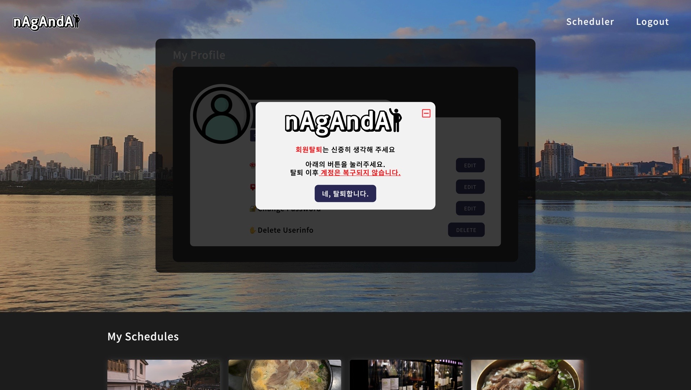
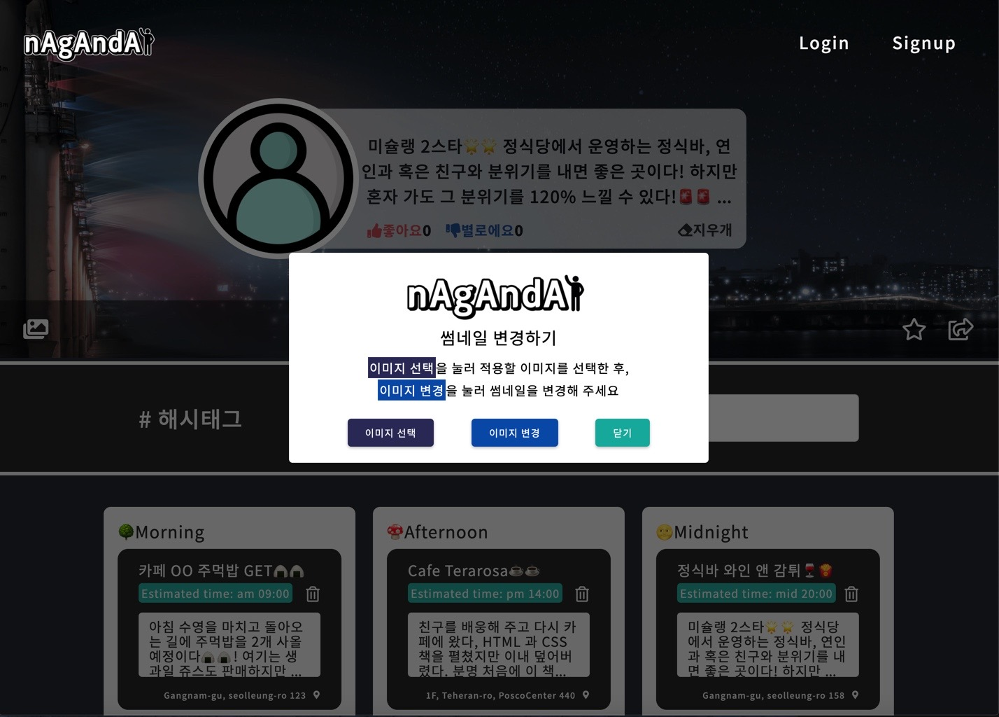

## 🤮부트캠프 졸업 이후가 진짜 시작이라는..

지난주 금요일에 웹 개발 부트캠프 과정을 수료했다.

그렇게 주말을 보내고 월요일이 되었고 지금은 금요일 저녁이다.

파이널 프로젝트를 조금 더 멋지게 가꾸어 나가는 중이다. 물론 의도한 바대로 기능을 구현하는데 조금 더 노력을 들여야 한다.

팀원들과 프로젝트를 다듬은 경험을 이야기 하기 전에 선택과 집중을 더 잘해야 겠다는 생각이 든다.

코딩 테스트도 연습해야 하고, 기초적인 CS 지식에 대한 학습과 그동안 쓴 블로그 글을 통한 복습도 필요하다.

욕심이 많아서 막 여기 저기 펼쳐 두고 한 번에 다 먹으려고 했던 점을 반성한다.

부트캠프에서 각자가 모두 개발자가 되려는 사연들이 있었다. 나도 마찬가지다. 난 해낼 거고 뿌리를 내려서 다시 꽃피워 나갈 것이다.

## 👨🏻‍🎨랜딩페이지 UI 개선


gif 를 통해 서비스를 시연하는 모습과 더불어 옆에 설명글이 있는데, 팀원들이 좋은 의견을 내주셔서 폰트와 크기를 좀더 눈에 들어올 수 있도록 변경해 주었다.

또한 footer 부분이 너무 왼쪽으로 치우쳐진 듯 하여 그 부분도 가운데로 정렬이 되도록 수정하였다. 그리고 로고와 Github 링크를 클릭하면 각각 파이널 프로젝트 기획서 (노션) 와 Github Repo 의 Wiki 페이지로 이동할 수 있게 해 주었다.

팀원분들이 조금 더 전문적인 느낌을 주기 위해서는 전체적으로 꽉 찬 UI 의 느낌보다는, 네이버 포털 화면처럼 좌우 여백이 있게 UI 를 개선해 보면 어떨까 제안을 해주셔서 그 점도 반영했다.

이 부분은 다른 페이지에도 동일하게 여백을 주어 적용했다.

## 👨🏻‍🎨마이페이지 UI 개선


이전에는 이모지의 남발이 좀 있었던 거 같아 최소한의 이모지를 제외하고는 모두 지웠다.

먼저 수정 전의 마이페이지의 사용자 정보 UI 를 보자.


alt 속성이나 깨진 듯해 보이는 사용자 아바타 박스가 무언가 미완성의 느낌을 풍기는 것 같았다.

그래서 최초 회원가입한 사용자와 게스트 로그인을 한 사용자의 기본 아바타 이미지를 적용해 주었고 백그라운드 색상을 다홍색으로 준 것을 지우고 해당 기본 아바타와 비슷한 색상을 적용해 주었다.

이미지 선택과 이미지 변경 버튼의 위치도 수정해 주었다. 사용자 정보에 대해서도 조금 더 오른쪽으로 정렬을 해서 통일성 있게 보이게 하였다.


기본 배경도 기존의 회색 보다는 한강이 보이는 뷰를 가진 이미지로 적용해주니 느낌이 훨씬 살아나는 것 같다.

그리고 사용자 정보를 수정하도록 하는 모달창의 UI 도 기존에 영어를 너무 남발하고 디자인이 별로인 듯 하여 이 부분도 수정했다.



그리고 아래를 내리면 스케줄 카드가 있는데 기존 풀 화면시 꽉찬 느낌에서 랜딩페이지 처럼 좌우 여백을 충분히 주었다.

## 👨🏻‍🎨스케줄러 페이지 UI 개선 및 기능 추가


위의 gif 가 수요일에 수정한 부분이였다.

마찬가지로 좌우 여백을 주었고 수정했을 지라도 반응형에는 전혀 영향을 주지 않게 코드를 작성해야 했다. 하지만 여기에서 더 나아간 부분을 소개하려고 한다.

스케줄러 페이지를 개선하면서 재미를 많이 느꼈지만 앞으로 진행할 부분에서 막힌 부분도 있어서 같이 풀어보겠다.

### 1. 스케줄러의 제목 내용을 직접 수정할 수 있게 로직 작성


원래는 스케줄러 메인 부분 좌측 에 있던 Edit 버튼을 눌러 모달창을 열고 거기서 스케줄러의 내용을 넣고 수정하려 했다.

하지만 이렇게 하면 서비스를 사용하는 유저 입장에서 너무 많이 거치게 되고 버튼을 많이 누르게 만드는 단점이 있었다.

이러한 사용자 경험을 고려해서라도 스케줄러의 제목 부분을 클릭하면 수정을 할 수 있도록 하며, 제목 바깥 부분을 클릭하면 다시 편집기능이 disabled 되게끔 하는 방법을 생각해야 했다.

팀원분이 보내주신 블로그 내용과 내가 찾아본 내용들을 취합해서 새롭게 로직을 다시 작성했고 팀원들에게 성공했음을 알리는 gif 를 보냈다!

### 1-2. 1번의 코드와 리뷰

```js
import React, { useState, useEffect, useRef } from 'react'
import ModifyThumbs from './popupModal/ModifyThumbs'

const SchedulerMain = () => {
  const initial = `미슐랭 2스타🌟🌟 정식당에서 운영하는 정식바, 연인과 혹은 친구와 분위기를 내면 좋은 곳이다! 하지만 혼자 가도 그 분위기를 120% 느낄 수 있다!🚨🚨 치즈에🧀🧀 레드와인🍷🍷 감튀🍟 면 모든게 끝난다!`
  const ref = useRef(null)

  const [likeCount, setLikeCount] = useState(0)
  const [dislikeCount, setDislikeCount] = useState(0)

  const [isBookmarked, setIsBookmarked] = useState(false)

  const increaseLikeCount = () => {
    setLikeCount(likeCount + 1)
  }
  const increaseDislikeCount = () => {
    setDislikeCount(dislikeCount + 1)
  }

  const handleBookmark = () => {
    setIsBookmarked(!isBookmarked)
  }

  const thumbnailRef = useRef(null)
  const [text, setText] = useState(initial)
  const [editable, setEditable] = useState(false)

  const editOn = () => {
    setEditable(true)
  }
  const handleChange = e => {
    setText(e.target.value)
  }
  const handleKeyDown = e => {
    if (e.key === 'Enter') {
      setEditable(!editable)
    }
  }

  const handleRemoveTitle = () => {
    setText('')
  }

  const handleClickOutside = e => {
    if (editable === true && !ref.current.contains(e.target)) {
      setEditable(false)
    }
  }
  useEffect(() => {
    window.addEventListener('click', handleClickOutside, true)
  })

  return (
    <section className="schedule-banner">
      <div className="schedule-info">
        <div className="schedule-avatar">
          
        </div>
        <div ref={ref} className="schedule-title">
          {editable ? (
            <textarea
              type="text"
              value={text}
              onChange={e => handleChange(e)}
              onKeyDown={handleKeyDown}
              rows="3"
              placeholder="스케줄에 맞는 제목을 입력해 보세요!"
            />
          ) : (
            <h2 onClick={() => editOn()}>{text}</h2>
          )}
          <div className="thumbs">
            <i className="fas fa-thumbs-up" onClick={increaseLikeCount}>
              좋아요<span>{likeCount}</span>
            </i>
            <i className="fas fa-thumbs-down" onClick={increaseDislikeCount}>
              별로에요<span>{dislikeCount}</span>
            </i>
            <i className="fas fa-eraser" onClick={handleRemoveTitle}>
              지우개
            </i>
          </div>
        </div>
      </div>
      <ModifyThumbs thumbnailRef={thumbnailRef} />
      <div className="shortcut-icons">
        <div className="add-thumbnail">
          <i
            id="open"
            className="fas fa-images"
            onClick={() => {
              if (thumbnailRef.current !== null) {
                thumbnailRef.current.classList.toggle('show')
              }
            }}
          ></i>
        </div>
        <div className="bookmark-share">
          {!isBookmarked ? (
            <i className="far fa-star" onClick={handleBookmark}></i>
          ) : (
            <i
              className="fas fa-star"
              onClick={handleBookmark}
              style={{ color: '#ff514f' }}
            ></i>
          )}

          <i className="far fa-share-square"></i>
        </div>
      </div>
    </section>
  )
}

export default SchedulerMain
```

editable 이라는 상태에 따라서 기본적으로 텍스트로 보이게 되는가 아니면 textarea 가 있는 박스가 표시 되는가 로 나뉘게 된다.

삼항 연산자를 사용하는 듯한 조건부 렌더링을 통해 editable 이 true 이면 textarea 를 보여주어 수정이 가능하게 하고, false 이면 일반 text 로써 보여지도록 한다.

해당 컴포넌트가 아닌 부분을 클릭했을 때 editable 이 false 가 되도록 useRef 와 useEffect 를 사용해 주어 클릭 발생시 'handleClickOutside' 함수가 실행되도록 하였다.

리액트에서는 DOM 요소를 직접 선택하면 오류를 일으키기 때문에 useRef 를 통해 접근하고자 하는 요소에 ref 를 걸어서 전달하면 ref.current 로 해당 요소 접근이 가능해진다.

ref.current 에는 현재 자바스크립트 객체가 들어가게 되고, 현재 객체가 지금 클릭한 e.target 을 포함하고 있지 않으면 editable 을 false 로 바꾸어 (클릭한 것이 스케줄러 타이틀이 아니라면) edit 모드가 꺼지고 일반 텍스트로 바뀌게 하는 것이다.

### 2. 스케줄러 썸네일 업로드 모달창



이미지 아이콘을 눌러 스케줄러 페이지의 썸네일을 업로드 하는 모달 Pop-up 창을 만들었다.

### 3. 좋아요, 싫어요 그리고 북마크

해당 사용자 입장에서 좋아요 혹은 싫어요는 무제한으로 누를 수 없는데 이 부분은 다시 개선이 필요할 것 같다.

그리고 북마크 여부를 통해 아이콘이 바뀌게 하였다.

### 4. 해시태그 커스텀 기능

아래 gif 에서 알록달록한 네 개의 해시 태그 요소들이 보이는가?


기존의 아이디어는 모달창에서 해시태그를 입력하면 스케줄러 페이지에서 보여주기로만 태그를 나열하게 하려는 의도를 가지고 있었다.

하지만 이 또한 사용자 경험상 불편한 방식이면서 자유롭게 변경하지 못한다는 느낌이 들었다.


프로젝트가 점점 개선되어 간다!

### 5. 프론트 팀원의 발전, 개선

프론트엔드 팀원 분께서 랜딩 페이지의 Input 을 통해 검색을 하면 서치 페이지로 이동하는 부분에 대한 UI 와 코드 개선을 해주셨다.


팀원 분들의 응원과 조언 그리고 본인의 노력으로 전보다 더 개선되고 발전된 UI 를 보여 주셔서 기분이 좋았다.

이를 계기로 조금 더 자신감을 찾아서 재밌게 만들어 나가는 재미를 함께 느꼈으면 좋겠다.

## 👨🏻‍🎨다음은?

실제 수정과 저장이 가능하도록 백엔드와 요청 응답을 주고받아야 한다!

그리고 Redux 코드에 대한 이해도를 더 높여가는 것이다.

화이팅! 난 할 수 있어! 😁😁😁😁😁😁😁😁😁😁
