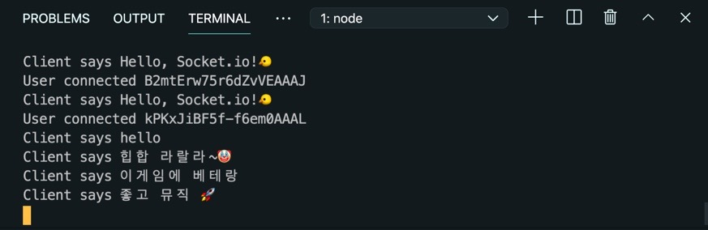
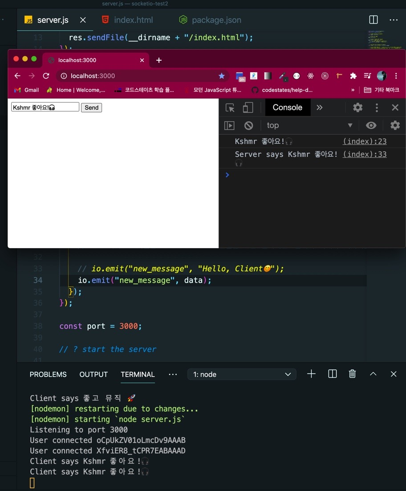
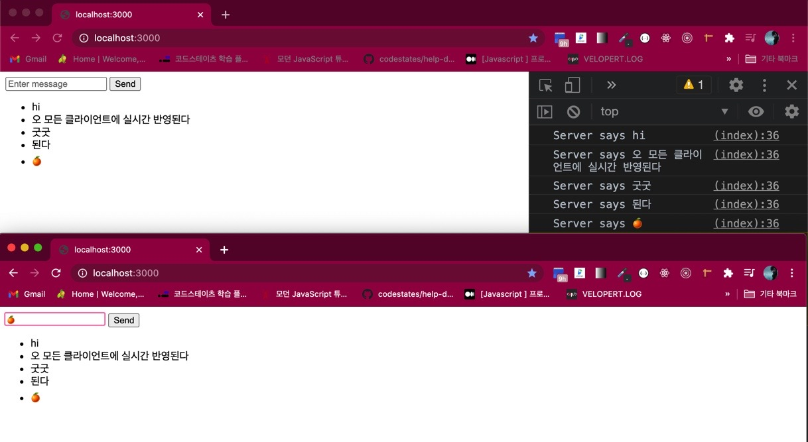
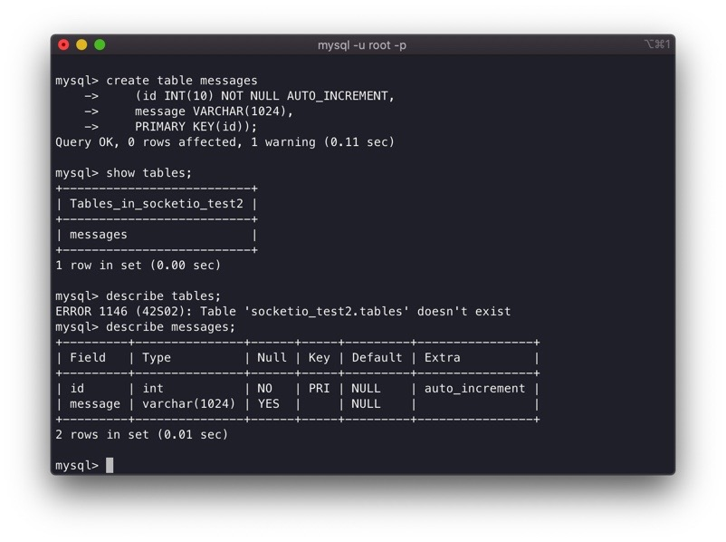
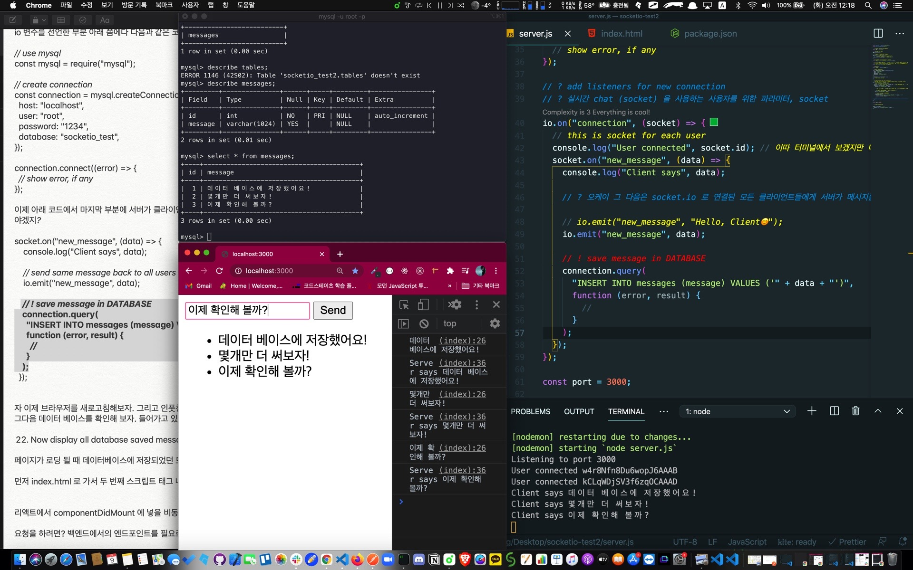
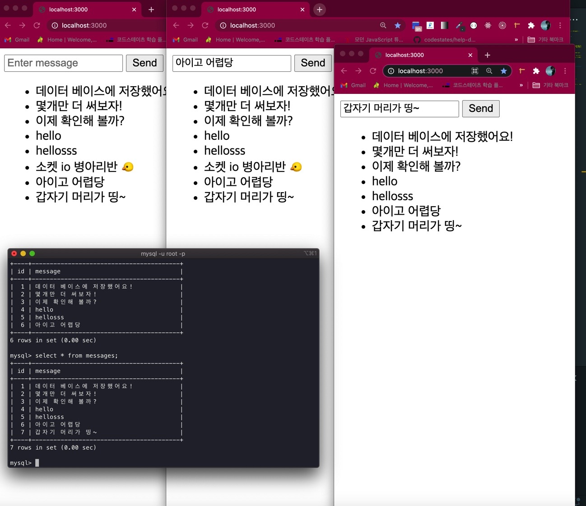

## 👦🏻Basic Socket.io 2부

broadcast 라든가 이런 부분은 일단 생략, 2부에서는 클라이언트 상에 보여지게 하고 Mysql 데이터 베이스와 연동해서 CRUD 를 실천해볼 것이다.

(물론 UD 는 다음에)

## 15. 두번째 script 태그 내에 함수 sendMessage 정의하기

1편에서 form 태그를 만들어 넣었고 onsubmit 이벤트를 form 에 걸었다.

sendMessage() 함수를 이제 정의해 주자.

아래와 같이 수정, 기존 socket.emit 코드를 함수 내로 위치시켜서 변경 하도록 한다.

```html
<script>
  const socket = io("http://localhost:3000");

  function sendMessage() {

    let message = document.querySelector("#message");

    // ! 연습했듯이 클라이언트에서 서버로 메시지를 날릴때는 뭐다? emit!
    console.log(message.value);
    socket.emit("new_message", message.value);
    // 다시 서버 쪽으로 돌아가서 클라이언트의 메시지를 받을 준비를 해야 한다.

    return false;
    // this is prevent the form from submitting, 리액트에서는 e.preventDefault 가 있듯이
  }


  // client will listen from server
  socket.on("new_message", (data) => {
    // localhost:3000 페이지 내 개발자 도구 창에서 확인해 볼 것
    console.log("Server says", data);
  }
</script>
```



## 16. server.js 에서 socket 클라이언트 들에게 같은 메시지를 전달하기

```js
// To send same message back to all users
io.emit('new_message', 'Hello, Client😊')
```

server.js 내 위의 코드를 아래와 같이 수정한다.

```js
io.emit('new_message', data)
```

클라이언트에서 인풋 창에 입력한 채팅이 data 변수 파라미터에 담겨 서버로 요청이 들어갔으니,

이제 이 data 를 socket 에 접속한 모든 클라이언트 들에게 뿌려주는 거다.

클라이언트(브라우저) 개발자도구를 가서 확인해 보면 채팅이 찍히는 것을 확인할 수 있다.



## 17. li 태그를 이용해 브라우저에서 전송한 모든 메시지들이 보이게 하기

index.html 에서

```html
<script src="/socket.io/socket.io.js"></script>

<form onsubmit="return sendMessage()">
  <input id="message" placeholder="Enter message" />
  <input type="submit" value="Send" />
</form>

<!-- List where all messages will be displayed -->
<ul id="messages"></ul>

<script>
  ...이하 생략...

    // client will listen from server
    socket.on("new_message", (data) => {
      // localhost:3000 페이지 내 개발자 도구 창에서 확인해 볼 것
      console.log("Server says", data);

      // display messages
      let li = document.createElement("li");

      li.innerHTML = data; // 만들어진 li 내 텍스트가 server 에서 받은 data 를 넣는다.
      const messages = document.querySelector("#messages");
      messages.appendChild(li); // ul 에 자식으로 li 추가하기
    });
</script>
```

## 18. 브라우저 테스트

브라우저 탭을 두개 정도 열어서 인풋에 채팅을 입력하고 submit 을 함과 동시에 실시간으로 반영되는 모습을 확인해 보자.



## 19. 대망의 데이터베이스 저장하기, Saving all messages in database

먼저 mysql 에 접속해서 “socketio_test” 라는 데이터 베이스를 생성한다. (마음대로 지으세요)

```js
create database socketio_test;
```

그리고 use socketio_test 로 들어간 후, 테이블을 생성하도록 한다.

```js
create table messages
    (id INT(10) NOT NULL AUTO_INCREMENT,
    message VARCHAR(1024),
    PRIMARY KEY(id));
```



## 20. 디렉토리 root 경로에서 mysql 설치

```js
npm install mysql
```

nodemon 으로 서버는 켜둘것

## 21. server.js 에서 mysql 관련 변수 설정, 사용하기

io 변수를 선언한 부분 아래 쯤에다 다음과 같은 코드를 작성한다.

```js
// use mysql
const mysql = require('mysql')

// create connection
const connection = mysql.createConnection({
  host: 'localhost',
  user: 'root',
  password: '1234',
  database: 'socketio_test',
})

connection.connect(error => {
  // show error, if any
})
```

이제 아래 코드에서 마지막 부분에 서버가 클라이언트에게 전송해준 data (챗) 부분을 봐야 한다.

여기서 클라이언트에게 전송 뿐만 아니라, database 에 저장을 해야겠지?

```js
socket.on('new_message', data => {
  console.log('Client says', data)

  // send same message back to all users
  io.emit('new_message', data)

  // ! save message in DATABASE
  connection.query(
    "INSERT INTO messages (message) VALUES ('" + data + "')",
    function(error, result) {
      //
    }
  )
})
```

자 이제 브라우저를 새로고침해보자. 그리고 인풋창에 입력후 엔터 쳐보자.

그 다음 데이터 베이스를 확인해 보자. 들어가고 있다.



## 22. 페이지가 로딩 될 때 데이터베이스에 저장되었던 모든 메시지들을 불러오게 하기

먼저 index.html 로 가서 두 번째 스크립트 태그 내 sendMessage 함수 코드의 아래 쯤에 ajax 요청을 넣을 차례다.

리액트에서 componentDidMount, useEffect 에 넣을 비동기 요청 (fetch) 등이 있겠다.

요청을 하려면? 백엔드에서의 엔드포인트를 필요로 한다.

일단, fetch("http://localhost:3000/get_messages") 정도로 작성해주고 다시 server.js 로 돌아가야 한다.

처음에 작성한 심플 get request 코드 위쯤에 작성한다.

```js
// ! create API for get_message
app.get('/get_messages', (req, res) => {
  connection.query('SELECT * FROM messages', (error, messages) => {
    // return data will be in JSON format
    res.end(JSON.stringify(messages))
    // 이거 하기 싫으면 app.use(express.json()); 를 적용해야 할 것이다.
  })
})
```

그럼 이제 index.html 로 돌아가서 클라이언트의 fetch 요청을 마저 작성한다.

```js
fetch('http://localhost:3000/get_messages')
  .then(res => res.json())
  .then(data => {
    const messages = document.querySelector('#messages')
    for (let i = 0; i < data.length; i++) {
      // display message, creates new DOM element
      let li = document.createElement('li')

      // give it unique id (in order to delete message)
      li.id = data[i].id

      // add message content as HTML
      li.innerHTML = data[i].message

      // append at the end of list
      messages.appendChild(li)
    }
  })
```

브라우저를 새로고침 해보자.

이제 브라우저를 새로 열어도 해당 채팅의 내용을 데이터베이스에서 고스란히 불러올 수 있게 된다.

또한 복수의 브라우저를 열어 테스트를 해 보면 실시간으로 나의 채팅이 다른 유저들에게 (클라이언트) 반영되는 것 또한 확인할 수 있다.



추가로 delete 하는 것도 넣으려 했으나 이건 나중에 넣겠다.

일단 이걸 이해하면 socket.io 의 쌩기초 정도는 맛을 봤다 정도가 되지 않을까 싶다.

🤡🤡🤡🤡🤡🤡🤡🤡🤡🤡🤡🤡🤡🤡🤡🤡🤡🤡🤡
