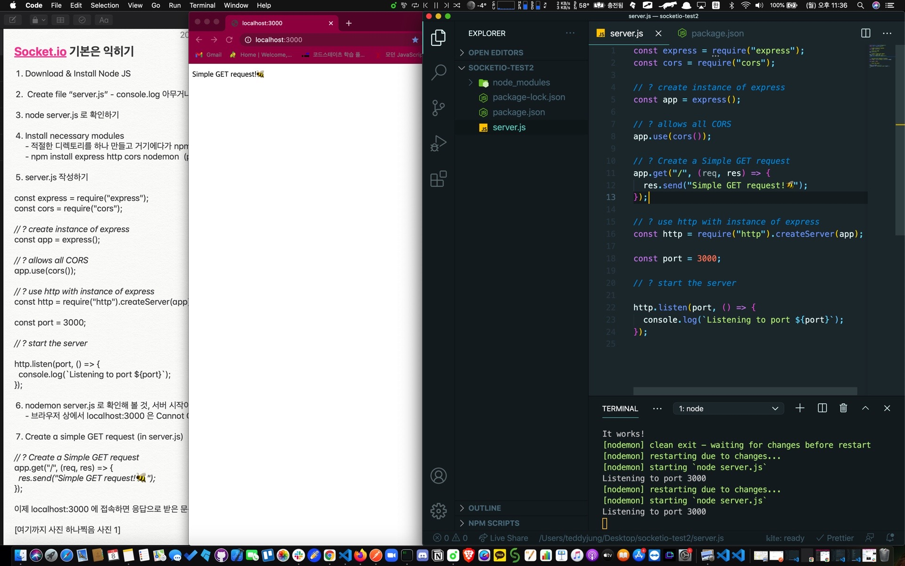
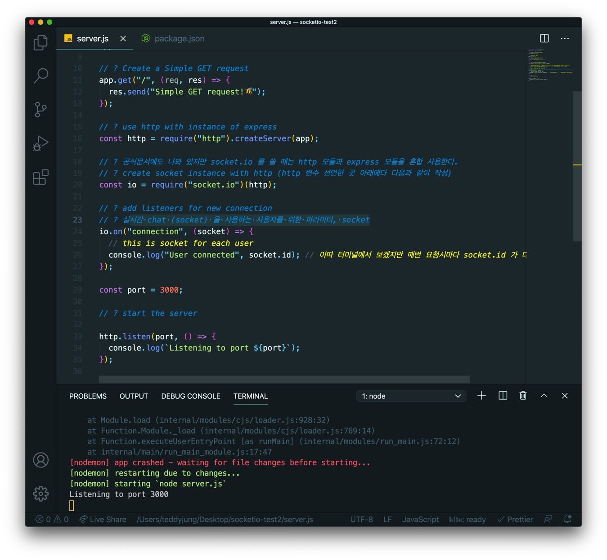
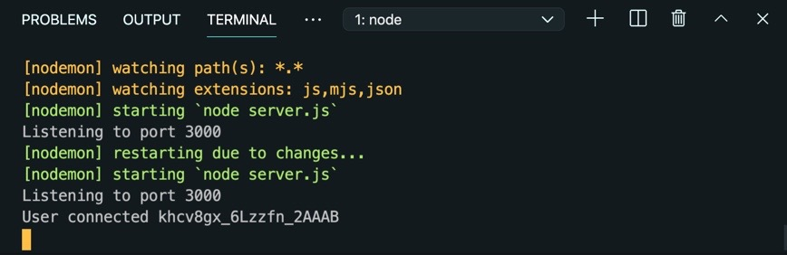
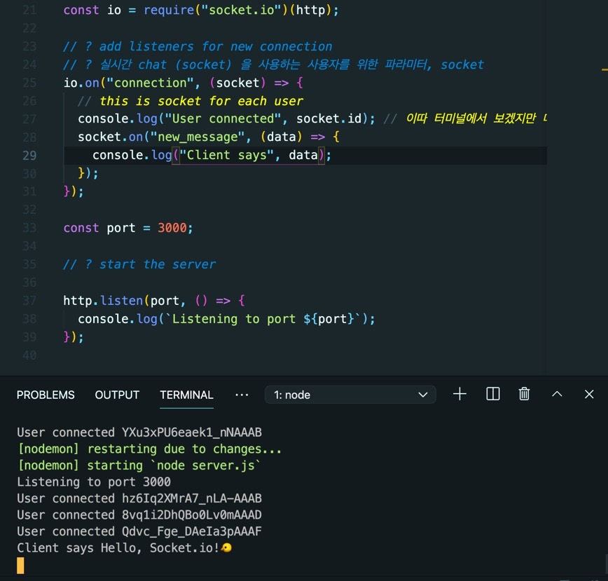
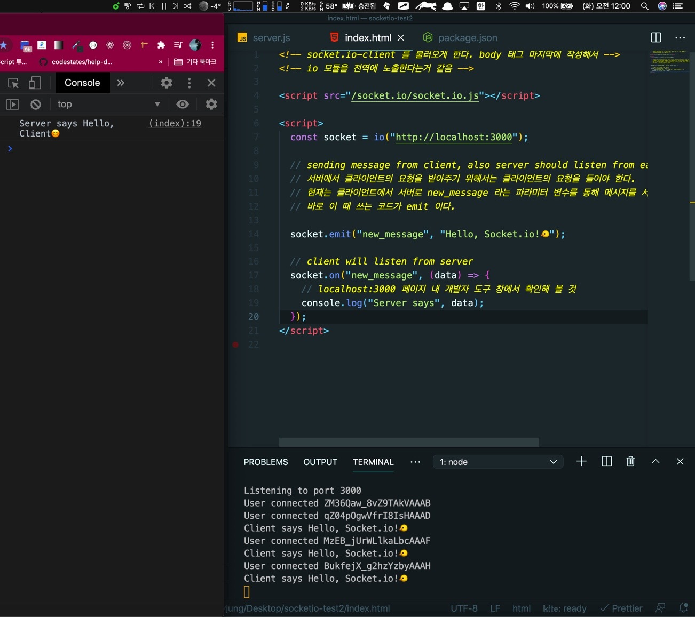

## 👦🏻Basic Socket.io

내가 생각하는 한 줄 요약 : on 과 emit 의 티키 타카 이다.

Tiqui-Taca barca ?


저 시즌의 바르셀로나는 뭐.. 역대급이구나.. 😱

여튼 각설하고 튜토리얼 순서대로 따라해 보면 socket.io 의 전부는 아닐 지라도 아주 미세한 기초 정도는 알 수 있지 않을까 기대하며 (페어님? 보구계시지유?😂) 가보즈아!

## 1. Create empty directory

일단 빈 디렉토리 하나 만들고

## 2. Create file “server.js”

에디터를 열든 해서 server.js 를 생성 이후 아무 콘솔로그나 같다 찍어 놓고

## 3. node server.js 로 확인하기

## 4. Install necessary modules

적절한 디렉토리를 하나 만들고 거기에다가

npm init -y 로 package.json 생성하기

npm install express http cors nodemon (package.json 에서 nodemon 으로 start 시 커맨드를 지정해준다)

## 5. server.js 작성하기

```js
const express = require('express')
const cors = require('cors')

// ? create instance of express
const app = express()

// ? allows all CORS
app.use(cors())

// ? use http with instance of express
const http = require('http').createServer(app)

const port = 3000

// ? start the server

http.listen(port, () => {
  console.log(`Listening to port ${port}`)
})
```

더이상의 자세한 설명은 생략합니다.

## 6. nodemon server.js 로 확인해 볼 것, 서버 시작이 되는가?

브라우저 상에서 localhost:3000 은 Cannot GET / 이라는 문구를 확인할 수 있다.

## 7. Create a simple GET request (in server.js)

```js
app.get('/', (req, res) => {
  res.send('Simple GET request!🐝')
})
```

이제 localhost:3000 에 접속하면 응답으로 받은 문구가 출력되어 있는 것을 확인할 수 있다.



## 8. Integrate Socket

socket.io 를 설치한다. (for serverside)

```js
npm install socket.io
```

공식문서에도 나와 있지만 socket.io 를 쓸 때는 http 모듈과 express 모듈을 혼합 사용한다.

server.js 내에 아래 코드를 http 변수 선언한 부분 아래에다 작성한다.

```js
// create socket instance with http
const io = require('socket.io')(http)

// add listeners for new connection
// 실시간 chat (socket) 을 사용하는 사용자를 위한 파라미터, socket
io.on('connection', socket => {
  // this is socket for each user
  console.log('User connected', socket.id)
  // 이따 터미널에서 보겠지만 매번 요청시마다 socket.id 가 다르게 확인된다.
})
```



## 9. make index.html on same root directory

같은 루트에 index.html 파일을 만든다.

```html
<!-- socket.io-client 를 불러오게 한다. body 태그 마지막에 작성해서 -->
<!-- io 모듈을 전역에 노출시키는 의미 -->
<!-- io 모듈 내 인자는 백엔드의 주소-->

<script src="/socket.io/socket.io.js"></script>

<script>
  const socket = io('http://localhost:3000')
</script>
```

이렇게 작성하고

server.js 내 코드의 simple get request 부분을 아래와 같이 수정한다.

```js
// ? Create a Simple GET request
app.get('/', (req, res) => {
  res.sendFile(__dirname + '/index.html')
})
```

클라이언트와 연결시키기 위함이다. 리액트에서는 이렇게 할 필요가 없다. 돈 워리

이후 브라우저 (localhost:3000) 을 새로고침 하면서 nodemon 으로 실행한 터미널을 유심히 살펴보자.

"User connected abcdefb123456cdefg" 등의 문구가 나오는 것을 확인할 수 있다. 뒤의 이상한 문자가 바로 socket.id 이다.



## 10. Send message

index.html 부분에서 작성한 코드 에서 두번째 script 태그 부분 아래에 socket.emit 이하의 코드를 추가한다.

```html
<script>
  const socket = io('http://localhost:3000')
  socket.emit('new_message', 'Hello, Socket.io!🐤')
</script>
```

sending message from client, also server should listen from each client via it's socket.

서버에서 클라이언트의 요청을 받아주기 위해서는 클라이언트의 요청을 들어야 한다.

현재는 클라이언트에서 서버로 new_message 라는 파라미터 변수를 통해 메시지를
서버로 전달하고자 한다.

바로 이 때 쓰는 코드가 emit 이다! (발음에 유의할 것)

## 11. 서버는 클라이언트가 던진 메시지를 받을 준비를 해야 한다. (server.js)

클라이언트에서 서버로 메시지를 보냈으니, 서버는 이 메시지를 받을 준비를 해야 한다.

server.js 내 코드에서

io.on 으로 시작하는 기존 코드 내 console.log 아래에 socket.on 이하의 코드를 추가해 본다.

```js
io.on(“connection”, (socket) => {
  // this is socket for each user
  console.log("User connected", socket.id);
  socket.on("new_message", (data) => {
      console.log("Client says", data);
    })
});
```

서버에서 클라이언트의 요청을 받아주기 위해서는 클라이언트의 요청을 들어야 한다.

그 때 쓰는 코드가 바로 on 이다!

파라미터로 받은 socket 을 가져와서, 클라이언트에서 emit 으로 작성한 new_message 의 변수를 일치시켜 첫번째 파라미터에 넣는다. (new_message)

두번째 파라미터의 data 는 클라이언트의 요청 두번째 파라미터에 담긴 값을 의미한다.

이제 클라이언트 (브라우저) 를 새로고침 해 주고 nodemon 으로 열어놓은 터미널을 보면,

“Client says Hello, Socket.io!🐤” 라는 문구를 확인 할 수 있을 것이다.

즉, 클라이언트의 메시지를 서버가 듣게 된 것이다 (하느님 들으셨나요? 같은 느낌)



## 12. 서버에서도 메시지를 클라이언트에게 전달해 줄 수 있다.

현재 작성된 코드에서,

console.log 아래에 io.emit 코드를 다음과 같이 작성한다.

```js
io.on('connection', socket => {
  // this is socket for each user
  console.log('User connected', socket.id) // 이따 터미널에서 보겠지만 매번 요청시마다 socket.id 가 다르게 확인된다.
  socket.on('new_message', data => {
    console.log('Client says', data)

    // ? 오케이 그 다음은 socket.io 로 연결된 모든 클라이언트들에게 서버가 메시지를 보내게 할 것이다.

    io.emit('new_message', 'Hello, Client😊')
  })
})
```

자 이제 이걸 클라이언트가 듣게 하려면?

다시 클라이언트 (index.html) 로 돌아가서 .on 으로 서버로부터의 응답을 듣게 만들어줘야 한다. 가자!

서두에 언급했던 메시지를 보내기 (emit), 메시지 요청을 듣기 (on) 라는 내용이 emit 과 on 의 티키 타카 라는 말이 이해가 좀 될까요?😊

## 13. 클라이언트에서 서버의 응답을 받게 하기. (index.html)

socket.on 을 통해 서버에서 전달해주는 응답을 받는다. 작성해보자.

```html
<script>
  const socket = io('http://localhost:3000')

  socket.emit('new_message', 'Hello, Socket.io!🐤')

  // client will listen from server
  socket.on('new_message', data => {
    // localhost:3000 페이지 내 개발자 도구 창에서 확인해 볼 것
    console.log('Server says', data)
  })
</script>
```



## 14. Send message from form and display in list

index.html 에서 두 스크립트 태그 사이에 form 태그로 입력창 만들어 놓자.

```html
<form onsubmit="return sendMessage()">
  <input id="message" placeholder="Enter message" />
  <input type="submit" value="Send" />
</form>
```

너무 길면 안되므로 2부에서 뵙시다.🤡
