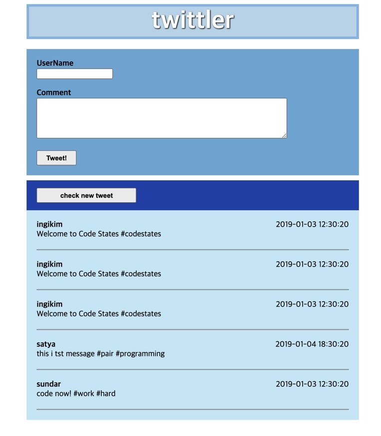
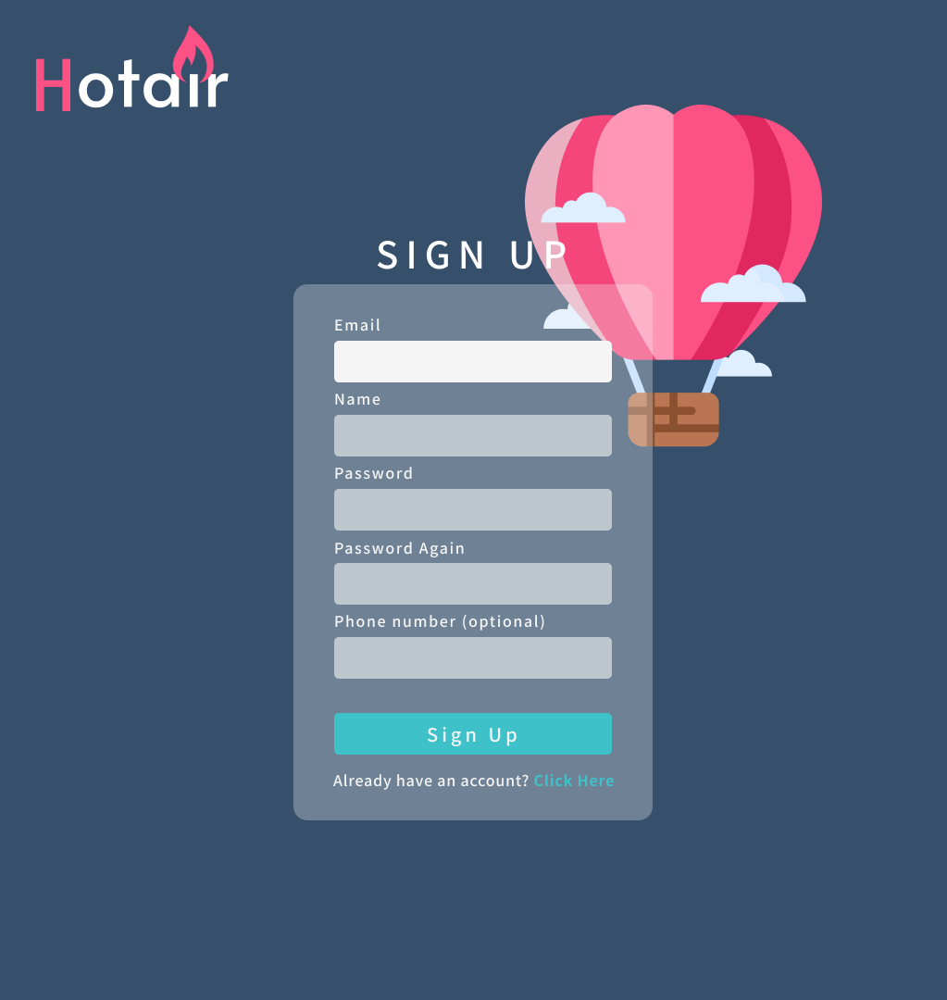
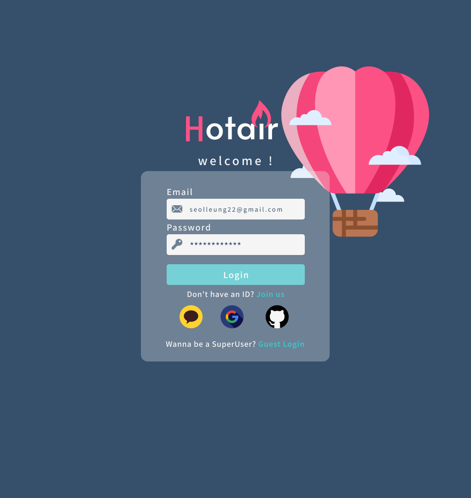
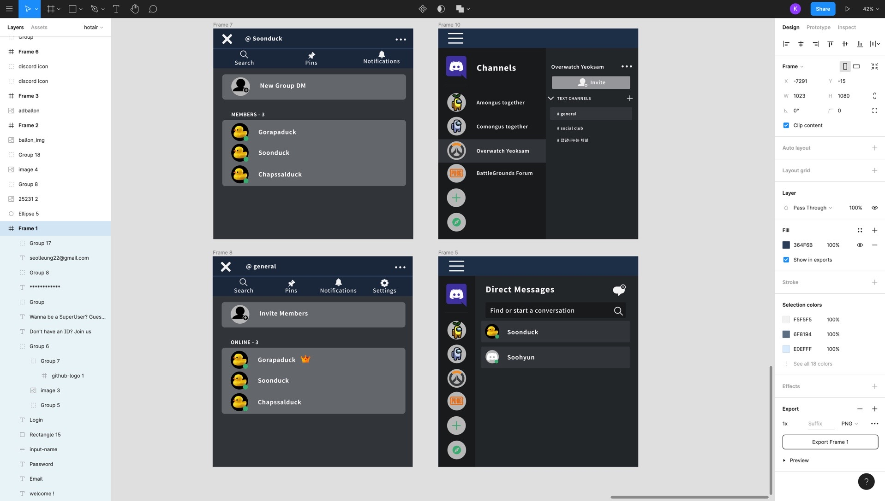
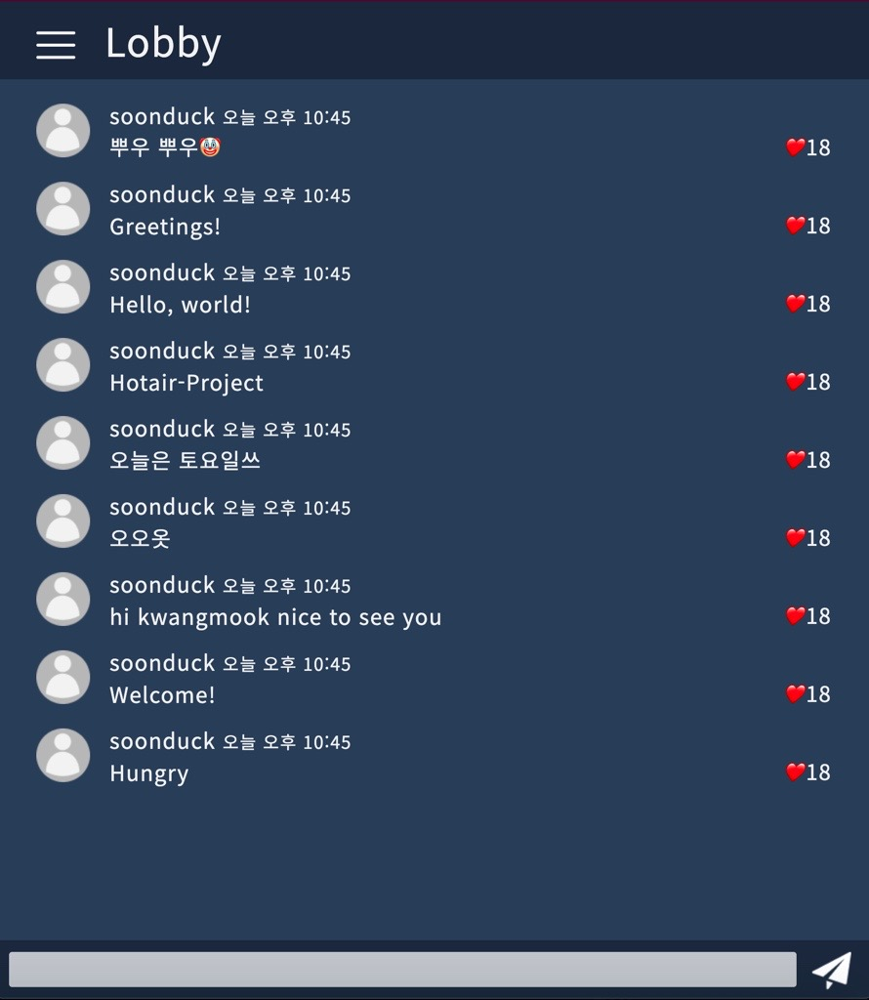
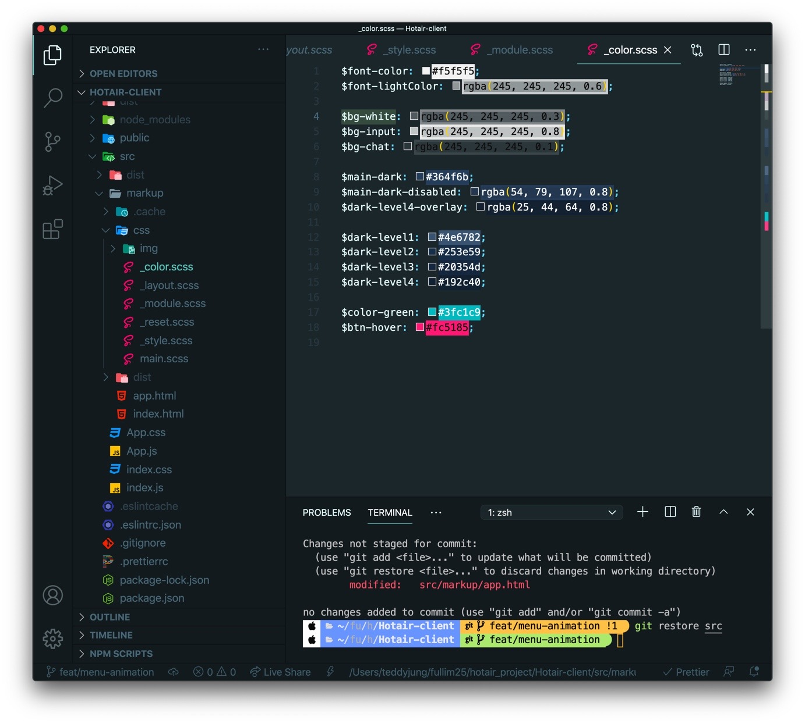
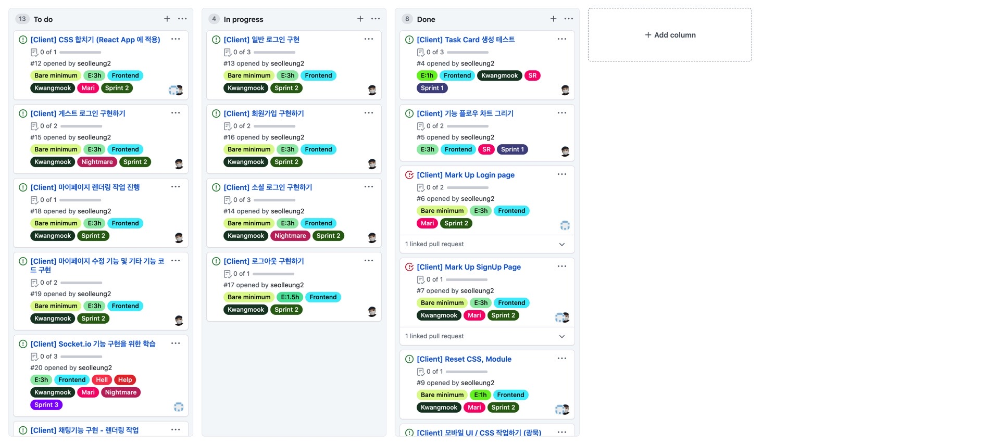
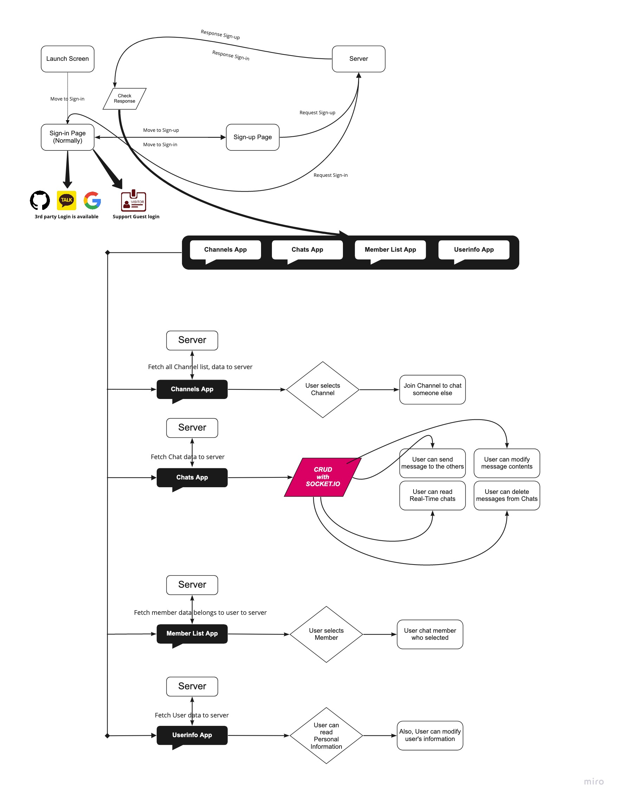

## 🤡일주일 무엇을 배웠나?

현재 퍼스트 프로젝트의 2주차가 되는 월요일 저녁이지만, 밤을 샐 예정이므로 일단 우아하게 오랜만에 블로그 글을 써본다.

(리액트 컴포넌트 작업 및 페이지 스크롤링 안되는 것은 어쩔....?!🙇🏻‍♂️)

배웠다 라는 의미가 하나의 기술에 통달했다 라는 의미가 아니라는 가정 하에서 나의 생각과 느낌을 정리해 보기로 했다.

## 🖼Figma

일단 나는 프론트 엔드 파트를 지망해서 다른 프론트 페어님과 둘이서 현재 프로젝트를 진행해가고 있다.

이 페어님과 같이 안했다면 영영 몰랐을 법한 것들에 대한 소개를 해볼건데 그중 대표가 바로 "Figma" 이다.



Pre 코스 때 배운 트위틀러인데 이 때 html 마크업을 진행하기 전, 그림판 등으로 박스를 그려가며 여기는 li 태그가 위치할 곳, 여기는 제목 이 위치할 박스 등을 정의해 가는 작업이 와이어 프레이밍 (Wired Framing) 이라는 것을 배웠다.

이번 프로젝트를 진행하면서도 물론 코드스테이츠 유어클래스에 Figma 를 사용하라는 내용은 있었지만 막상 다루려니 뭐가 뭔지 하나도 몰랐었다.

그런데 같이 하는 페어님이 디자인 관련 공부를 하셔서인지 능숙하게 다루는 것을 보고 배우게 되었다.

나는 모바일 UI 를 피그마로 담당했는데 페어님께 한번 일대 일로 배우고 나서 아래와 같은 디자인을 만들어 낼 수 있었다.

아래는 회원가입 Mobile UI 이다.



아래는 로그인 Mobile UI 이다.



그리고 아래는 최종 채택은 되지 않았지만, 나름 디스코드를 따라해본다고 모바일 앱을 다운받아 스스로 그려본 와이어 프레이밍 이다.



## 🖼Figma 를 해보고 난 뒤 생각

처음에는 그냥 적당히 짜고 컴포넌트로 가서 만들면 되지 않을까 싶었다.

지나친 공을 들일 것 까지는 아니더라도,

대략적인 예상도를 피그마로 잘 계획하면 나중에 html 마크업 작업을 하거나 css 작업을 할 때 어떻게 해야 할 지 갈팡질팡 하지 않게 만들어주는 마크업 API (?) 교본 같은 역할을 한다고 생각한다.

## 🦴Markup HTML

이 또한 처음에 그냥 바로 리액트 컴포넌트에 막바로 가져다 쓰면 더 빠르지 않은가 싶었는데

페어님을 통해서 순서를 좀 알게 되었다.

1. Figma 로 와이어 프레임 작업

2. HTML, CSS 를 사용한 순수 마크업, 디자인 작업

3. 리액트에 고대로 이식

물론 방식이 이게 맞다 아니다 절대적인 것은 아니지만 페어님의 방식도 나름 구조를 짜고 다시 되돌아가는 수고를 덜기 위해서는

효율적인 방식이라 생각했다.

## 😱나는 생각보다 HTML, CSS 를

과정을 하면서 나는 스스로 HTML, CSS 를 어느 정도 다룬다고 생각해 왔다.

근데 그게 지난 일주일 동안 산산 조각이 나기는 했다.

좌절해 있기 보다 어떻게 공부를 해나갈 지 생각해 보았다.

채팅을 하는 모바일 화면을 아래와 같은 CSS 코드로 구성했다.

```css
// 채팅 내역들 CSS
.list-chat {
  padding: 20px 40px;
  .item-chat {
    display: flex;
    align-items: center;
    padding-bottom: 15px;
    .chat-avatar {
      width: 55px;
      height: 55px;
    }
  }
  .info-chat {
    // border: 2px solid red;
    margin-left: 20px;
    font-size: 22px;
    flex: 1;
    .date-chat {
      font-size: 18px;
    }
  }
  .text-like {
    // border: 2px solid blue;
    display: flex;
    align-items: center;
    p {
      margin: 0;
    }
    .like-chat {
      // border: 2px solid green;
      display: flex;
      position: sticky;
      left: 90%;
    }
  }
}
// 아래 채팅 인풋창
.input-chat {
  background: $dark-level3;
  padding: 0.5rem;
  position: fixed;
  bottom: 0;
  left: 0;
  right: 0;
  display: flex;
  height: 60px;
  button {
    background: none;
    border: none;
    padding: 0 0.5rem;
    margin: 0.25rem;
    outline: none;
  }
}
#inputChat {
  // border: 1px solid red;
  background: $bg-input;
  color: black;
  padding: 0 1rem;
  flex-grow: 1;
  // border-radius: 2rem;
  margin: 0.25rem;
  &:focus,
  &:hover {
    background: $font-color;
  }
}
```

요약하면 flex 와 margin, padding 을 적절히 활용한 게 다였다.



위와 같은 화면이 나오기는 했는데, 페어님과 공유하면서 더 효율적인 방법을 알게 되었다.

그것은 flex 의 사용이 아닌 grid 의 사용에 대한 것이였다.

```css
.real-chatting {
  display: flex;
  flex-direction: column;
  flex-grow: 1;
  justify-content: flex-end;
}
.item-chat {
  display: grid;
  grid-template:
    'avatar writer likes' 30px
    'avatar text likes' 1fr
    /80px 1fr 80px;
  padding: 12px 20px;
  &:hover {
    background: $dark-level2;
  }
}
.avatar-grid {
  grid-area: avatar;
  display: flex;
  justify-content: center;
}
.writer {
  grid-area: writer;
}
.text-chat {
  grid-area: text;
  white-space: normal;
  word-break: normal;
}
.likes {
  grid-area: likes;
  display: flex;
  flex-flow: column;
  align-items: center;
}
```

grid 템플릿을 사용하는 것 만으로도 엑셀의 그 행과 열처럼 자동으로 모양이 맞춰지게 되었고,

grid-template 에 넣은 변수 이름으로 grid-area 를 지정해 주면 해당 위치에 배치가 되는게 너무나 신기했다.

이것 뿐만이 아니라



SCSS 를 쓰게 되면서 css 를 사용함에 있어 위의 그림처럼 컬러나 기타 css 적인 요소를 변수로 두어 필요할 때마다 꺼내서 사용한다 는 것에 대한 개념도 알게 되었다.

그리고,

```css
.wrap-main {
  section[class$='-side']:not(.side-active) {
    display: none;
  }
}
```

위의 코드처럼 class 명이 side 로 끝나는 section 태그 내의 모든 클래스를 선택하게 하고,

그 중에서 class 가 side-active 가 아닌 것들을 선택하게 하는 방식에 대해서도 자바스크립트 코드가 아닌 css 만으로도 선택할 수 있다는 것에 대해 알게 되었다.

그리고 CSS 도 처음에 초기 세팅이 필요하다라는 것을 알게 되었다.

```css
@import 'color';

h1,
h2,
h3,
h4,
h5,
h6,
a,
p,
pre {
  margin: 0;
  padding: 0;
  font-size: 1rem;
}
body,
html {
  margin: 0;
  padding: 0;
}
body * {
  box-sizing: border-box;
  font-weight: normal;
  color: inherit;
}
input,
button {
  border: none;
}
a {
  text-decoration: none;
  &:visited {
    color: inherit;
  }
}
button {
  cursor: pointer;
}
ul {
  list-style: none;
  margin: 0;
  padding: 0;
}
```

## 👌🏻프로젝트 초기세팅

깃허브 프로젝트에서 칸반 보드를 만들어 트렐로 처럼 작업을 나누어 일정을 한 눈에 관리하는 법을 직접 만들어 봐서 어느정도 익숙해 졌다.



트렐로나 노션을 사용해서 관리 할 줄 알았는데 라벨도 별도로 만들어 붙일 수 있고 깃허브의 칸반보드는 생각보다 괜찮았다.

## 🐤Flow Chart 그리기

뭣도 모르고 그냥 내가 하겠다 했는데 프로젝트를 한 눈에 볼 수 있게끔 플로우 차트를 그리는 것도 개발하는 사람을 위해서 필요한 요소 라는 것을 느꼈다.



## 😽Github 의 협업 방법

1. dev (또는 develop) 브랜치를 원본 레포에서 만들어 푸시해놓는다.

2. 깃허브에서 default branch 를 dev 로 지정해 놓는다 (setting)

3. 원본 레포를 포크 및 클론을 받는다.

4. dev 브랜치로 되어있는지 확인하고 git checkout -b feature/setup 등으로 브랜치를 만든 후 해당 브랜치에서 작업을 한다.

5. (최초) git remote add upstream "원본 레포 주소" 를 해주어 원본 레포와 연결한다.

6. 4 에서 작업이 완료 되면 git add 및 commit 한다.

7. git push u origin feature/setup 을 통해 내 오리진에 작업을 푸시한다.

8. 깃허브에 가서 pull request 를 날린다.

9. merge 권한을 가진 분에게 풀리퀘가 가면 머지 여부를 결정 후 머지를 해준다.

10. 수정된 작업을 받을 때는 git pull upstream dev 를 통해 로컬 레포를 최신화 한다.

11. 최신화 작업 이후 새로 브랜치를 만들어 해당 브랜치에서 다시 작업한다.

## 😊남은 일주일은

어떻게 나올지 나도 잘 모르겠지만 일단 해본 대로 하다 보면 뭐라도 썰리지 않겠나 싶다.
