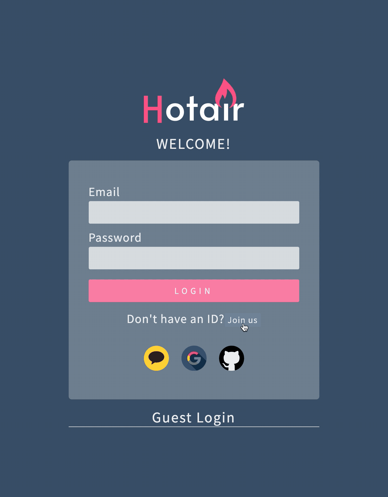
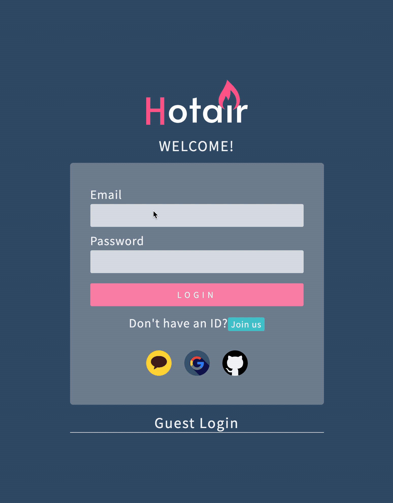
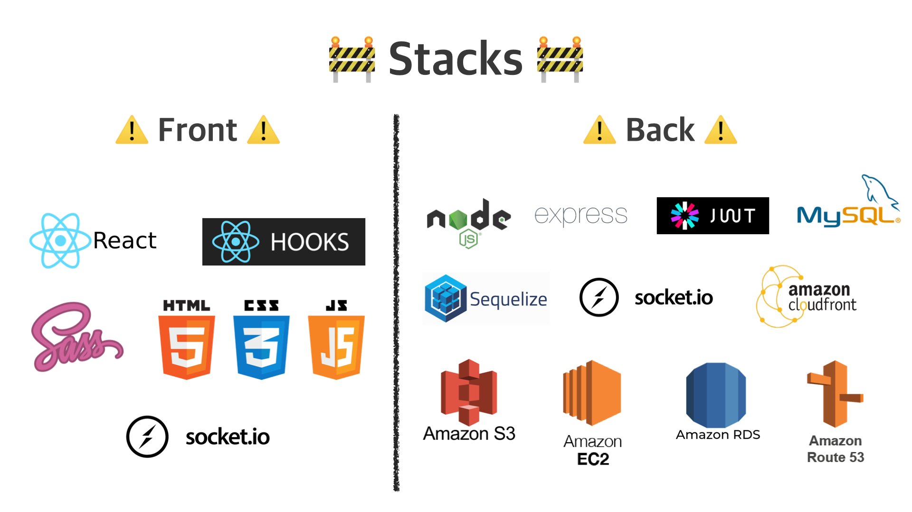

## 🐤발표 및 1차 프로젝트 아디오스..

2주간의 1차 프로젝트를 마무리하고 오늘 Zoom 미팅에 모두 모여 발표를 하는 시간을 가졌다.

우리 조에서는 내가 발표를 했는데, 발표를 하기 전에는 내가 말을 제대로 하지 못할까 걱정했다면,

발표를 하고 난 후에는 해결하지 못했거나 제대로 해보지 못했던 기능이나, 기본적 마크업에 대해 다시 생각해 보게 되었다.

무엇보다 자기 반성을 위해 블로그를 남겨서 잊지 않기 위함이다.

## 🔥1주차

https://dev-seolleung2.netlify.app/HOTAIR%20PROJECT/hotair-1week/

1주차 회고를 올렸었다.

한번 더 요약을 하자면 나는 프론트엔드 를 담당했고 다른 페어님과 둘이서 만들려는 앱의 대략적인 UI 를 피그마로 그려나가고 HTML 과 CSS 로 마크업을 진행했던 한 주였다.

전부는 아니지만 피그마를 사용해서 만들게 될 앱의 와이어 프레이밍을 (프로토 타입을) 만들 수 있는 자신감이 생겼다.

그리고 같이 하는 페어님을 보면서 HTML 구조를 나보다 훨씬 원활하게 다루는 모습에 놀랐기에 다음 프로젝트를 진행할 때는,

내가 프론트엔드를 맡던 백엔드를 맡던 하루 한 두시간 정도는 기본적인 마크업, CSS 를 그려나가는 연습을 해 나갈 것이다.

그리고 하나 더, 와이어 프레이밍을 하는 것도 좋지만 너무 거기에 시간을 쏟아서는 안 된다고 생각했다.

잘 하시는 분의 화면을 보면서 서로 맞춰가는 방식도 좋지만 그보다 각자 페이지를 나눠서 모바일일 때의 반응형까지 확실히 맡겨서 일임하게 하면 더 좋겠다는 생각이 들었다.

SCSS 를 하면 서로의 변수를 맞춰야 하니까 그럴 수 있겠으나 서로의 공평한 발전을 위해서는 CSS 만으로도 아무 상관 없을 듯 싶다.

내 생각에는 위에 적은 방법이 좋고 각자가 기여했다는 느낌에 더 열심히 하게 될 것 같다.

그렇게 하지 않으면 책임소재가 불분명 해져서 아무것도 안하고 놓고 있어도 말을 제대로 하지 못하는 듯 싶다.

그리고 무조건 상대에 맞춰 주려 하지 말고 아니다 싶을 때는 최대한 완곡하고 강력하게 주장을 펼쳐야 겠다.

## 🔥2주차

2주차는 완성된 마크업을 가지고 리액트 컴포넌트로 적용하고 실제 기능들을 구현해서 요청과 응답을 백엔드와 원활한 소통을 가능하게 만들어야 했다.

2주차 월요일부터는 거의 새벽 다섯시, 여섯시까지 했었는데 시간과 아웃풋은 정비례 하지는 않는다는 것을 느꼈다.

뭔가 보기에 단순한 기능인데 배웠던 것은, 혹은 이전에 해봤던 것은 왜 기억이 나질 않는 것일까?

하지만 그 시간은 나름의 해법을 페어님과 찾아나가고 기뻐했을 때 매우 의미있었다고 생각한다.

인생을 바꾸려는 노력을 하는데 쉬웠으면 누구나 다 하지 않았을까?

아래는 발표할 때 피피티에 넣은 Socket.io 를 이용한 양방향 실시간 채팅의 모습이다.

프론트엔드 입장에서 아쉬웠던 점은

1. 로그인 후 리디렉션 되는 화면 에서 왼쪽에는 채널 리스트, 오른쪽에는 현재 접속한 사람 리스트를 보여주며, 모바일에서 햄버거 버튼을 눌렀을 때 나타났다 사라지게 하는 반응형 애니메이션을 못함.

2. 기본적인 CSS 도 나쁘지 않았지만 애초 디자인이 독창적이지 않을 것이면 처음에 디스코드의 디자인을 어느정도 따라 가려는 시도도 좋았을 거 같다.

3. 페어님과 역할을 분담한 다고 해서 내가 페어님이 무엇을 하는지 아예 잊어버리면 안된다는 점.

4. 기본적인 CSS 디자인에 대한 나의 이해를 더 올리는 학습을 해야겠다 라는 자기 반성.

5. 백엔드 페어님들의 속도를 맞추기 위해 조금 더 고군분투 했어야 했다.

6. 할 수 있을 거에요 라는 말은 아무 소용이 없다. 그냥 하고 다음날 아침 이렇게 해봤는데 어떤지 코드를 같이 볼까요? 최소 이렇게는 해야 성의가 있다고 생각한다.

7. 리액트 훅에 대한, useEffect, use - 로 시작하는 Hooks 에 대한 개념 이해도가 약했다.

8. Socket.io 를 다시 찬찬히 살펴볼 기회가 생긴다면 그 때는 최소한의 오류로 기능을 구현하게 만들 수 있을 거 같다.

## 🔥그래서 나는

다음 프로젝트에는 주도적이고 더 적극적으로 바뀔 것이다.

다른 팀원의 열정을 기다리기 보다 내가 팀원들의 사기를 올릴 수 있게 적극적으로 나설 것이다.

별도의 과외 시간에 마크업, CSS 연습을 할 것이다.

위의 피피티 발표물 의 기술 스택을 더 풍성하게 하기 보다 해본 것이라도 아는게 아닐테니 조금 더 겸손함을 가지고 학습과 프로젝트에 참여해야 겠다.

의욕뿜뿜이면서도 다음 2차 프로젝트가 기대반 걱정반이기도 하다. ㅎㅎ!
