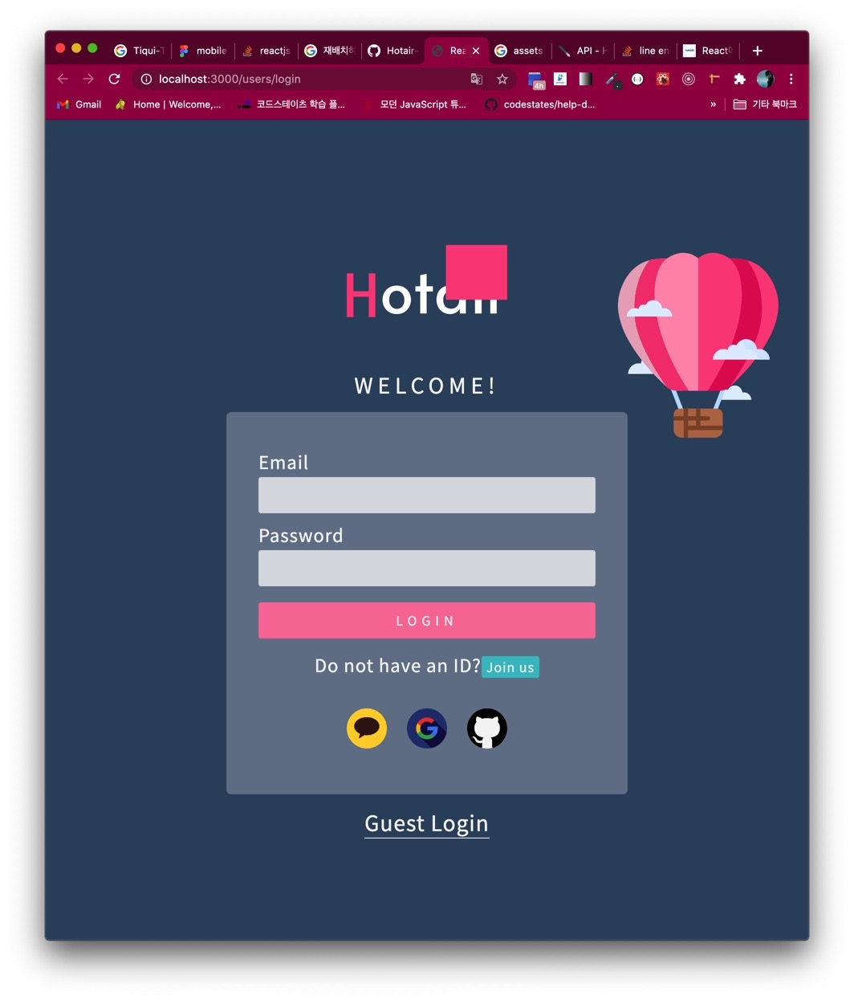
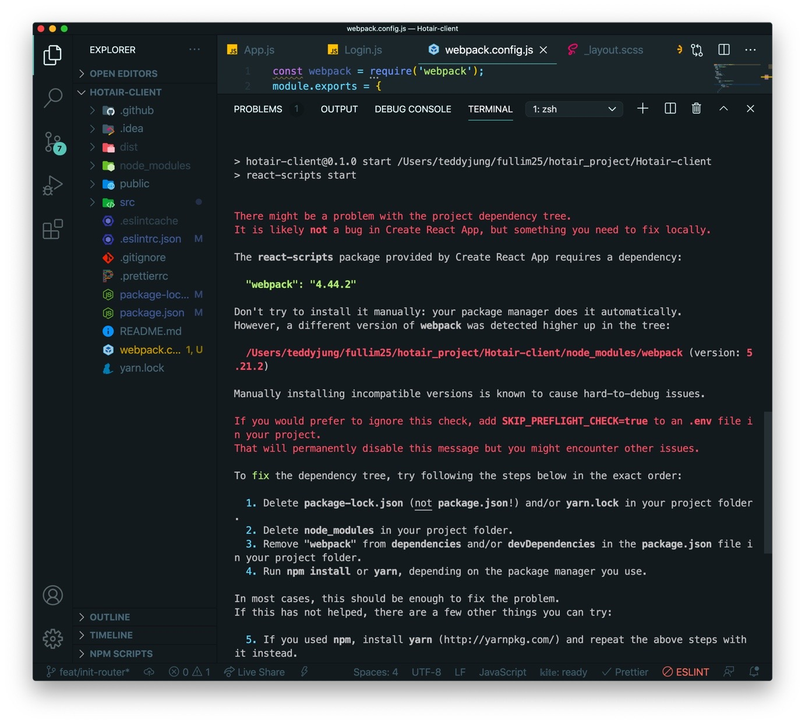

## 🏵SVG 의 정의

스케일러블 벡터 그래픽스(Scalable Vector Graphics, SVG)는 2차원 벡터 그래픽을 표현하기 위한 XML 기반의 파일 형식으로, 1999년 W3C(World Wide Web Consortium)의 주도하에 개발된 오픈 표준의 벡터 그래픽 파일 형식이다.

SVG 형식의 이미지와 그 작동은 XML 텍스트 파일들로 정의 되어 검색화·목록화·스크립트화가 가능하며 필요하다면 압축도 가능하다.

SVG 형식의 파일은 어도비 일러스트레이터와 같은 벡터 드로잉 프로그램을 사용하여 편집이 가능하다. 물론 XML 형식으로 되어 있으므로 메모장과 같은 문서 편집기로도 편집이 가능하다.

## 🐞SVG 가 뭐?

2주 프로젝트를 진행하는 2주차 화요일, UI 부분에 피그마에서 추출한 아이콘 이미지들을 계단 현상 깨짐 없이 사용하기 위해 svg 확장자로 이미지를 import 해 와서,

svg 파일을 경로 내 img 폴더 내에 넣어 놓고, JSX 에 img src 속성에 그대로 넣는 방식을 적용하는게 되지 않아 검색해 보았다.

리액트에서 svg 파일을 사용하려면,

```js
import { ReactComponent as Logo } from '../assets/img/logo.svg'
//

export default function Login() {
  return (
    <>
      <Logo className="img-logo" alt="hotair-logo" />
      <AirBallon className="bg-airBalloon" alt="hot air ballon" />
    </>
  )
}
```

위와 같은 식으로 넣으면 되는 구조라 생각했는데 해당 Logo 를 여러번 사용해서 넣는 구조여서 였는지

아래의 사진처럼 svg 이미지가 원래 모양대로 나오지 않는 현상이 발생했다.



그래서 더 찾아보다 보니, svg 파일을 react 프로젝트에서 사용하기 위해서는 먼저 npm에서 svg 로더를 받아야 한다고 한다.

## 🍦@svgr/webpack 설치

https://www.npmjs.com/package/@svgr/webpack

npmjs 에서 확인해 보면,

```js
npm install @svgr/webpack --save-dev
```

위의 코드를 cli 에 입력해 설치할 수 있고 usage 또한 확인이 가능하다.

## 🍇webpack, webpack-cli

```js
npm i -D webpack webpack-cli
```

npm으로 위와 같이 개발 환경으로 설치한다. 웹팩4 부터는 webpack-cli 를 같이 설치해야 커맨드라인에 webpack이란 명령어를 사용할 수 있다고 한다.

## 🍙webpack.config.js 생성하기

리액트에서의 사용을 위해 프로젝트 루트 경로에 해당 파일을 생성한다.

그리고 기본적인 파일 포맷을 검색해서 붙였다.

```js
const webpack = require('webpack')
module.exports = {
  mode: 'development',
  entry: {
    app: '',
  },
  output: {
    path: '',
    filename: '',
    publicPath: '',
  },
  module: {},
  plugins: [],
  optimization: {},
  resolve: {
    modules: ['node_modules'],
    extensions: ['.js', '.json', '.jsx', '.css'],
  },
}
```

## 🍒url-loader 설치하기

svg 파일을 불러오기 위해 컴포넌트 방식 외에 url 주소로 지정하고 싶다면 url-loader 를 설치해야 한다.

https://www.npmjs.com/package/url-loader

```js
npm install url-loader --save-dev
```

그리고 공식 문서 내에 Getting Started 부분에 작성되어 있는 webpack.config.js 파일 내에 넣을 코드를 복사해 붙여 넣는다.

```js
const webpack = require('webpack')
module.exports = {
  mode: 'development',
  entry: {
    app: '',
  },
  output: {
    path: '',
    filename: '',
    publicPath: '',
  },
  module: {
    rules: [
      {
        test: /\.(png|jpg|gif)$/i,
        use: [
          {
            loader: 'url-loader',
            options: {
              limit: 8192,
            },
          },
        ],
      },
      {
        test: /\.svg$/,
        use: ['@svgr/webpack', 'url-loader'],
      },
    ],
  },
  plugins: [],
  optimization: {},
  resolve: {
    modules: ['node_modules'],
    extensions: ['.js', '.json', '.jsx', '.css'],
  },
}
```

오 잘 따라가고 있어 좋아좋아

근데 아래와 같은 에러가 뜬다.

## 🌴To fix the dependency tree

그렇게 이제 npm run start 를 하면 다음과 같이 무시무시한 경고 문구가 나오면서 더이상 실행되지 않는다.



사진에 있는 1 ~ 4 까지를 그대로 따라했다.

다른 분들이 깃에서 풀로 당겨 받을 때 npm install 이 다시 필요할 부분일 거 같다.

## 🐤사용 예시와 svg 깨짐 문제 해결

```jsx
import React from 'react'
import Logo from '../assets/img/logo.svg'
import { ReactComponent as AirBallon } from '../assets/img/bg-balloon.svg'

export default function TopLogo() {
  return (
    <>
      <h1 className="logo pc">
        
      </h1>
      <AirBallon className="bg-airBalloon" alt="hot air ballon" />
    </>
  )
}
```

logo.svg 의 경로를 통해 Logo 를 불러와서, img src 속성 내에 curly bracket 을 통해 안에 Logo 변수를 넣어주니 깨짐 없이 정상 작동 하는 것을 확인할 수 있었다.


