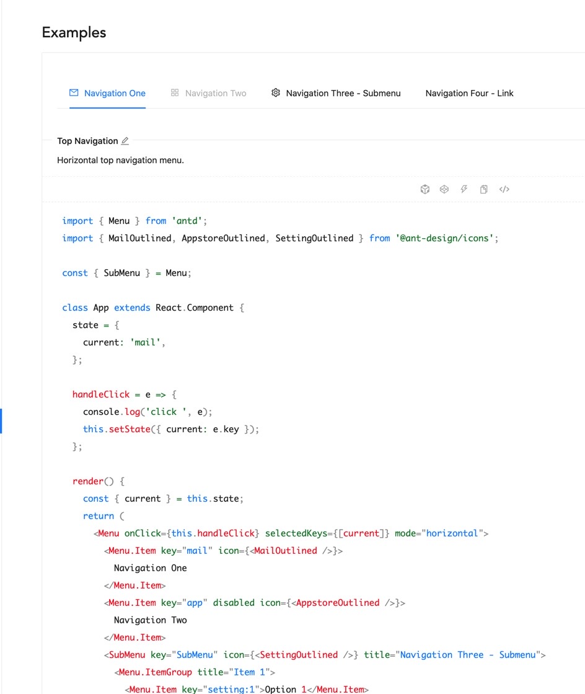

## 🐜Ant Design

리액트를 지원하는 UI 라이브러리는 여러 가지가 있다.

Bootstrap, Material UI, Ant Design 등등이 있는데, 코드스테이츠의 웹 개발 과정에서는 해당 라이브러리의 사용을 하지 않도록 안내해 줬다.

왜냐하면 CSS 의 구조를 바닥 부터 하나 하나 만들 줄 알아야 하기 때문이다.

그런데 현재는 과정을 졸업을 한 상태이기도 하고, 현업에 계신 개발자 분들의 이야기를 들어보니 사용을 해 보아야 겠다는 생각이 들었다.

왜냐하면,



antd 페이지를 들어가서 code 부분을 눌러 보면 위 사진과 같이 클래스형 컴포넌트들이 나와 있다.

그냥 막 가져다 쓰는 것이 아닌, 함수형 컴포넌트로 변경도 시켜 보면서 보다 더 나은 코드를 짜는데 도움이 될 수 있을 거 같았다.

단순히 CSS 를 하는 시간을 아끼고자 하는 것이 아니라, 이러한 코드 구조를 이해하는 데 도움을 줄 것이므로 나중에 혼자 무언가를 만들고 바닥부터 CSS 구조 레이아웃을 짤 때 해당 라이브러리 사용 경험이 내게 도움을 줄 것 같다고 판단했다.

그리고 현업에서 사용하는 경우가 많이 있는 듯 하기도 했다.

## 🐜Ant Design 의 기본 사용

https://ant.design/docs/react/introduce

공식 문서를 참조해 볼 수 있다.

그리고 현재 따라 배우면서 진행 중인 코드를 옮겨 본다.

```js
import React from 'react'
import PropTypes from 'prop-types'
import Link from 'next/Link'
import { Menu } from 'antd'
// pages directory 안의 페이지 들이 공통적으로 사용하는 앱 레이아웃을 만든다.
const AppLayout = ({ children }) => {
  return (
    <div>
      <Menu mode="horizontal">
        <Menu.Item>
          <Link href="/">
            <a>메인</a>
          </Link>
        </Menu.Item>
        <Menu.Item>
          <Link href="/profile">
            <a>프로필</a>
          </Link>
        </Menu.Item>
        <Menu.Item>
          <Link href="/signup">
            <a>회원가입</a>
          </Link>
        </Menu.Item>
      </Menu>
      {children}
    </div>
  )
}

AppLayout.propTypes = {
  children: PropTypes.node.isRequired,
}

export default AppLayout
```

pages 내 각각의 파일 (페이지) 들이 공통으로 사용할 레이아웃의 컴포넌트 이다.

하지만 이렇게만 했을 때는 CSS 가 전혀 먹히지 않고 무언가 깨져 있음을 확인하게 된다.

무턱대고 antd 를 가져다 쓰는 것이 아닌 바로 React 와 연결을 지어야 한다.

## 🐜antd.css 임포트 하기

Next.js 에는 기본적으로 Webpack 이 내장되어 있다고 한다. 이 웹팩이 CSS 를 보는 순간 스타일 태그로 바꾸어 확장자에 상관없이 합쳐 html 에 넣어준다고 한다.

그래서,

```js
import 'antd/dist/antd.css'
```

를 상위에 import 해주면 알아서 웹팩이 처리를 해주는데, 그럼 어디에 import 를 해줄까?

pages 에 있는 각 파일마다 모두 해당 코드를 넣어주어야 할까? 아니다.

## 🏠pages 내 \_app.js 를 생성
