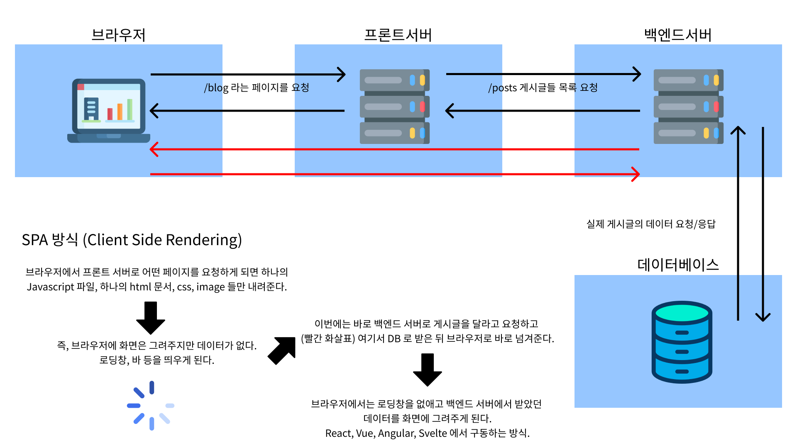

## 🧚‍♀️전통적인 Web 요청에 따른 흐름 그리고 SPA 방식

위 이미지 왼쪽 부터 검은색 화살표 대로 돌고 돌아오는 왕복 과정이 (데이터의 흐름이 일자로 받는 형식) 전통적인 웹 요청에 따른 데이터 흐름이다.

두번째로 클라이언트 사이드 렌더링 (CSR) 방식이 이미지에 보이는 대로, 먼저 로딩창이 뱅글뱅글 돌아가게 되면 그 동안 브라우저에서 백엔드 서버로 다이렉트로 데이터 요청이 들어가서 응답을 받아 화면에 그려주게 되는 방식이다.

Single Page Application 방식 이며 리액트와 Vue, Angular 와 Svelte 가 이에 해당한다고 한다.

전통적인 방식은 화면이 한 번에 그려진다는 장점은 있지만 그 과정이 길기 때문에 로딩 속도가 오래 걸린다.

그래서 두번째 방식인 CSR 방식으로 먼저 로딩창을 보여주고 그 시간을 버는 동안 backend 서버로부터 데이터를 받아 화면에 그려주게 되는 것이다.

어쩌면 두번째 방식이 전체적인 시간 측면에서 더 오래 걸릴 수가 있다.

처음 로딩창을 표현해 주지만 모든 화면을, 그리고 클릭에 따라 바뀔 것에 대비한 다른 화면까지도 다 가져와야 하므로 데이터 까지 받는 시간이 더 걸릴수도 있다.

그 말인 즉슨 첫 페이지를 렌더링할 때 모든 페이지를 다 넘긴다는 건데 이것은 일종의 비효율일 수 있다.

왜냐하면 방문하지도 않을 페이지까지 다 받아오게 되기 때문이다.

## 🧚‍♀️해결법 : 서버사이드 렌더링, 코드 스플리팅

이러한 비효율, 모든 페이지에 대한 것이 아닌 방문한 페이지에 대한 코드만 보내줄 수 있게 코드 스플리팅을 사용한다.

그리고 서버사이드 렌더링 인데

서버사이드 렌더링은, 첫 방문만 앞서 언급한 전통적인 데이터 흐름 방식 대로 하고 그 다음 부터는 리액트의 CSR 방식을 따르는 일종의 하이브리드 스러운 방식이라 할 수 있다.

대표적인 프레임워크가 Next.js 이고 앞서 블로그를 작성한 바 있다.

## 🧚‍♀️Next.js 를 쓸 필요가 없는 서비스

Admin 페이지가 예가 될 것이다.
