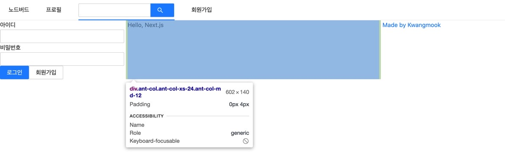

## 👨🏻‍🎨앤트 디자인의 input 태그

기존에 만들었던 AppLayout.js 파일에서 해시태그를 검색할 수 있는 인풋 창을 넣어 주었다.

```js
import React, { useState } from 'react'
import PropTypes from 'prop-types'
import Link from 'next/Link'
import { Menu, Input } from 'antd'

const AppLayout = ({ children }) => {
  return (
    <div>
      <Menu mode="horizontal">
        <Menu.Item>
          <Link href="/">
            <a>노드버드</a>
          </Link>
        </Menu.Item>
        <Menu.Item>
          <Link href="/profile">
            <a>프로필</a>
          </Link>
        </Menu.Item>
        <Menu.Item>
          <Input.Search enterButton style={{ verticalAlign: 'middle' }} />
        </Menu.Item>
        <Menu.Item>
          <Link href="/signup">
            <a>회원가입</a>
          </Link>
        </Menu.Item>
      </Menu>
      {children}
    </div>
  )
}

AppLayout.propTypes = {
  children: PropTypes.node.isRequired,
}

export default AppLayout
```

https://ant.design/components/input/

공식 사이트에서 찾아보고 적용할 수 있다. 그렇게 하다 보면 위아래 정렬이 맞지 않을 수도 있는데, 이때는 inline style 을 적용해서

```js
<Menu.Item>
  <Input.Search enterButton style={{ verticalAlign: 'middle' }} />
</Menu.Item>
```

이런 식으로 코드를 작성해 주면 세로로 가운데 정렬을 맞출 수 있었다.

## 👨🏻‍🎨앤트 디자인의 Grid 시스템

<p align="center"></p>

ant design 은 반응형 웹 사이트 제작을 위한 그리드 시스템을 갖추고 있다. 이를 위해서는 먼저,

```js
import { Menu, Input, Row, Col } from 'antd'
```

반응형을 위해 Row 와 Col 을 import 해주어야 한다.

<strong>"반응형을 위한 원칙"</strong>은 다음과 같다.

1. 가로 (Row) 를 먼저 선언, 그 다음 가로에서 세로 (Col) 로 자른다.

2. (효율성을 위해) 모바일 (XS) 디자인을 먼저 해야 한다. 데스크탑부터 하면 breakpoint 설정이 어려워진다.

- xs : 모바일

- sm : 태블릿

- md : 작은 데스크탑

공식 문서 사이트 : https://ant.design/components/grid/

## 👨🏻‍🎨코드로 확인해 보기

```js
<Row gutter={8}>
  <Col xs={24} md={6}>
    왼쪽 메뉴
  </Col>
  <Col xs={24} md={12}>
    {children}
  </Col>
  <Col xs={24} md={6}>
    <a
      href="https://dev-seolleung2.netlify.app/"
      target="_blank"
      rel="noreferrer noopener"
    >
      Made by Kwangmook
    </a>
  </Col>
</Row>
```

먼저 Row 를 선언해 주었고, 그 안에 Col 이 세 개 들어가 있는 형태 이다.

24라는 숫자는 2, 3, 4, 6, 8, 12 같은 다양한 숫자로 등분하기 좋은 숫자이기에 앤트 디자인에서 채택한 거 같다.

```js
<Col xs={24} md={6}>
  왼쪽 메뉴
</Col>
```

바로 위 코드의 xs 24 는 그러니까 모바일일 때는 24칸 (한 줄) 을 다 차지한다는 의미가 된다.

즉 화면 100%를 다 사용한다.

xs 일 때 세 Col 모두가 24 를 차지하기 때문에 컬럼 세 개가 스택처럼 쌓인 형태로 보여지게 된다.

하지만, md (작은 데스크탑) 사이즈 일 때는 첫번째 Col 은 6/24 즉 25% 를 차지하고,

두번째 Col 은 12/24, 50% 를 차지하며, 세번째 Col 또한 25% 를 차지한다.

6 + 12 + 6 = 24 이고 모바일 (xs) 에서는 세로 스택형태로 배치되었던 Col 이 md 사이즈일 때는 가로로 한 줄에 배치되게 된다!

쉽게 말해서 합이 24 이하여야 가로로 쫙 나올 수 있게 된다.

## 👨🏻‍🎨컬럼 사이의 간격을 주기 위한 gutter 속성



미리 적용한 이미지를 첨부했지만, gutter 를 적용하지 않았을 때는 컬럼 사이의 간격 (padding) 이 0 이였기 때문에

컬럼들이 다닥다닥 붙어 있게 되어 버린다.

바로 이 컬럼 사이의 간격을 주기 위해 Row 에 gutter 속성을 넣어 준다.

```js
<Row gutter={8}>
  <Col xs={24} md={6}>
    왼쪽 메뉴
  </Col>
  <Col xs={24} md={12}>
    {children}
  </Col>
  <Col xs={24} md={6}>
    <a
      href="https://dev-seolleung2.netlify.app/"
      target="_blank"
      rel="noreferrer noopener"
    >
      Made by Kwangmook
    </a>
  </Col>
</Row>
```

gutter 8 을 넣어주면 위의 이미지와 같이 좌 4px 우 4px 합이 8px 로 간격을 띄워 줄 수 있다.

## 👨🏻‍🎨보안 위협을 예방하기 위한 rel 속성 적용하기

세번째 Col 에서 target="\_blank" 속성은 잘 알듯 링크를 클릭했을 때 새 페이지에서 띄울 수 있게 하는 속성이다.

하지만 이는 보안 위협을 불러 온다.

왜냐하면, 다른 곳으로 가는 링크를 클릭하면 가고자 하는 웹 사이트는 웹 사이트에서 마지막 위치의 URL 을 referrer 헤더로 받는다.

그런데 이 URL 에는 세션, 토큰이나 사용자 ID 와 같은 민감한 데이터가 포함될 수도 있기 때문에 노출하면 안된다.

이를 막기 위해서 Referrer-Policy 헤더를 no-referrer 로 설정하게 되지만

여기에서는 target 속성을 지정해 줌과 동시에,

rel="noreferrer noopener" 속성을 지정해 줌을 통해 보안 위협을 예방할 수 있다.
