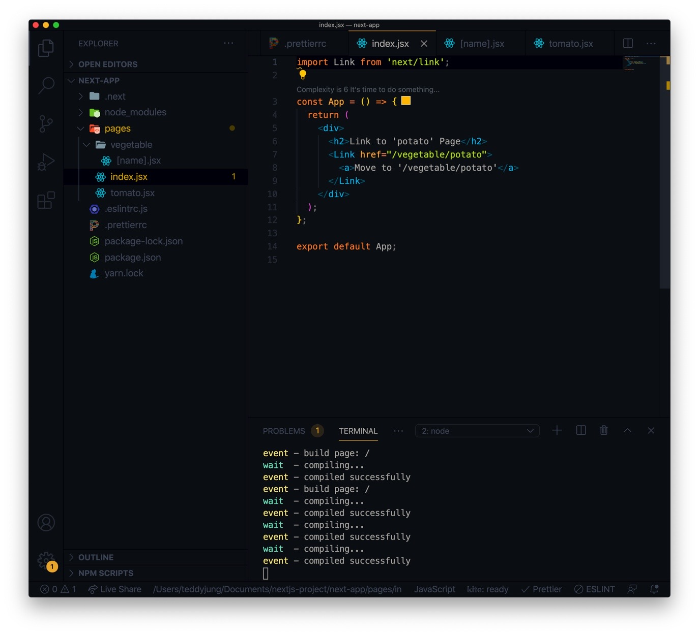
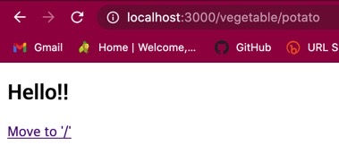
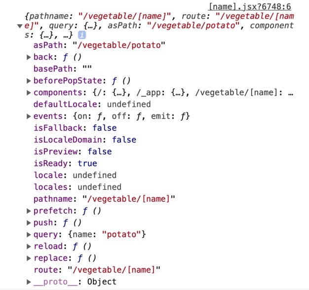
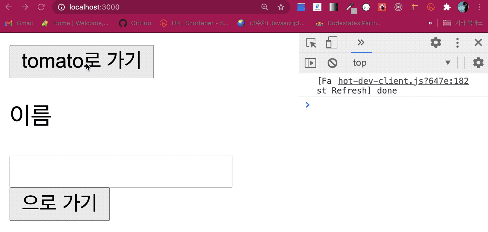

## 🎮라우팅의 비밀, pages 폴더

따라 해보면서 와 대박 신기함을 느꼈다.

세상에... 너무 간편하잖아? 😭😭😭

넥스트에서 라우팅 설정은 pages 폴더에 파일을 만들면 (기본 root 경로는 index.js) 파일의 경로에 따라 경로가 설정이 된다.

## 🎮1. 정적 페이지 라우팅 하기

pages 폴더 내 index.js (혹은 jsx) 파일을 만들고 코드를 작성했다.

```js
import Link from 'next/link';

const App = () => {
  return (
    <div>
      <h2>Link to 'tomato' Page</h2>
      <Link href="/tomato">
        <a>Move to '/tomato'</a>
      </Link>
    </div>
  );
};

export default App;
```

yarn dev 를 통해, Move to '/tomato' 라는 문구가 localhost:3000 의 루트 페이지에 보여진다.

이 문구를 누르면 페이지가 이동은 되는데 404 페이지가 뜬다.

/tomato 의 경로로 이동했을 때 해당 경로를 가지는 페이지를 만들지 않아서이다.

그래서 pages 폴더 내 tomato.jsx 파일을 생성했다.

```js
import Link from 'next/link';

const tomato = () => {
  return (
    <div>
      <h2>Link to 'Main' Page</h2>
      <Link href="/">
        <a>Move to '/'</a>
      </Link>
    </div>
  );
};

export default tomato;
```

이 페이지 에서는 다시 링크를 통해 메인 루트 페이지로 이동하게 된다.

```js
import Link from 'next/link';
```

넥스트에서 주소 이동을 할 때는 주로 Link 컴포넌트를 사용한다. 

Link 컴포넌트는 DOM 을 가지진 않지만 자식 요소인 < a > 태그를 클릭하게 되면 클라이언트 측 내비게이션을 실행하여,

페이지 전체를 새로 불러오지 않고 주소 이동을 할 수 있다.

/tomato 페이지에서 뒤로가기를 실행하면 새로운 컴파일 시간을 가지지 않고 이전에 렌더링된 페이지 를 보여주는 것을 확인할 수 있다.

하지만 Link 컴포넌트를 쓰지 않고, 아래 코드처럼 a 태그 만을 이용해 주소 이동을 하게 되면

```js
const App = () => {
  return (
    <div>
      <h2>Link to 'tomato' Page</h2>
      <a href="/tomato">
        <p>Move to '/tomato'</p>
      </a>
    </div>
  );
};
```

페이지 전체를 새로 받아오게 되어 속도가 느려지고 깜박임 현상이 발생하며 뒤로가기를 해도 페이지를 새로 받아오게 된다.

또한 Link 컴포넌트 안에 a 태그가 아닌 p 태그 등을 넣어도 라우팅 기능을 수행하지만 웹 접근성과 SEO (검색엔진 최적화) 에 좋지 않다는 점!

마지막으로 Link 컴포넌트 안에 리액트 컴포넌트를 넣어 라우팅을 시도하는 경우이다.

```js
import Link from 'next/link';

const App = () => {
  return (
    <div>
      <h2>Link to 'potato' Page</h2>
      <Link href="/tomato">
        <Child/>
      </Link>
    </div>
  );
};

const Child = () => {
  return <p>Move to '/tomato'</p>;
};

export default App;
```

렌더링된 화면은 확인 할 수 있지만 리액트 컴포넌트를 클릭했을 때 라우팅이 되지 않는 것을 확인할 수 있다.

리액트 컴포넌트에 라우팅 기능을 주고 싶다면

```js
<Link href="/tomato">
  <a><Child/></a>
</Link>
```

a 태그로 감싸 주어야 한다.

## 🎮2. 동적 페이지 라우팅 하기



이전에 정해지지 않은 주소로 라우팅을 한다.

위의 이미지 처럼 'pages' 폴더에 'vegetables' 폴더를 만들고 그 안에

```js
[name].jsx
```

라는 파일을 만들었다.

그리고 파일 안에는 적당한 컴포넌트를 다시 작성해 주고,

```js
// [name].jsx

import Link from 'next/link';

const name = () => {
  return (
    <div>
      <h2>Hello!!</h2>
      <Link href="/">Move to '/'</Link>
    </div>
  );
};

export default name;
```

이처럼 파일 이름을 대괄호로 감싸서 만들게 되면 페이지가 정적 페이지가 아닌 동적 페이지임을 의미하게 된다.

[ name ].jsx 는 동적 페이지인 것이다. 여기서 name 은 임의의 값이 된다.

pages/index.jsx 코드를 바꿔 보았다.

```js
// pages/index.jsx

import Link from 'next/link';

const App = () => {
  return (
    <div>
      <h2>Link to 'potato' Page</h2>
      <Link href="/vegetable/potato">
        <a>Move to '/vegetable/potato'</a>
      </Link>
    </div>
  );
};

export default App;

```


루트 '/' 페이지의 모습을 확인하고 '/vegetable/potato' 로 넘어가는 링크를 클릭하면, 만들어 두었던 [ name ].jsx 페이지가

아래와 같이 나온다.



파일 이름에서 대괄호 안에 있는 값은 라우터 객체 (router) 의 query 속성으로 들어가게 된다.

정말 그런지 확인해 보기 위해 'next/router' 의 useRouter 훅스 를 사용하여 확인할 수 있다.

useRouter 는 라우트 객체를 리턴해 보여줄 테니 그걸 콘솔로그를 찍어보면 될 것이다.

오호, 리액트와 비슷하군?!🤣🤣🤣🤣🤣

```js
// [name].jsx
import Link from 'next/link';
import { useRouter } from 'next/router';

const name = () => {
  const router = useRouter();
  console.log(router);
  return (
    <div>
      <h2>Hello!!</h2>
      <Link href="/">Move to '/'</Link>
    </div>
  );
};

export default name;
```

브라우저의 개발자 도구 콘솔 창에서 라우터 객체를 확인해 보았다.



```js
{pathname: "/vegetable/[name]", route: "/vegetable/[name]",
query: {…}, asPath: "/vegetable/potato", components: {…}, …}
asPath: "/vegetable/potato"
back: ƒ ()
basePath: ""
beforePopState: ƒ ()
components: {/: {…}, /_app: {…}, /vegetable/[name]: {…}}
defaultLocale: undefined
events: {on: ƒ, off: ƒ, emit: ƒ}
isFallback: false
isLocaleDomain: false
isPreview: false
isReady: true
locale: undefined
locales: undefined
pathname: "/vegetable/[name]"
prefetch: ƒ ()
push: ƒ ()
query: {name: "potato"}
reload: ƒ ()
replace: ƒ ()
route: "/vegetable/[name]"
__proto__: Object
```

라우터 객체의 속성 중 query 속성 안에 {name: "potato"} 값이 들어 있는 것을 확인 할 수 있다.

이를 통해 pages 폴더에 파일 이름을 대괄호로 [ name ] 으로 작성하면 주소로 전달한 (href) 값이 query 속성 안에

name 속성의 값으로 들어간 것을 알 수 있다.

파일의 이름이 [ item ] 이라면 query 속성 안에 {item: "potato"} 라는 값이 될 것이다.

## 🎮3. 라우터 객체를 이용하여 라우팅 하기

항상 Link 컴포넌트로 주소 이동을 하지는 않는다.

버튼을 통한 onClick 이벤트 함수 내에서 라우트 이동을 하게 되는 경우도 빈번하다.

바로 위 라우터 객체의 키와 값을 보면 다양한 함수들이 있는데 이 중에 주소 이동을 위한 함수가 있다.

"push" 가 대표적이다.

Link 대신 버튼을 누름으로 인한 정적 페이지 이동과 input 태그 내 입력한 name state 를 가지고 해당 텍스트 주소로 이동하는

동적 주소 이동을 하게 하는 코드를 작성했다.

```js
// index.jsx

import { useState } from 'react';
import { useRouter } from 'next/router';

const App = () => {
  const [name, setName] = useState('');
  const router = useRouter();
  return (
    <div>
      <button type="button" onClick={() => router.push('/tomato')}>
        tomato로 가기
      </button>
      <p>이름</p>
      <input
        value={name}
        onChange={(e) => setName(e.target.value)}
        style={{ marginRight: '12px' }}
      />
      <button type="button" onClick={() => router.push(`/vegetable/${name}`)}>
        {name}으로 가기
      </button>
    </div>
  );
};

export default App;
```

아래 파일의 코드도 동적으로 바뀌는 query 를 확인하기 위해 변경해 보았다.

```js
// pages/vegetable/[name].jsx

import Link from 'next/link';
import { useRouter } from 'next/router';

const name = () => {
  const { query } = useRouter();
  console.log(query);
  return (
    <div>
      <h2>Hello!! {query.name}</h2>
      <Link href="/">Move to '/'</Link>
    </div>
  );
};

export default name;
```



라우팅 객체를 이용한 주소 이동 (동적 라우팅) 이 잘 되는 것을 확인 할 수 있다.

## 🎮4. 정리

'pages' 폴더를 사용해서 정적 페이지와 동적 페이지의 라우팅을 설정하였고, Link 컴포넌트와 라우터 객체를 이용하여 주소 이동을 해 볼 수 있었다.

넥스트에서 제공하는 라우팅 관련 기능들이 편리하다 라는 것을 새삼 느꼈다.


