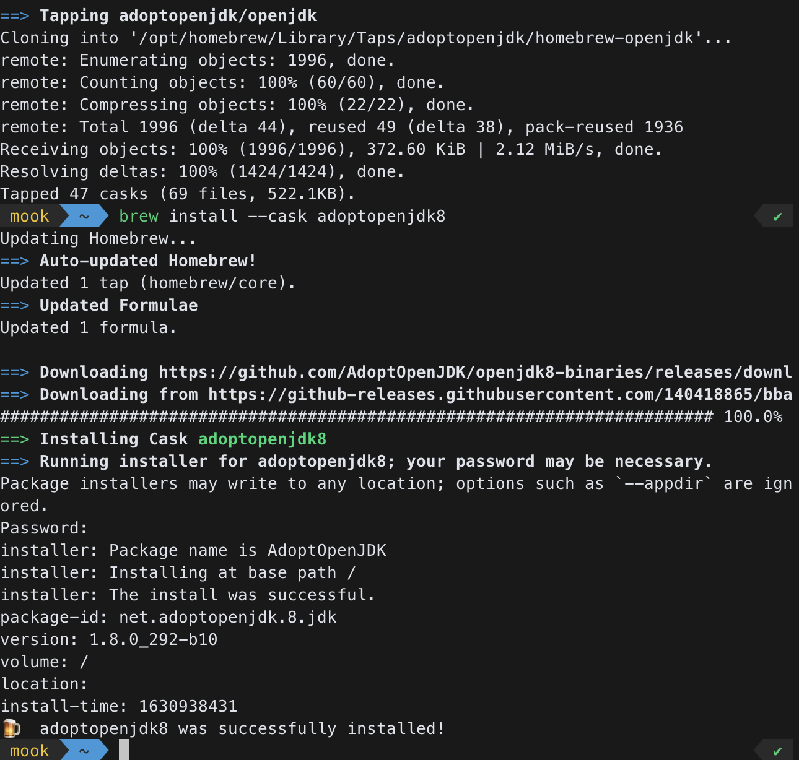

## 🏠Install Homebrew, VScode, Node.js

기존 설치되어 있으므로 생략

## 💻Install JAVA 8 SDK

안드로이드 빌드 도구를 통해 자바의 모듈을 가져다 쓰기 위함.

이전 설치 버전이 있었으나 (백엔드) 그대로 다시 설치.



## 📱Install Xcode for IOS

리액트 네이티브로 iOS 앱을 개발하려면 Xcode 가 필요하다.

참고로 맥OS 에서는 안드로이드, iOS 앱 모두 개발이 가능하지만, 윈도우 운영체제 혹은 리눅스 자체 운영체제 에서는 두 플랫폼 모두 개발은 불가능 하다.


(필자는 앱등X 이지만 최근 접히는 폰을 구매했으므로 안드로이드 운영체계를 타깃으로 개발할 예정이다.

## 🍫Install Cocoapod

iOS 개발을 하려면 iOS 에 맞는 네이티브 모듈을 빌드해야 하는데 자바와 달리 오픈소스 패키지를 개발 컴퓨터에 내려받아 설치하는 기능이 없으므로 Objective-C 프로젝트를 빌드하기 위한 프로그램.

```js
sudo gem install cocoapods
pod --version
```

애플 실리콘 기반 맥북이여서 인지는 모르지만 안 통해서 아래 링크를 참조

http://gyutaehan.me/macesococoapodsseolchihegyul/

## 🤖Install Android Studio program & Make Android Emulator

https://developer.android.com/

설치한 뒤 zshrc 환경변수 설정 뒤 적용 (source .zshrc)

하지만 애플 실리콘 기반 (arm) 에서는 X86기반 이미지를 사용할 수 없었고 설치 이후 안드로이드 에뮬레이터를(AVD) 생성하기 위해서는 추천 경고 문구를 가볍게 무시하고 넘어가야 한다.

https://www.androidhuman.com/2021-07-04-android_emulator_apple_silicon

recommended 에 나오는 X86기반 을 사용하려다 에러가 나는지라 찾아보았다.

## 😭블로그 후기

근무하는 곳도 여러 변화를 많이 겪고 있어 따로 공부할 시간을 내는 게 가능할까 싶었다.

이미 나는 작년 9월 5일 부트캠프 과정을 수강했던 시간으로 되돌아갔으니 할 수 있는 것들을 제대로 잘 해낼 것이다.

(비록 할 줄 모르는 게 더 많아서 울고 있지만 ㅠㅠ...)

그럼 화이링!!
